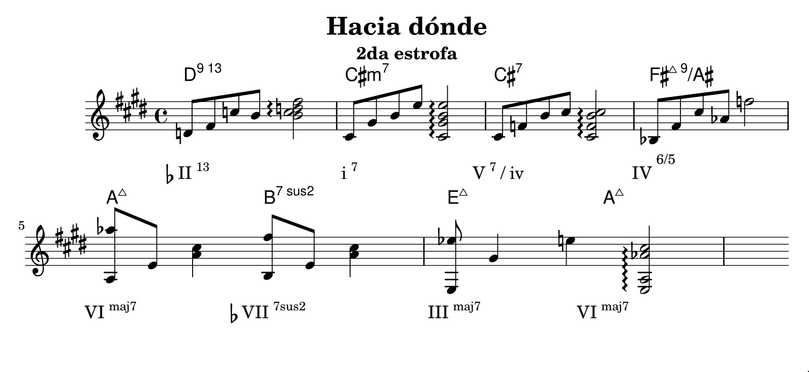

En la segunda estrofa de *Hacia dónde*, Juan Quintero emplea una cadencia
hermosa para moverse del grado $i$ al $VI$. Este pasaje también puede analizarse
desde la perspectiva de la tonalidad relativa mayor, como un movimiento $vi \to
IV$. 

    

> La letra correspondiente va desde «¿qué es lo que espero cuando te llamo?»
hasta el primer «¿hacia dónde?».

La belleza oculta está en cómo se resuelve la tensión del dominante secundario
del cuarto grado ($\text{V}^7/\text{iv}$). En lugar de resolver sobre el
$\text{iv}$ diatónico ($\text{F\#m}$), como el oído espera, Quintero resuelve en
$\text{IV}^{\text{maj9}}_{6/5}$, es decir el cuarto grado mayor con séptima
mayor y novena, dispuesto en primera inversión ($\text{C\#7} \to
\text{F\#}^{\text{maj9}}/\#A$). El uso de este acorde constituye un cambio
modal, porque se lo «toma prestado» del modo dórico de la escala. Mientras el
cuarto grado diatónico es oscuro, este cuarto grado «dórico» es de una preciosa
luminosidad.

<iframe width="560" height="315" src="https://www.youtube.com/watch?v=dDswNI_TrcE&list=RDdDswNI_TrcE&start_radio=1" frameborder="0" allowfullscreen></iframe>

La resolución sobre $\text{IV}^{\text{maj9}}$ (en 1era inversión) no sólo ofrece
un contraste de color, donde esperamos llegar a un lugar sombrío y sin embargo
sentimos como si un haz de luz se abriera entre las nubes. Además de eso, es un
acorde que, al estar invertido, no resuelve del todo la tensión creada por el
dominante secundario. La tensión se relaja, pero no se libera del todo, y existe
una hermosa sensación de suspensión, de estar aún flotando en el aire hacia
algún lugar.

Ese *algún lugar* al que todavía sentimos que debemos llegar es, al menos en el
caso de esta composición, un tanto inesperado: $\text{VI}^{\text{maj7}}$, en
este caso $\text{A}^\Delta$. La novena añadida en $\text{IV}^{\text{maj9}}$, que
funciona como acorde de paso, es la séptima mayor en $\text{VI}^\Delta$, y actúa
como pivote armónico y melódico. (La línea melódica descansa sobre esta nota, lo
cual fortalece la coherencia del movimiento armónico.) Además, por estar el
cuarto grado dórico en primera inversión, hay un descenso cromático en los
bajos: en el movimiento 
$\text{V}^7/\text{iv} \to \text{IV}^{\text{maj9}}_{6/5} \to \text{VI}^{\text{maj7}}$, los bajos son $\text{C\#} \to \text{A\#} \to
\text{A}$, donde el bajo «dórico» $\text{A\#}$ es extremadamente tenso.

La canción en su totalidad es una hermosura, pero cuando la estudié fue este el
aspecto que más me impresionó. Debe decirse que si bien la versión que refiero
es de Quintero, la versión original es de la compositora y guitarrista cubana
Marta Valdés:

<iframe width="560" height="315" src="https://www.youtube.com/watch?v=k3b0lVODumI&list=RDk3b0lVODumI&start_radio=1" frameborder="0" allowfullscreen></iframe>

