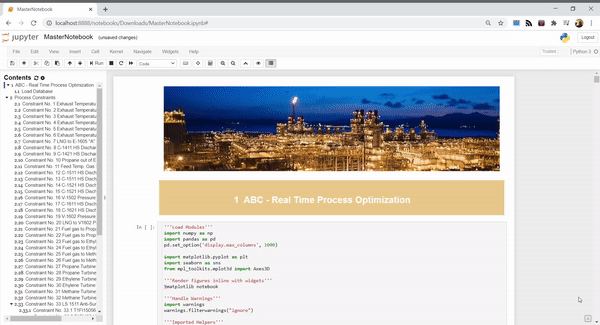
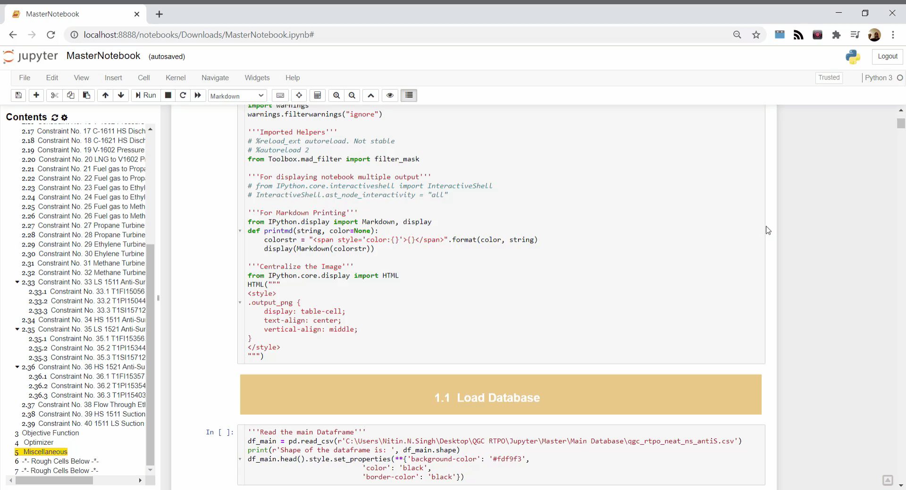

Jupyter notebooks are great. Among the other benefits of using them, I often find they are simple but great tool for working in projects that involve close collaborations with domain experts, process engineers etc. You can keep all of your models in one place, record the outcomes of numerical experiments, write down your notes etc. In some cases, I often try to compile exploratory analysis, model building, analysis of the results and notes into a single notebook. This helps in working iteratively with the other team members, communicating ideas and helps maintain the *story* of the project eg. what key finding in the data lead to certain choices in model building etc. Most importantly I find them helpful to work in an organized manner.    
However, it was quite unlike this and to to some extent productivity hampering, when I started using Jupyter notebooks initially. I would find myself endlessly scrolling and searching for specific figure, model, code cell etc., until, I found certain jupyter notebook extensions that did exactly what I was looking for to enhance my productivity and keep the notebook organized. In this post, I am going to share information about these extensions and some other tips that help me work efficiently in a lengthy jupyter notebook.  The information about how to install jupyter notebook extensions can be found  [here](https://jupyter-contrib-nbextensions.readthedocs.io/en/latest/install.html). 

**1. Initialization Cells**

Helps you mark certain cells as *initialization cell* that run automatically the moment you launch a jupyter notebook. This can be used to automatically run code cells that load library modules or the cells that load the input data.

   

 

**2. Table of Contents**

Provides with an automatically created table of content section on the left side of the notebook that can help in easy navigation from one section/subsection to another.  

**3. Scratchpad**

Helps in testing quick ideas on the fly. 

**4. Hide Code Cells**

Hides you code cells for someone who is not interested in them, leaving behind markdown text and figures. Can be used to render a simple document. 

**5. Change Code Font Size**

I found this extension to be particularly useful when I found long code sections unavoidable. It helps you to automatically adjust the font size if needed so that everything fits on the screen.

**6. Code Folding**

Aims to fold the foldable code sections. Helps in hiding the technical details and saves scrolling time too. 

**Other Tips**

- Categorize your content into proper section, subsections. 
- Color sections, subsections in different colors that you want for quick identification.
- Name your variables creatively. That avoids name clashes. 
- Use markdown printing to annotate important output.
- Create a **Rough Code** section towards the end of your notebook for experimentation. 