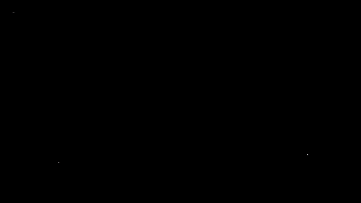
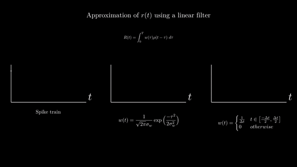
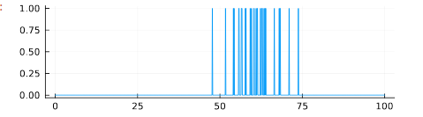
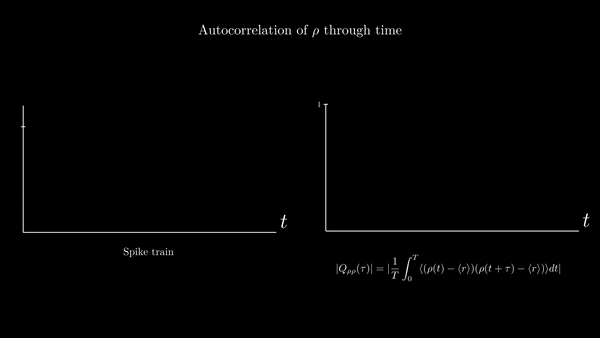

--- 
title: Monkey neurons firing
categories: [ Science ]
---

This is a monkey neuron firing - or rather an accurate simulation of one. At a
first glance, it might seem like random spikes appearing here and there in time.
However, you would be surprised by the amount of information one can gather from
such a simple phenomenon, as well as the richness of the mathematical models
that are behind it. 


<p align="center">
  
</p>

In this entry, I would like to share a computational model that simulates spike
trains such as the one animated above. The model is written in Julia, although a
Python implementation will also be made available. The model provides an
opportunity for discussing the mathematical modeling of neuronal dynamics
theoretically. 

It wasn't easy to decide how much detail I should provide for the mathematical
model used in the implementation. Ideally, I want this to be understandable for
a student - very few resources exist in computational neuroscience that don't
assume an experienced and highly prepared reader, and this shies away or, which
is worse, dulls the interest of novices. However, I also want to focus on the
computational, not the mathematical, model - and although the first follows the
latter, they are nonequivalent. I decided to follow the practice of not
anticipating formulas too much and somewhat "throwing them at the reader's
head", but always providing some insight on why the formula makes sense
*intuitively*. Demonstrations and a more detailed exposition of the mathematics
used in this model exist in Dayan and Abbot's indispensable work, *Theoretical
Neuroscience*, to which I refer the mathematically advanced and curious reader.

The first part is strictly mathematical and the presentation of the computer
simulation is delayed. This is necessary, because the computational model is
based on the mathematical description of neuronal dynamics. The reader is free
to skip the first part and dive straight into the programming of the model,
consulting the mathematical definitions only as they appear in the code.

**** 

When looking at the times at which a neuron fires, which is what the
animation above is showing, one is confronted firstly with the problem of
providing a good mathematical model for a series of spikes in time. Dirac's
$\delta$ function comes to mind. Dirac's $\delta$ is one of those pretty little
mathematical devices that, albeit being somewhat artificial, allows the modeling
of a wide variety of phenomena relating to sudden bursts of energy. Like neurons
firing.

In particular, let $\{t_{1}, \ldots, t_{n}\}$ be the sequence of times at which
a spike occurred. Then we define the *neural response function* as follows:

$$
\rho (t) = \sum\limits_{i=1}^{n}\delta(t -t_{i})
$$

The function defined above maps a time $t$ to $\infty$ if that time is a spike
time and to zero otherwise. It is analogous to $\delta$, which composes it,
except that instead of being positive at zero it is positive at any spike time.

A property that follows directly from the definition of Dirac's $\delta$ is
that, for any well-behaving function $h(t)$, we have

$$
\sum\limits_{i=1}^{n} h(t - t_{i}) = \int_{-\infty}^{\infty} \rho(t-\tau)h(\tau)~d\tau
$$

This formula might seem strange at first, but it expresses something rather
intuitive. The integrand expression $\rho(t - \tau)$ will always be $0$, except
when $\tau$ takes the value of the time distance between $t$ and a particular
spike time. When that is the case, the $\rho$ expression is one and the integral
incorporates into its sum the term $h(\tau)$. Thus, the integral expression is
the sum of all $h(\tau)$ values with $\tau$ a distance from $t$ to a time spike
$t_{i}$. Which is exactly what the left-hand expression is.

The property detailed above is of great importance because we very often care
about summing the distances a given time point has from each spike. Hence,
functions of the form $\sum\limits h(t - t_{i})$ will be very common in our of
inquiry of neuronal dynamics. The property provides a direct association between
any such function and the neural response function.

**** 

Action potentials are a stereotypical phenomena. Because between two action
potentials no essential difference exists other than the time at which they
occur, it has long been understood that whatever mechanism underlies neuronal
encoding must have to do with the arrangement of such activations in time. In
this sense, synchronous and asynchronous are the binary language of the brain.
When one ponders about the preponderance of time on the nature of neuronal
dynamics, the common place analogy of the brain as a great orchestra takes full
dimension.

For this reason, the temporal characterization of spike trains is of great
interest to researchers. A particularly important concept is that of the *firing
rate* of a given spike train. One might innocently believe this is a
straight-forward concept, but there are actually several ways in which the
firing rate may be conceptualized. The most important one is that which takes
the firing rate to be not a fixed value but a function of time. In particular,

$$
r(t) = \frac{1}{\Delta t} \int_{t}^{t+\Delta t} \langle \rho(\tau)\rangle ~ d\tau
$$

where $\langle \cdot \rangle$ denotes the *trial-average* of $\cdot$. The
definition above is straight-forward and should pose no problem to the reader.
An important fact is that $r(t)\Delta t$ provides the probability that a spike
occurs at time $t$, when $\Delta t$ is sufficiently small. This follows from the
fact that $\langle \rho(\tau)\rangle$ is the fraction of trials where a spike
occurred at time $\tau$ - this is, it is a relative frequency. This
probabilistic interpretation of the firing rate will be important in the future.

The average firing rate can on its turn then be defined as 

$$
\langle r \rangle =\frac{1}{T} \int_{0}^{T}r(t) dt = \frac{1}{T} \int_{0}^{T}\rho(\tau) ~d\tau
$$

The second term is identical to the third by virtue of the fact that, for
sufficiently small $\Delta t$, the average neural response and the firing rate
are equivalent, as it is easy to observe by the definition of $r(t)$.


***


The firing rate, like a distribution parameter, is inferred from a given
population of spikes. In fact, we shall show that the firing rate resembles a
distribution parameter in more than a casual way. For the moment, let us
consider how such approximation can be carried out using using linear filters.

A linear filter is a function of time that computes, at each time point $\tau$,
the linear combination of a linear kernel $w(\tau)$ with coefficients $\rho(t -
\tau)$. In our case $\rho$ is the neural response function, but it could be any
signal. More particularly, a linear filter over $\rho$ is expressed as

$$
R(t) =\int_{-\infty}^{\infty} w(\tau)\rho(t - \tau) d\tau
$$

where $w$ is a suitable kernel function. Two functions commonly used to capture
the firing rate of a spike train are the Gaussian kernel,

$$
w(\tau) = \frac{1}{\sqrt{2\pi}\sigma_{w}}\exp \Big(\frac{-\tau^{2}}{2\sigma_{w}^{2}}\Big)
$$

and a bin-average function

$$
w(t) = \begin{cases} \frac{1}{\Delta{t}}& t \in \left[\frac{-\Delta{t}}{2}, \frac{\Delta{t}}{2}\right]\\ 0 & otherwise \end{cases}
$$

The second splits the time-axis into bins of size $\Delta t$. The value of the
window at each point $t$ is $\frac{c}{\Delta t}$, the number of spikes occurring
at the window averaged over the window size. The first slides a Gaussian curve
at each time point $t$ and assigns to $R(t)$ the sum of the Gaussian values
associated to the distance of each spike to $t$. Distant spikes contribute
little to the value - proximate spikes contribute more. Below is an animation
that illustrates the parallel formation of the two window functions capturing
the firing rate of a random spike train. Try to consider how the spike spiking
rate at a certain region of the train correlates to the values of the filters
around that region.

<p align="center">
  
</p>

***

A spike train is a series of action potentials in time, where such potentials
are represented in binary terms. The dynamics behind the production of action
potentials, the swaying of the membrane voltage, the transportation of ions
through leaking or voltage-dependent pumps - in short, the marvelous complexity
behind the occurrence or non-occurrence of an action potential - is abstracted
away from our consideration.

The independence of spike-train modeling from such factors allows us to pay
closer attention to the dynamics underlying the interactions of the neuron with
the world. Its inner dynamics disregarded, at least for the moment, we may
attend to the effect of external stimuli on its behavior. 

The study of such effect is carried using what is termed a *tuning curve*. A
tuning curve is a function $\langle r \rangle = f(s)$, where $s$ is a stimulus
parameter. In short, it is a representation of the average firing rate as a
function of a parametrizable characteristic $s$ of a stimulus. Tuning curves are
fitted from experimental data to simulate real neuronal dynamics. For example, a
group of researchers recorded the activations of a neuron in the primary visual
cortex of a monkey as a rotating bar of light was shown before the animal. They
found that the firing rate of the neuron correlated to the angle $s$ of the bar.
The firing rate as a function of the angle of orientation of the bar was fitted
by a function

$$
f(s) = r_{max} \exp \Bigg( \frac{-1}{2} \Big( \frac{s-s_{max}}{\sigma_f} \Big) \Bigg)
$$

where $r_{max}$  was the highest elicited firing rate, $s_{max}$ was the angle
of the bar that corresponded to that maximum firing rate, and $\sigma_{f}$
determined the width of the tuning curve. 

In our simulation, we will simulate this experiment - with the tuning curve
above. To do so, we must also characterize the way in which the stimulus
fluctuates in time. Indeed, the stimulus $s$ is itself a function $s = g(t)$.
When researchers control the stimulus presented to the neuron, such function is
known *a priori* and may constitute the only property relating to the spike
train that is not inferred *a posteriori* from experimental data. For the case
of the rotating bar of light, we shall assume the bar rotates at a constant rate
from an angle of $-40$ to $40$ degrees in the duration $T$ of the recording, so
that the angle is zero at exactly $\frac{T}{2}$. It is trivial to observe the
function describing the angle of the bar of light, which is our stimulus
parameter $s$, is

$$
g(t) = \frac{4}{5}t-40
$$

When we inquire on some special properties of the spike train, it will become
useful to treat $g$ as a periodic function, imposing that $g(T + \tau) = g(\tau)$. 
This is an implicit assumption in our mathematical model, but must be explicitly
determined in the program. 

***

We are ready to produce our artificial spike train. We will begin with what we
described last: the stimulus function $s = g(t)$ and the stimulus curve $f(s)$.
Since the stimulus curve determines the firing rate, and depends on $g(t)$,
these are fundamental to the model. 

For starters, it is very easy to define $g$ as we want it.

```julia
function stimcurve(x, T)
	# We make stimcurve(T + t) = stimcurve(t)
    4 / 5 * (x % T) - 40
end
```

In what comes to the tuning curve, we will make `TuningCurve` struct in order to keep track of some of its important parameters. This may seem unnecessary now, but will prove useful later.

```julia
struct TuningCurve
    f::Function
    max_rate::Float32
    argmax_rate::Float32
    σ::Float32

    function TuningCurve(max_rate, argmax_rate, σ)
        f(s) = max_rate * exp(-0.5 * ((s - argmax_rate) / σ)^2)
        new(f, max_rate, argmax_rate, σ)
    end
end
```

It is only now that, using the fact that $\langle r \rangle = f(s) = f(g(t))$,
we model our spike train. I include the documentation of the struct to keep 
the mathematical justification of the model at hand.

```julia
mutable struct SpikeTrain
    """Struct representation of a spike train with a firing rate that is a 
    non-constant function of time.

    Parameters
    ----------
    T : number > 0 
        Duration of the trial.
    Δt : number > 0
        Size of the infinitesimally small bins that split the time domain.
    tuncurve : TuningCurve
        The TuningCurve struct represents the function that governs the 
        variation of r = f(s), the firing rate as a function of a stimulus 
        parameter. The stimulus parameter is on its turn  a function s = g(t) 
        of time.
    stimcurve : function
        A periodic mapping from ℝ to ℝ that is the function s(t) of a stimulus
        parameter with respect to time. Periodicity must be imposed into
        whatever function describes the stimulus across time for some of the
        calculations to make sense. Such condition is often easy to impose
        using standard mathematical methods even on non-periodic functions.

    Fields
    ----------
    T : Float32 > 0 
        Duration of the trial.
    Δt : Float32 > 0
        Size of the infinitesimally small bins that split the time domain.
    t : Vector{Float32}
        Vector representation of the time domain [0, T] where t_i is the ith 
                            
                                [t_i, t_i + Δt]
    spike_train : Vector{Int} 
        A binary vector whose ith value is ρ(tᵢ).
    tuncurve : TuningCurve. 
        The TuningCurve instance that represents the function that governs the 
        variation of r = f(s), the firing rate as a function of a stimulus 
        parameter. The stimulus parameter is on its turn  a function s = g(t) 
        of time, where g is the stimulus curve.
    stimcurve : f : ℝ → ℝ
        A periodic mapping from ℝ to ℝ that is the function s(t) of a stimulus
        parameter with respect to time. Periodicity must be imposed into
        whatever function describes the stimulus across time for some of the
        calculations to make sense. Such condition is often easy to impose
        using standard mathematical methods even on non-periodic functions.
    """

    T::Float32
    Δt::Float32
    t::Vector{Float32}
    n::Int
    spike_train::Vector{Int}
    avg_spike_train::Vector{Float32}
    spike_times::Vector{Float32}
    avg_n::Float32
    tuncurve::TuningCurve
    stimcurve::Function

    function SpikeTrain(T, Δt, tuncurve, stimcurve)
        δ(x) = x >= rand() ? 1 : 0
        t = collect(0:Δt:T)
        f = tuncurve.f
        g = stimcurve
        spikes = [δ(f(g(x)) * Δt) for x in t]
        spike_times = [t[index] for (index, value) in enumerate(spikes) if value == 1]
        n = length(spike_times)

        new(T, Δt, t, n, spikes, [], spike_times, 0, tuncurve, stimcurve)
    end
end
```

The `SpikeTrain` struct stores in the `spike_train` attribute the values of
$\rho(t)$ for all $t$. It is a binary vector of zeroes and ones, with ones only
at the index that corresponds to a time in `t` when a spike occurred. Hence the
definition of `spike_times` as the values of `t` at the indexes where `spikes`
is `1`.

The reader is not to be deceived by the simplicity of the model, which counts
with only a few dozen lines of code. Its virtue lies entirely on the fact that
it follows experimental data entirely. None of its elements is derived from
arm-chair reasoning. I should advise him to stop and ponder on the beauty that
exists in a simple model reflecting, albeit through many layers of abstraction,
the fascinating complexity of the natural world.

A sample use of the code above is given below. We plot a simulated spike train
where the tuning curve was given parameters $r_{max}=2, s_{max}=10, \sigma=5$.
The trial had a duration of 100 (whether seconds, milliseconds, this is
abstracted out).

```julia
using Plots

st(x) = stimcurve(x, 100)
tuncurve = TuningCurve(2, 10, 5)
A = SpikeTrain(100, 0.1, tuncurve, st)
plot(A.t, A.spike_train,size=(500, 150), legend=false)
```

<p align="center">
  
</p>

****
There is a wide range of properties that can be inferred from this simulation. I
describe the mathematics behind them - their code implementation is at the
*spikes* repository on my GitHub profile.

One such property is the spike-triggered average $C(\tau)$. This function
describes the average value of a stimulus $s$ at a time interval $\tau$ before a
spike fired. In other words,

$$
C(\tau)= \Big\langle \frac{1}{n}\sum\limits_{i=1}^{n} s(t_{i} - \tau) \Big\rangle
$$

Because of it is sum of a function involving the distance each spike has from a
time-point $\tau$, we may express it using the neural response function as

$$
C(\tau)=\frac{1}{\langle n \rangle}\int_{0}^{T} \langle \rho(t) \rangle s(t - \tau) ~ dt =\frac{1}{\langle n \rangle}\int_{0}^{T} r(t) s(t-\tau)~ dt
$$

In Julia, a possible implementation is

```julia
function sta(spike_train::SpikeTrain)
        """
        The spike-triggered average (STA) of a stimulus is a function C(τ) of 
        time that computes the average value of a stimulus τ time units prior 
        to the generation of an action potential. For an individual spike train,
        it is defined as 

                                C(τ) = 1/n * ∑ⁿ (s(tᵢ - τ))

        where t₁, …, tₙ are the spike times in the train and s(t) is 
        the stimulus curve.
        """
      
        values = []
        for τ in spike_train.t
            Cτ = sum([spike_train.stimcurve(t - τ)
                      for t in spike_train.spike_times]
                      ) / spike_train.n
            push!(values, Cτ)
        end

        return values
end

function mean_sta(st::SpikeTrain)
        """
        The mean spike-triggered average (STA) of a stimulus is the trial
        average of a  function C(τ) of time that computes the average value of
        a stimulus τ time units prior to the generation of an action potential.

        Because trial average spikes are no longer binary values in {0, 1} 
        but frequencies, there is no sequence {t₁, …, tₙ} to be used for the 
        computation, and the alternative definition

                                C(τ) = 1/⟨n⟩ ∫ᵀ ⟨ρ(t)⟩s(t - τ) dt 

        is used, where ⟨ ⋅ ⟩ denotes a trial average value and the inferior 
        integral bound is 0. This definition is a bit more complicated, and 
        its computation is more costly compared to STA estimation with a unique 
        spike train, but it is also statistically more precise.
        """

        values = []
        avg_st = st.avg_spike_train 
        n = st.avg_n 

        for τ in st.t
            c_of_τ = 0
            for time_index in range(1, length(st.t))
                t = st.t[time_index]
                ρ_at_t = avg_st[time_index]
                c_of_τ += ρ_at_t * st.stimcurve(t - τ)
            end
            push!(values, c_of_τ/n)
    end

    return values
end

```

Observe that the function above does not compute $C(\tau)$ but the sequence
$\\{ C(\tau_{1}), \ldots, C(\tau_{T}) \\}$ for each discrete time point $\tau_{i}$
in our simulated time dimension `t`.

Another quantity of interest is the stimulus-firing rate correlation. As the
reader may know, a correlation function defines how the variations of two
time-dependent quantities are correlated. In particular, for the stimulus and
the firing rate, we have

$$
Q_{rs}(\tau) = \frac{1}{T} \int_{0}^{T} r(t)s(t+\tau) ~ dt
$$

A possible Julia implementation is 

```julia
function stim_fr_corr(spike_train::SpikeTrain, τ::Int)
    """Compute the time correlation of functions f and t. Importantly, 
    f and g are taken to be lists with the function values rather than 
    functions themselves, and τ is taken to be an indexing distance rather 
    than a real-valued distance.

    Args:
        f (list): Values of f(t)
        g (list): Values of g(t)
        τ (int): Index distance of the values being correlated at each time
        point.
    """
    
    r(t) = firing_rate(spike_train, t)
    s = spike_train.stimcurve
    corrs = [r(t) * s(t + τ) for t in spike_train.t]

    return sum(corrs)/spike_train.T
end

function stim_fr_corr(spike_train::SpikeTrain)
        return [stim_fr_corr(spike_train, t) for t in spike_train.t]
end
```

Another property of interest is the spike-train auto-correlation. It turns out
the distribution of time intervals between spikes is quite descriptive of the
neuronal dynamics underlying their generation. I will provide a derivation of
the probability density function of the length of these intervals in the
appendix of this entry. For the moment, suffices to say that an important
function related to interspike intervals is the spike train autocorrelation
function. It is the autocorrelation of the neural response function $\rho$ with
its own average. Since the time average of the neural response is the
spike-count rate $r$, we have

$$
Q_{\rho\rho}(\tau) = \frac{1}{T}\int_{0}^{T} \langle (\rho(t) - \langle r\rangle) (\rho(t + \tau) - \langle r\rangle )\rangle dt
$$

This represents the correlation between deviations from the mean value at point
$t$ with deviations from the mean value at $t + \tau$. It is a measure of the
average influence that finding a spike at time $t$ has on finding a spike at
time $t + \tau$.

<p align="center">
  
</p>

A possible implementation:

```julia 
function autocorr(st::SpikeTrain, τ::Int)
    r = get_avg_firing_rate(st)
    N = length(st.t)
    avg_st = st.avg_spike_train

    value = 0
    for t in range(1, N)
        t_plus_tau = t + τ <= N ? t + τ : ((t + τ) % N) + 1 # +1 to make index > 0
        a = avg_st[t] - r 
        b = avg_st[t_plus_tau]
        value += a * b
    end 
    value/st.T
end

function autocorr(st::SpikeTrain)
    [autocorr(st, τ) for τ in range(1, length(st.t))]
end
```

The reader may be curious about implementations of the linear filters discussed
earlier. If we let $\omega$ denote the bin-average window and $\gamma$ the
Gaussian window, then a possible implementation is:

```julia 
function ω(st::SpikeTrain, Δt::Int)
    """Approximate r(t) using the window function 
        
                        {  1/Δt     t ∈ [-Δt/2, Δt/2]
                w(t) = -{
                        {  0        otherwise

    Algorithmically, the function iteratively takes slices of ρ(t) of size 
    2 * Δt (or less out of bounds) and computes the average number of spikes 
    for each slice. Returns a list of length equal to the length of self.t 
    the time dimension with each average.

    Mathematically, this function slides a window of size 2 * Δt across
    the time domain. At each point t the window is centered at t. 
    w(t) is evaluated and thus the average spike count is computed for 
    each window.

    Args
        Δt (int > 0)   Half the number of time-units comprised by each 
                        window.
    """

    N = length(st.spike_train)
    counts = []
    for i in range(1, N)
        lower_bound = i > Δt ? i - Δt : 1
        upper_bound = i + Δt <= N ? i + Δt : N
        bin = st.spike_train[lower_bound:upper_bound]
        push!(counts, count(x -> x == 1, bin)/Δt)
    end
    return counts
end


function γ(st::SpikeTrain, σ::Float64)
    """Approximate r(t) using the window function 
        
                w(t) = 1/(√(2π)σ) ⋅ exp(- τ²/ (2σ²))

    where σ is a parameter that governs the intensity with which 
    distant spikes affect the value at t (analogous to Δt on the 
    delta filter).

    Algorithmically, the function computes at each point t in self.t the 
    value of w(t - s) for every spike-time s. A list of equal length as 
    t is returned with these values.

    Mathematically, this function slides a Gaussian window of σ amplitude 
    across the time domain. At each point t the window is centered at t and 

                        ∫ w(τ)ρ(t - τ) dτ

    is computed with integral bounds 0 and T. 

    Args
        σ (float > 0) Amplitude of the Gaussian window.
    """

    N = length(st.spike_train)
    g(t) = (1/(sqrt(2* pi) * σ)) * exp(-t^2/(2*σ^2))

    results = []
    for i in range(1, N)
        distances = [st.t[i] - x for x in st.spike_times]
        r_of_t = sum([g(d) for d in distances])
        push!(results, r_of_t)
    end
    return results
end
```

Some of the functions above make use of helper functions - such as
`get_avg_firing_rate`. I do not provide the definition of these functions
because they are very simple. They can be found at the GitHub repository.

--- 

## Another spike train model 

We have so far explored estimations of the firing rate giving an empirical
distribution of spikes (a spike train). We now pose the problem in different
terms. We assume the estimated firing rate $r_{est}(t)$ is a weighted sum of a
stimulus across time. Since time is continuous, this results in an integration:

$$ r_{est}(t) = r_{0}+ \int_0^{\infty} \mathcal{D}(\tau)s(t - \tau) ~ d\tau $$

Here, $r_0$ accounts for any firing that occurs when $s = 0$, and $\mathcal{D}$
is a weighting factor that determines the strength and direction with which the
stimulus at time $t - \tau$ influences the firing rate at time $t$. Observe that
$r_{est}$ is a linear filter]. To construct the estimation $r_{est}$ we
minimize the difference between this function and the squared difference between
the actual measured response averaged during the duration of the trial:

$$ E = \frac{1}{T} \int_{0 }^{T} \big(  r_{est}(t) - r(t) \big)^{2}dt $$

$E$ is minimized by setting its derivative with respect to $\mathcal{D}$ to
zero. The result is that $\mathcal{D}$ depends on the stimulus autocorrelation
function and the stimulus correlation function, $Q_{rs}$ and $Q_{ss}$.  In
particular, the equation yields 

$$ \int_0^{\infty} Q_{ss}(\tau - \tau')\mathcal{D}(\tau') ~ d\tau' =
Q_{rs}(-\tau) $$

This is why this estimation method is called *reverse correlation*, because
$Q_{rs}$ is evaluated at $-\tau$. This equation can be solved most easily if the
stimulus $s$ is white noise, so that $Q_{ss}(\tau) = \sigma_{s}^2\delta(\tau)$ ,
resulting in 

$$ \sigma_{s}^{2}\int_0^{\infty}\delta(\tau - \tau')\mathcal{D}(\tau') =
\sigma_{s}^{2}\mathcal{D}(\tau) $$

from which follows 

$$ \mathcal{D}(\tau) = \frac{Q_{rs}(-\tau)}{\sigma_{s}^{2} } = \frac{\langle r
\rangle C(\tau)}{\sigma_{s}^2} $$

where $C(\tau)$ is the spike-triggered average stimulus and $\langle r
\rangle$ is the average firing rate. We have used the relation
$Q_{rs}(-\tau) = \langle r \rangle C(\tau)$.

If one uses a static nonlinearity, then the minimization presented here is
no longer optimal, because it is done with respect to $L$ and not $F(L)$.
However, a theorem (appendix C of the book) suggests that the minimization
obtained for $\mathcal{D}$ is still a reasonable kernel if the white noise
stimulus used is Gaussian.

One possible static nonlinearity is

$$
F(L) = G[L-L_0]_{+}
$$

where $L_0$ is a threshold value that $L$ must attain before firing begins.
Above the threshold, the firing rate $r_{est}(t) = r_{0}+ F(L(t))$ is a linear
function of $L$. In this sense, this static nonlinearity is only non-linear in
the sense that it provides an inferior bound to the function; above that bound
it is linear.

Another static nonlinearity is the saturating nonlinearity given by

$$ F(L) = \frac{r_{max}}{1+\exp\Big( g_1(L_\frac{1}{2}-L)\Big)} $$

where $r_{max}$ is the maximum possible firing rate, $L_{\frac{1}{2}}$ is the
value of $L$ for which $F$ achieves half of this maximal value, and $g_1$
determines how rapidly the firing rate increases as a function of $L$. $g_1$ is
not a function!

Since the range of $\sigma(x) = \frac{1}{1 + e^{-x}}$   is $[0, 1]$, this
function will range between $[0, r_{max}]$. This achieves the desired
saturation.

Another static nonlinearity which not only saturates but has a threshold is
the function 

$$ F(L) = r_{max} \big[ \tanh \big(  g_{2} (L - L_0\big) \big]_{+} $$

The range of $\tanh$ is $[-1, 1]$; it follows that the range of $[\tanh(u)]_+$
is $[0, 1]$. It is easy to see how the function then achieves saturation and
obeys a threshold. Since $\tanh (u)$ surpasses zero only when $u > 0$, the
threshold is given by $L_0$. Here too $g_2$ is a factor that controls the rate
with which the curve grows once $L > L_0$. 

Sometimes, the accuracy of the predictions can be improved if $L(t)$ is defined
not with respect to $s$ itself but to some function of $s$:

$$ L(t) = \int_0^{\infty} \mathcal{D}(\tau)f(s(t - \tau) )~ d\tau $$

In particular, letting $f$ be the tuning curve of the response is a
reasonable choice. Here, $L$ itself may be regarded as an extension of the
response tuning curve.


All of these, along with static nonlinearity, is sufficient to simulate a
Poisson spike generator. The structure of the simulation is schematically the
following: Given a stimulust $s(t)$, compute the linear filter $L$ and compute
$r_{est}(t)$ using a static nonlinearity. Then drive a Poisson model with the
following criterion: Whenever $r_{est}(t)\Delta t > x_{rand}$, generate a spike.

---

**Appendix: Spikes through probability theory**

Spike trains are a probabilistic process. Two probability questions are
immediate: that which inquires on the probability that exactly $n$ spikes occur
on a trial of duration $T$, and that which inquires on the probability that a
specific sequence $\{ t_{1}, \ldots, t_{n} \}$ occurs. 

Imagine the time-dimension is split in $M$ bins of size $\Delta t$, so that
$\frac{T}{{\Delta t}} = M$. For a particular spike train $\{ t_{1}, \ldots,
t_{n} \}$ to occur, two things must be satisfied: exactly $n$ spikes must occur,
and those $n$ spikes must be located at $n$ of the $M$ possible time-bins. There
are of course $n!$ equivalent arrangements. Hence we quite readily obtain that

$$ P_T(\{t_{1}, \ldots, t_{n}\}) = n!P_{T}(N = n) (\frac{\Delta t}{T})^{n} $$

where $P_{T}(\{ t_{1}, \ldots, t_{n} \})$ is the probability of obtaining
exactly the sequence $\{ t_{1}, \ldots, t_{n} \}$ in a trial of duration $T$,
and $P_{T}(N = n)$ the probability of obtaining exactly $n$ spikes in a trial of
duration $T$.

Furthermore, if we inquire on $P_{T}(N = n)$, we observe that there are
$\binom{M}{n}$ ways for $n$ spikes to occur across $M$ bins. For each specific
bin the probability for a spike to occur is $r\Delta t$. We require that $n$
spikes occur *and* no more - this is that the remaining $M - n$ bins have no
spikes. Then

$$ P_{T}[N =n] = \lim_{\Delta t \to 0} \binom{M}{n}(r\Delta t)^{n}(1 -r\Delta
t)^{M - n} $$

Unsurprisingly, the event follows a binomial distribution - since it is a
sequence of independent events with a bimodal outcome. However, we take the
limit $\Delta t \to 0$  to ensure that no two spikes can occur at the same time
space. However, $\Delta t \to 0$ implies $M \to \infty$, and hence we find
ourselves at the point in which the Binomial and the Poisson distribution
connect. Particularly, if $M \to \infty$ we have $M - n \approx M =
\frac{T}{\Delta t}$. Using this and letting $u = -r\Delta t$ we obtain

$$ \lim_{\Delta t\to0}(1 - r\Delta t)^{M - n} = \lim_{u \to 0}\Big( (1 +
u)^{\frac{1}{u}}\Big)^{-rT}=e^{-rT} $$

by the limit definition of $e$. In short,

$$ P_{T}[N = n] = \frac{(rT)^{n}}{n!}e^{-rT} $$

and the number of spikes in a trial of time $T$ follows a Poisson distribution
with $\lambda = rT$. 

Lastly, let $L$ denote the length of an inter-spike interval. Let $t_{i}$ be an
arbitrary time in $\{t_{1}, \ldots, t_{n}\}$. The probability that no spike
occurs in the interval $[t_{i}, t_{i} + \tau]$ is the probability of obtaining
$N = 0$ spikes in a trial of length $\tau$:

$$ P(L > \tau) = \exp(-r\tau) $$

From this follows that the CDF of $L$ is 

$$ F(\tau)= 1-\exp(-r\tau) $$

from which directly follows that the PDF of $L$ is

$$ f(\tau) = r\exp(-r~\tau) $$

--- 
