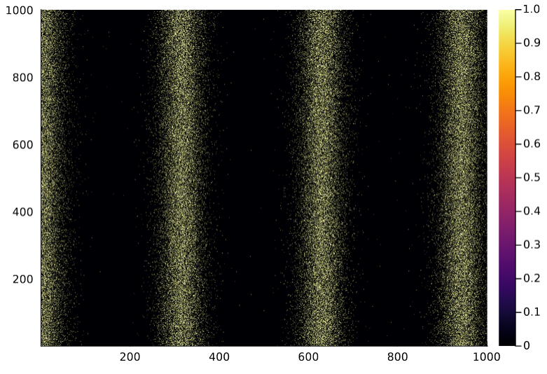
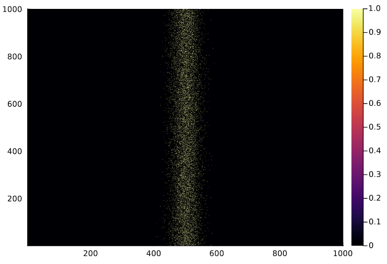

--- 
title: The Perron eigenvalue of a spike matrix - Brief research notes
categories: [ Science ]
---

*Preliminary definitions.* Let $r: \mathbb{R} \to \mathbb{R}$ be the firing rate
of a neuron, s.t. $r = f \circ g$ for $f: \mathbb{R} \to \mathbb{R}$ a tuning
curve and $g: \mathbb{R} \to \mathbb{R}$ a periodic stimulus curve. Assume that
$r$ describes the firing rate of a neuron during a trial of length $T$, and let
$\Delta t$ be a small positive constant describing the bin size of a partition
of $[0, T]$ into $n$ bins. 

*Spike vector and spike matrix*. We define a *spike vector* as $\omega \in \{0,
1\}^{n}$ s.t. $\omega_{i} \sim \text{Bernoulli}(r(\frac{i}{T})\Delta t)$. More
generally, a *spike matrix* is defined as a matrix whose rows are spike vectors.
The squared spike matrix of $n^2$ dimensions is referred to as the *Omega*
matrix. In other words, we define $\Omega \in \{ 0, 1 \}^{n \times n}$ as a
random matrix s.t.

$$ \Omega_{ij} \sim \text{Bernoulli} \Big( r \big( \frac{j}{T} \big) \Delta t\Big) $$ 

*Spike density*. Let $\mathcal{D}: \mathbb{N} \to \mathbb{N}$ be the
spike density function, defined for $0 < i \leq n$ as

$$ \mathcal{D}(i) = \sum\limits_{j = 1}^{n} \Omega_{ji} $$ 

where $i =t \cdot T$ with $0 \leq t \leq T$.

*Relationship between density and firing rate*. The probability that a given
value $\Omega_{ij}$ is $1$ is determined by $r(t)$. Let $S_r = \text{sup} \{
r(t) : 0 \leq t \leq T \}$ and $S_{\mathcal{D}} = \text{sup}\{ \mathcal{D}(i) :
0 < i \leq n \}$. Now observe that

$$ \mathbb{E}\big(\mathcal{D}(i)\big) = \sum\limits_{j=1}^{n}
\mathbb{E}(\Omega_{ji}) = nr(t)\Delta t $$ 

where $t = i/T$. From here it evidently follows that the highest values of
$r(t)$ correspond to the highest expected values of $\mathcal{D}$. Informally,
the denser regions of $\Omega$ correspond to those around the supremums of $r$.

*An application of Frobenius-Perron theorem*. By virtue of the Frobenius-Perron
theorem, $\Omega$ will have a leading eigenvalue $\lambda$ corresponding to a
fully positive eigenvector $\alpha$. Informally, the magnitude of $\lambda$ will
be determined by the density of $\Omega$, because each non-null entry in
$\Omega$ adds to the magnitude of the linear combination $\Omega \alpha$. The
density of $\Omega$ is on its turn dependent on $r(t)$, as was previously
observed. It stands to reason that $\lambda$ is dependent on $r(t)$. In
particular, $\lambda$ should depend on $S_{r}$ and on the rate at which $r$
dissipates from its peak values as $t$ distances from the values of $S$.

*A parameterized rephrasing of the above.* Put differently, the leading
eigenvalue of $\Omega$ is a random function of the parameters of $f \circ g$. It
stands to reason that certain properties of this function may be inferred from
the eigenvalue. In general, $f$ may be parameterized to obey a specific maximum
$r_{max}$ at some specific stimulus value $s_{max}$ and with a certain decay
rate or amplitude $\sigma$. As a mere example, it is conceivable that $f$ should
obey a sinusoidal form, and hence may be parameterized as

$$ f(s; r_{max}, \sigma) = r_{max}\sin(\frac{s}{\sigma}) $$

These parameters determine the highest density of $\Omega$ and the rate at which
such density dissipates when considering non-maximal time regions. 

***

I simulated a series of spike trains to test whether there is in fact a
discernible relation between the Perron eigenvalue of $\Omega$ and the
parameters of $f$. For the simulations, I let

$$ \begin{align*} f(s) &= r_{max} \exp \Big( \big( \frac{s-s_{max}}{\sigma}
\big)^{2} \Big) \end{align*} $$

This choice is not arbitrary, insofar as this Gaussian curve has been found to
fit the firing rate of true biological neurons in the brain. I used two
different stimulus curves:

$$ \begin{align*} g_{1}(t) &= \sin(\frac{t}{10})\\ g_{2}(t) &= \frac{4}{5}t -40 \end{align*} $$

The sinusoidal stimulus was not inspired by any true experiment but chosen due
to its convenient and understandable shape. $g_{2}$ is an expression of the
rotating light bar experiment detailed in $\text{Part I}$ of Dayan and Abbot's
*Theoretical Neuroscience*. The programming implementation enforced periodicity
onto $g_{2}$ so that $g_{2}(T + t) = g_{2}(t)$.

Below is a plot of $\Omega$ under $r_{max} = 4$ and $\sigma = \frac{1}{4}$ for
$g_{1}$, followed by a plot of $\Omega$ under $r_{max} = 2$ and $\sigma = 2$ for
$g_{2}$.

  

  

Under $g_{1}$, the random Perron eigenvalue of $\Omega$ was correctly fitted by

$$ \rho(\Omega) = \sigma r_{max} $$ 

Under $g_{2}$, it was fitted by

$$ \rho(\Omega)=3\sigma r_{max} $$

Because $\rho(\Omega)$ is a random variable itself, a statistical treatment of
it may be useful. But that is a matter of future inquiry.

