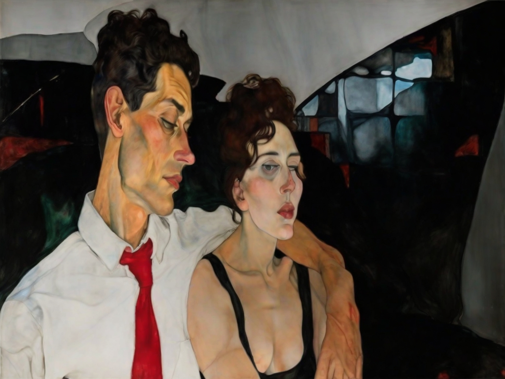
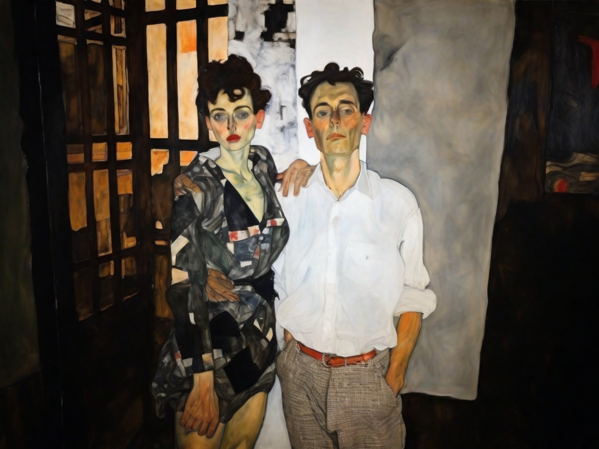
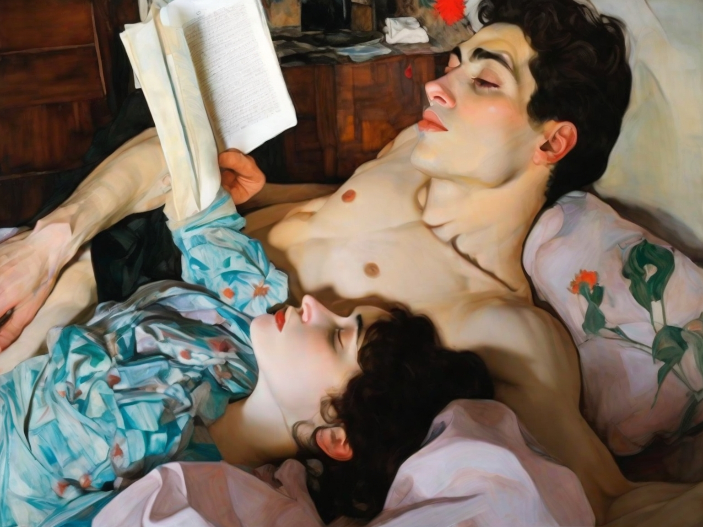
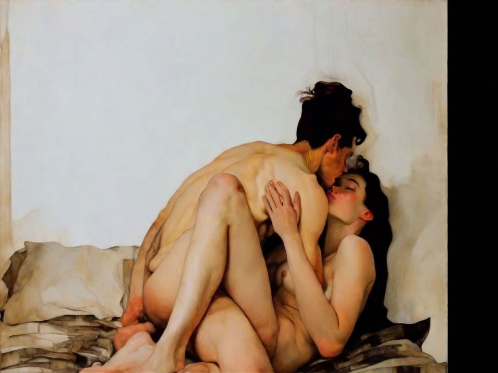

---
title:
categories: [ Personal ]
---

We almost never recognize the most defining of moments. How many sorrows in our
lives can we trace to a definite genesis? And the genealogy of what fraction of
our joys could we produce? *Ex nihilo nihil fit*; everything is begotten. But
faith is woven silently: We never know whether an ocean was just set in chaotic
motion, whose onslaught may already, though in chrysalis, be our faith. It is
natural, then, that the day I met my wife passed like any other. I was twelve
years old. And although I do not wish to detail the circunstancial aspects of
this meeting, I do care to comment on its metaphysics. I find it curious to
think that, in that very day, the writing of this entry was fixed; perhaps even
the exact combination of its words. As Pascal observed, in infinite time and
space, every point, and everyone, is at the center of the universe. When we
light a match, fire appears as if instantly combusting before our eyes; in
relative terms, however, the match underwent a process of extraordinary
duration. Similarly, under the right perspective, any pair of events in life are
infinitesimally close to each other, however distant they might seem—And so
indeed the day I met my wife, in more than a literary sense, was the day I wrote
these words—and the day I died beside her. We sometimes speak of our wish to die
with one another; we forget we already have. I am already resting in our warm
and common grave—I have been since that twelve-year-old laid eyes on her. And if
I make an effort, although trapped in space and time, I feel already that which
is the wisest form of peace: The death of one who died in love. It was in such
spirit that I wrote the poem:

>ves en el corazón de mi agonía  
> un interior de luz inmarcesible? 
> ves en mi palidez un imposible   
> rubor? ves en mi cáscara sombría   
>cómo mi carne nunca estará fría  
> si doy feliz el paso ineludible?  
> aunque mi muerte me es incognoscible  
> sigue siendo, después de todo, mía…   
> no llorarás por mí, no verás una  
> serpiente amanecer en mi retrato  
> tuya será la paz que me consume  
>y en el último eclipse de la luna 
> oirás el rechinar de mi zapato  
> y olerás en la muerte mi perfume

But my wife and I have different tastes in poetry. She likes to be shocked,
caught off guard—she cares not for structure, metrics—she is passionate and also
modern. I strive (with little success, that is) for more classical lyricism; to
me semantics precede wording; I very rarely enjoy free verse and think no
structure almost always implies no pace nor rhythm. And although it would be
false to claim this wasn't problematic at first—she doesn't like my poetry, and
I am a prideful man—our differences kept a hidden pearl. My wife taught me to
appreciate poetry in a different way. I saw that accents could be placed in
manners altogether different to those I was accustomed to. For any man of
sensibility, to be introduced to new literature or music is a delicious
pleasure. But to have our very sense of art renewed and changed, and all by
virtue of the generous and honest contributions of a friend, is truly an
invaluable gift. In this, and many other ways, she made me a richer man. And
this I could never forget.

But this is close to nothing if I think of all the other things which she has
given me. It would be immodest to delve too deeply in the conditions of my life
before we started to be lovers. I should only say this: No witnesses exist of
the anguish and dismality which reigned my life, because I was alone
*completely*—No witnesses even if we were to count myself, for my sorrow was so
deep, and the structures which used to support my life were so in ruins, and my
identity so forgotten, that I have no memory of that time except for these
vexing feelings. An almost total amnesia has consumed the whole year which this
crisis lasted. My wife did not precisely save me from this languid and
despondent state, and I would be suspicious of the foundations of my love if I
were to consider her a savior. As a matter of fact, she came to my life not
during this time, but some months after I had started to regain my strength and
live again; after a sense of purpose had been restored or manufactured. My wife
is not the reason why I managed to survive the crisis—and I speak of survival in
a very literal sense. She is, more rightly, the sweet apotheosis of my coming
back to life. Put differently, it is not that she infused *new* life within me:
She was the culmination of the vital spirit which somehow guided me to
resurrection. She made me understand the Christian concept of guardian angel.
(This is so much so that I have wondered, when simply pondering about the
joyfulness of her, whether God in fact exists.) It is as if she came to ensure,
once I escaped the grip of death, that I should never die again. 

  

There is another sense in which she acted as a restorer of compassion and
positive affect. As I said, I knew my wife at a very early age. Some time after,
I devoted myself to reading the classical works of the socialist tradition. I
studied anarchism and Marxism; in fact, I distinctly recall finishing my reading
of *Das Kapital* the day I turned sixteen, in a hotel bed in Buenos Aires, alone
and delighted. I called myself a socialist until I was perhaps twenty, when I
became profoundly disillusioned with the way left-wing activism was conducted in
practice. I am unsure of whether the reasons which gave way to my disappointment
are just or true; some of them I sustain, some I don't. The point, however, is
that when depression and dejection seized my life, this disappointment grew more
bitter—I could not see mankind as nothing but a hopeless case—My dreams of a
world of solidarity seemed ridiculous now. Once, around this time, I conversed
with an anarchist young woman: She said in a free, equal and just society, there
would be no murders, because there would be *no reasons* to kill. I still
believe this is a silly statement, but the reply I gave at the time is
representative of my feelings for mankind  at the time; for I condescendingly
said: What if having no reason at all *is* the reason? From this very comment,
an educated reader may guess that I was reading Dostoevsky, which is perhaps the
stupidest thing a man can do when he is hopeless. Whatever the case, although my
conception of human nature remains transformed, and is somewhat darker than it
was when I was an adolescent, I have come to the intellectual conclusion that
this in no way contradicts a socialist commitment—if anything, it strengthens
it. But this intellectual realization came not on its own, but was a consequence
of an emotional and sentimental rebirth, induced by the example set daily by my
wife.

Indeed, I have never known a more generous person, a soul more decidedly
committed to giving. I avoid commenting too much on the lives of those I mention
on this diary; suffices to say she lives and breathes for the betterment of
human kind, and this in concrete and practical ways, and almost always without
getting nor expecting any profit whatsoever for herself. She is so profoundly
*good*—and this, like Machado said, *en el buen sentido de la palabra*—that she
sometimes forgets herself amidst the horrors she deals with; she suspects, for
example, that behind her compassion and commitment lay more selfish and obscure
motives. That she is willing to question her purity is a proof of decency and
intelligence; it is true that nothing in life is pure; and it is true as well
that nothing needs be. Our inner lives are mysterious; the criteria to decide
upon our worth should, with some exceptions, be reduced to the consideration of
the *effects* we bring about in the world. Whatever the case, the truth is that
the more I have gotten to know her in our adult life, the more she has inspired
me. I now even suspect the word "inspiration" is imprecise; she rekindled in me
the love and solidarity which reigned my younger years, and taught me what I
once forgot: That slavery and serfdom are the pities of this world. This was not
at all inconsequential; it changed, for example, the course of my professional
life. I came to disregard the (constant and assailing) calls of worthless
industries for computer scientists, where piles of money are given in exchange
for the most unproductive and useless of labors, and shifted my attention to
aspects of scientific development which bear at least potential for the
betterment of human life. I have written elsewhere on this; those reflections
are a product of my wife's example.

  

Some time ago, I heard a man say there is no such thing like unconditional love.
This is, undoubtedly, the prudent stance; the post-romantic vision; the
expression of an *ethos* where affective independence is viewed as the supreme
achievement, and love as nothing but a rational arrangement. Very few people, I
think, would object to the man's claim. But, although in intellectual matters
the appeal to our own experience is an act of vanity, with regards to this I do
dare to say: I can attest that the man was wrong. I recall now a story which my
father told me many years ago. A crooked son accepts from a miserable man some
weight in gold in exchange for his mother's life. To prove the deed is done, the
son is to take his mother's heart to the miserable man. That night indeed he
kills her; he rips her heart out with the very knife that stole her life. But
the night is dark and starless, and a violent a rain has filled the ways with
mud, and as he runs, his mother's heart in hand, he trips and fall. And then a
voice is heard—and the voice comes from the heart—and it is the mother's voice
that asks: *My son, are you hurt?* The moral of the story is not only clear, but
true. I acknowledge unconditional love is not a universal fact, not even for
motherly love, but it is a fact in any case. Love may transcend a persons
actions and, so to speak, reach a person's essence or identity. I had a dream
some time ago: My wife, in a strange frenzy, killed me. I died with unspeakable
sadness, but I was not sad for me. The thought which broke my dying heart was
bound to her: I knew that she would suffer once she realized what she had done.
I admit: *This* is a dream, *that* is a story; but almost always a tale is not a
tale and a dream is not a dream; or this at least was Epicurus claim:

> τά τε τῶν μαινομένων φαντάσματα καὶ <τὰ> κατ' ὄναρ ἀληθῆ, κινεῖ γάρ· τὸ δὲ μὴ
> ὂν οὐ κινεῖ 
> 
> *The imagery of delusion or of dreams is real inasmuch as it is stimulating:
> what does not exist, does not affect.*

And so, although I should not wish to test this theory, both the dream I
mentioned as well as mental experimentation force me to the conclusion that I
would not cease to love my wife, even if she were to kill me. And nothing is
worst than murder. It follows, then, in the most classic syllogistic manner,
that nothing she could do would make me cease to love her. Who can dispute to me
then that there is no such thing like unconditional love? Of course, the cynic
will claim that a mental experiment is a safe and comfortable place; that should
the imagined scenario be *actually* true my love would disappear. He is right in
claiming that *something* would disappear: My desire to be with her, for
example, would surely cease. But not my love, I think. Her *identity* is the
object of my love; that which is referred by the word *she*; this has no bearing
with eventual *actions*; nothing but time affects this.

A typical contemporary person will detest these imaginations. How sick to claim
that love could endure attempted murder! They may be right in claiming that it
*shouldn't*; but to claim that it *couldn't* seems too audacious to me. It is
said that we have overcome the romantic spirit; that we are saner, more prudent,
smarter. I am suspicious of these claims, although this is no place to speak of
this. I will not make the case, not here, that a romantic *ethos* is superior to
our contemporary obsession with contractual arrangements and our sober apathy. I
should only wish to say my love for my wife is, at least in its core,
romantic—in the true sense of the word. I say *in its core* because merely
romantic love almost always never lasts—or at least such is my experience. Like
a series of concentric rings, whose center is the most incandescent passion,
different realms of more mundane affective experience are arranged in such a way
that heat is preserved in the system. An amicable daily life, for example, is an
aspect of such arrangement. The tender universe of friendship, which is
tranquile and warm, is another. Passion exists in these regions, of course, as
if diffused from the core, in delightful affective irrigation; but it is
certainly no protagonist. Love, as I experience it, is twofold: It may refer to
the romantic passion which is at the center of our bond, or to the sundry
amalgam of tender, though quieter affect which is conformed around such center.
Almost nothing in life can be sustained or grow if not embedded quietly in
day-to-day life; and so, in love, passion is and is not the constant: It is, in
the sense that it lays at the center of the zeal and impetus which moves our
bond at every point; but it is not, in the sense that it cannot continuously be
the principal actor in our life without rapidly disarranging it. Romantic
passion is the *background* of a daily life where more tranquile affects are
protagonists—it is *el fondo*  where the shining *astrums* of quieter affections
gently flow and blaze—it is an atmosphere, an ambiance that only at times
devours it all. 

  

On another note, our memories of love are truly a singular curiosity. I have
many times endeavored to predict that a particular moment I was living would not
be forgotten. Almost always this prediction is wrong, and I am left only with
the memory of my *intention* to remember. And if I suspend, at least as much as
anybody can, the willing direction of my thoughts, and allow memories of my wife
to appear before me in a somewhat random fashion, I find many that I would not
have suspected were preserved. Most of these are precious; some are maybe sad;
no love can exist, I think, without a mixture of these two sentiments, which are
mistakenly taken to be *simple* opposites, instead of *complementary* ones. This
is so true indeed that I cannot imagine a more beautiful image than the face of
my wife when, saddened by a minor or a serious event, tears are shedding from
her eyes and through the blushing cheeks. The imagination is painful, yes, but
it is also beautiful. My wife, particularly, cries quite a lot, and for the most
minor of occasions; so much so that I anticipate her tears whenever we, say, set
out to watch a movie or listen to certain music. This does not trouble me at
all; I am fond of her sensibility. Besides, at least compared to the mean of the
masculine distribution, I cry rather often too, though in general not from
sadness. I am particularly sensible to the merciless whip of music, and my tears
are often effected by overwhelming or sublime artistic expression rather than
melancholic dejection. I do not think, however, that my wife has seen me cry
that often, nor anybody for that matter; it is almost always a secret moment.
She is, this I concede, the only one who has seen me shed tears of gratitude and
love, of profuse and staggering joy, and more importantly the only one who has
provoked them. It was a warm and tropical night and we were laying in our couch;
I suddenly recalled *Kathy's song* and played it. This is a song I heard in loop
the night before she came to me, as I expected her coming to me, as all rejoiced
that she would come to me; and hearing it once more, with some years of love
behind us, produced such overflow of gratitude and passion as I had never felt. 

On another note, I don't think I know a man more disgusted by the idea of
marriage than my father—although it is abundantly clear, at least to anyone that
knows him, that none of his opinions on this matter are but a projection of his
own frustrations. He is, in many senses, a great man; but he is also, quite
sadly, a lawyer, by which I mean to say that any point whatever which he wishes
to make, he shall strive to make it through whatever casuistry available. A rich
library on sociology rests in his house, my old familiar home, whose only
purpose at times is to provide him with material to justify his prejudices on
these matters. Thus, I grew not only a witness of the catastrophic end of my
parent's marriage, whose divorce went wrong in virtually every possible way
imaginable, but also under the intellectual claim that marriage is but a
bourgeois institution; a guillotine for superficial loves and aspirational
idiots; a sham, a lie, a trap, a mistake. Most women (in my father's words, *of
course not all women, but ninety percent surely!*) only wish to seduce a
distracted and innocent men, to fool him into marriage (in Spanish, *casarlo*,
which implies the subject is passive), and to *make a baby out of him* (*hacerle
un hijo*, again the man is passive). If a man is masculine and intelligent, he
will resist these tricks and retain his liberty; if he is not, he is lost. This
view of marriage is more common than I would have imagined. It belongs to a set
of myths that aim to represent frustrations arising from stupidity and impotence
rather than from the institution of marriage itself. Perhaps the most common of
these myths, at least among men, is that the relationship between husband and
wife is almost sexless, if not completely. That there are sexless relations I do
not doubt, but this is not unique to marriage. And though it is true that, for
some couples, the frequency of their sexual interactions decreases after an
initial period of intense activity, it is absurd to think, if the couple is
healthy, that they will have less sex than they would if they were single. Let
us not speak of human kind as some abstraction floating in the air; we are,
above all, a biological creature, and it is a simple fact that a stable
relationship provides a constant source of sexual satisfaction, which in every
person is a natural necessity, though in varying degree. In what comes to the
alleged pleasure derived from a varied set of sexual partners, which partly
sustains the idea that monogamy is but fetters, I very much think it is
tremendously overestimated. Dating with multiple people, simultaneously or not,
or even having casual sexual interactions, is not only ridiculously costly in
terms of time and resources, material and emotional, but it has a tremendous
drawback: Most people are not worth interacting with. But let us not delve in
this too much; for, even if you still desire the liberty to sleep with multiple
people, nothing stops you from discussing it with your wife or husband and
coming to some arrangement on the matter. I do not see why marriage should imply
monogamy. This is at least superior to what seems to be the two natural
alternatives: To cheat or, even worse, to grow resentful due to lacking a
liberty which you would probably not even enjoy in any case. Many men blame
marriage for a sexless, or at least a boring, sex life; but I suspect that
almost always it is their incapacity to pose a difficult conversation, their
cowardice in living up to their desires, which is to blame.

As far as my personal experience goes, the constancy of marriage, and the trust
and comfort which I feel around my wife, allowed for exploration and curiosity
to blossom unprecedentedly. I have always treated sensual pleasures in a
somewhat oriental manner; having no religious education, no taboos nor
impediments hindered my pursuit of a rich and varied sexual life from a
relatively early age. And yet, it was marriage what allowed for the richest and
more voluptuous life imaginable. Sexual commerce, like conversation, grows in
quality through mutual discovery and acquaintance; my generation, I think, puts
too much emphasis in the sexual discovery of oneself, but it is in the other
where mystery lays. Quite obviously, a prerequisite for this is to feel genuine
attraction for one's partner. The number of people committed to partners which
they don't find attractive is incredible; in some cases, their partners *became*
unattractive, be it due to a deterioration in their aspect or simply out of
boredom; in other cases, which are to me rather strange, physical attraction was
never particularly present. As for myself, I am very much attracted to my wife,
the description of whose beauty is impossible in words. And so, I have found
that the masculine teachings of our previous generation were, in this regard,
blatantly wrong. Not only marriage does not lead to a sexless life, but it
allows for the richest and more continual of sensual explorations. One must only
take the rather sensible precaution of marrying someone one finds attractive,
and whose sexual interests and desires are compatible with their own. And while
it is true that keeping the sensual tension alive through many years is not
something that happens on its own, and that attraction may cease if certain
matters are left unattended, it is also the case that keeping these things alive
is not that difficult either, at least not in normal conditions. And this *at
least in normal conditions* leads us to another important point in what comes to
the teachings I was given with regards to marriage.

  

In general, those circumstances that ruin married life, whether endogenous or
exogenous, are simply those that ruin life itself. The exogenous ones are
universal and simple: Poverty, the fetters of debt, a serious health condition,
etc. Some endogenous factors are unstable patterns of behavior on whichever end
of the couple, dishonesty, and greed. All of these things make existence, in
marriage or without it, bitter and rough. It is hard to imagine the perish of a
loving marriage when two decent people meet and coexist with not too
overwhelming existential hardship. And it is obvious that the existential
threats which I have named are more easily dealt with in companionship than in
solitude. For most people, the odds are set out against them, and I find it only
natural that they should strive to partner up and better their chances against
the numberless calamities which constantly assail them. The most significant
dangers to marriage are the significant dangers to life; they are peculiar to
marriage in no way whatsoever. If there is one peril specific to marriage, it is
only this: Time. In this strange dimension, almost everything is lost; and who
is to say not only what they will become, but what their partner will become, in
five or twenty years? With regards to this, however precious a marriage might
be, no matter how solid its foundation, there is nothing but complete and utter
uncertainty. This is the great gamble in love, its most extraordinary stake; we
risk it all, our eyes closed, our inferences weak, to this: That those who will
take the place of us, husband and wife, two lovers, two friends, in twenty
years, will also be meant for each other. Absolutely nothing justifies any
prediction on this matter; it is a myth that personalities are constant, and a
fact that circumstances are changing. This is the primary reason for divorce, of
which no marriage is safe. And nothing can be done: True lovers close their
eyes, cross their arms across their chest, and throw themselves into that river
of which Heraclitus spoke. *Ceteris paribus*, it is time who rules them all. If
anything at all can set the stakes in their favor, although I doubt anything
can, is to keep the blindest of faiths, the most radical commitment; for it is
true, as Virgil said, that

> *Possunt, quia posse videntur.* 

It is precisely this art, to *can* by virtue of believing that one can, the one
at which my wife excels. Contrarily to myself, she was born in a working class
family, with virtually all odds set out against her. An absent father, economic
instability, a mother suffering from a psychiatric disorder, and many others
were the factors which made, to any sensible observer, impossible to guess what
she would become. I am no advocate of self-made stories, but her story, though
not *exactly* one of those, undeniably has many of the features. To prove this,
I would have to tell of her numberless successes in life, both in terms of the
education which she managed to obtain, as well as her professional achievements.
But both topics are unrelated to the subject of marriage. To give proof of her
unbreakable spirit, of her character, and of her capacity to accomplish that
which she sets to achieve, I would have to tell too much of our romantic story;
and I do not wish to share anecdotes here. Suffices to say, I have known no
person so devoted to her goals, and so capable of achieving them; so focused and
hard-working; so serious and committed. This is such a desirable trait in a wife
as I could not express, for that same force of spirit and devotion are exerted
on our marriage, with the purpose of making the relationship grow as well as to
further our advancement in life. 

This is, for now, as much as I care to share. Love is, no doubt, the supreme
force in life; and though marriage, as an institution, implies love in now
necessary way, I came to find it acts as a protective and fostering ring when
love exists. I am aware that many of virtues I have named of my marriage are not
peculiar to marriage, but rather of the fact that I married a loving and
extraordinary individual. Perhaps the praises I have given of the institution
are but a diversion; perhaps I have been only too lucky. I have a wife that I
miss when left without her; a wife that I find attractive; a wife of remarkable
intelligence and talent; kind and tranquile, generous and loving. Does marriage
require extraordinary individuals, extraordinary relations, in order to function
properly? Statistics suggest so, for an impassioned analysis of the facts leads
to the conclusion that marriage can, and almost always is, a recipe for
disaster; half of marriages end in divorce; of those that don't, how many are
truly happy? But enough of this. I praise my wife with the due devotion; I know
no love as giving, as unselfish and generous, as that she gives to me, and that
I give to her. I wish everybody knew what it is like to experience the wonder of
such love; most people live a loveless life.  

