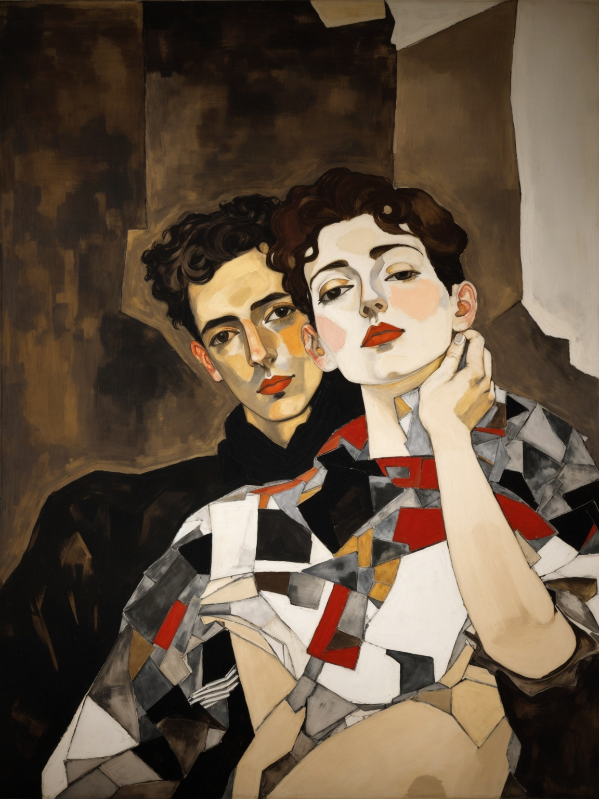
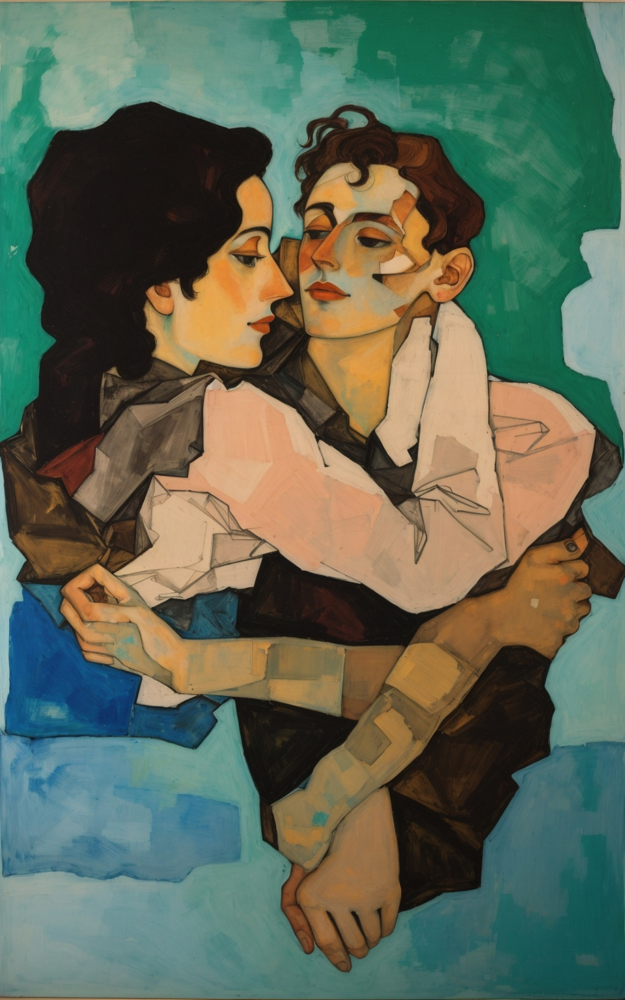
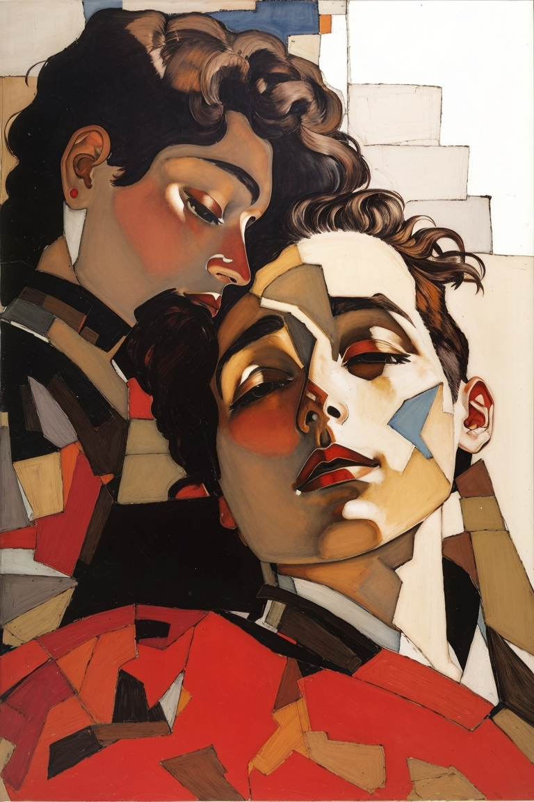

--- 

  

**Oblatio**

I wish to give the windings of the moon to you 
the blunt interrogation of the dawn 
mercilessly posed before the soul of men 

the streets unwalked the libraries 
a page randomly taken—violently taken from a secret book 
and mysticism and dew 

I desire to offer all that I’ve never possessed 
but in what I live ungotten to you 

the locust-stricken regions of a tree 
the unsuspected darkness of the rose 
the never solitary loneliness of me 
under a winter-rain someday perhaps maybe 

I wish to offer silence 
dead and weary silence to you 

and that is all I am to offer to you 

this is the eternal water of generous cosmologies 
the stars reflected clear, as well eternal, in the water 
the silence of a dreaming child—these are my offerings to you 

this I confess before the night amidst the speeches of the water: 
that time the sands of time the cruelty of time I give to you 

This I confess before the moon that evil star: 
I longingly pursue all that which may evoke you 
hidden under a cloak of almost ethereal gloom  
as sweet as drizzly childish dawns  
only to think of you with unspeakable delight 

before you I extend this sort of death 
that rises from the heart unto the lips 

I seek in every rose the ceasing of the rose 
and in a whispering zest 
I speak your name I speak 
the vicious letters of your earthly name 

---

**Here as we timeless lay**

here as we timeless lay presume that all is timeless 
that each new life is but an instant’s way 
and this ungotten child we have prefigured in a dream 
already bears the guilt of humankind 

yes, in the birth of each new drop of life 
awaits the seeds of all that is unfading 

you’ll see as I see now that you have been 
a wife to me as you were the wife of Abraham 
and that our child awaited in the rose 
that some forgotten eyes saw rise and fall amid the snow 

---

**Una esmeralda negra?**

era obsidiana antigua lo que formaba tu alma? 
una esmeralda negra? 

vi una vez —fue hace ya tiempo 
todavía eran eternos los jazmines— 
arenas minerales en tu pecho 
rubí entre tus pezones caudalosos 
un mar y caracolas con espuma 
corales luminosos de tu vientre 

eras un monumento del agua y de la tierra 
y en cuarzos y cristales 
vi tu dios y tu barro originarios 

una esmeralda negra? 
 

---

  

**Volver al agua**

soñé con todas las almas 

el polvo de muchos siglos 
las ensuciaba 

amor (yo dije) quisiera 
volver al agua 
floreciente de tus pechos 
volver al agua...! 

todas sintieron el eco 
de esa plegaria 

todas supieron el sueño 
que yo soñaba: 

volver al agua 

---

**Malos ánimos**

quisiera ser un hombre simple 

quisiera sospechar que todavía 
algo de mí no se ha perdido, algo…! 

algo que ansiosa de crueldad y noche 
ceñiste dentro de una azucena muerta 

algo que un tenue gesto de tus manos 
hizo desvanecer, o algo…  

a todas horas 
un huevo lleno de ávidas serpientes 
presiente la fractura inevitable 

¿lo sientes? en mi carne tenebrosa 
la cobra de tu amor ha eclosionado 

quisiera ser un hombre más sencillo 
o un perro que envejece serenamente triste 

entonces nuestro amor no habría perdido 
ni un solo sueño y no florecerían 
estas escamas negras en mi vida… 

no soy un hombre simple, en todo siento 
el eco de un milenio anocheciente 

e incluso en tu ternura, que es perfecta, 
presagio un universo de sospechas 
y en bífidos eclipses anochezco…! 

  

