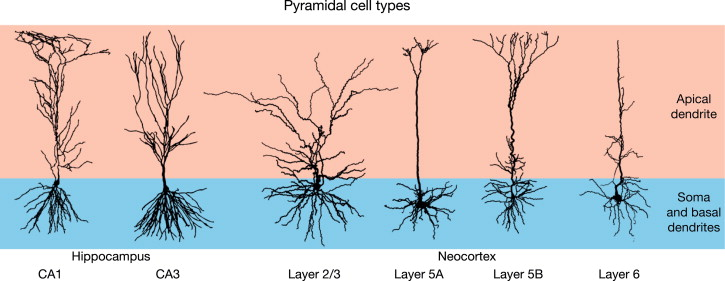
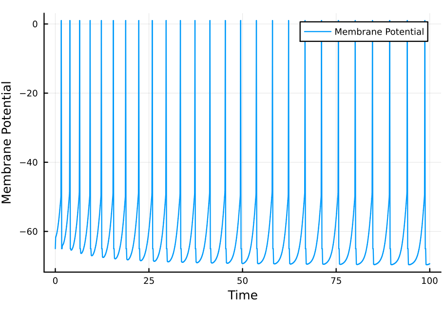

In a [Leaky integrate-and-fire neuron
model](https://slopezpereyra.github.io/2024-01-01-Leaky/), we discussed a simple
model of action potential generation based on Lapicque's work. Some neurons, for
example cortical pyramidal cells, show a slight decrease in their firing rate
until a certain stable rate is reached. This phenomenon is termed spike-rate
adaption. 


<p align="center">
  
</p>

Firstly, recall the basic leaky integrate-and-fire model, where a single leakage
current is considered.


$$ \tau_{m} \frac{dV}{dt} = E_{L}-V + R_{m}I_{e} $$

In order to include spike-rate adaption, we can include an extra current in the
model with a certain conductance $g_{sra}$. This current is modeled as a $K^{+}$
flow; thus, it is a hyperpolarizing current flowing out of the cell (positive
sign) with an equilibrium potential $E_{K}$. 


$$\begin{equation} \tau_{m} \frac{dV}{dt} = E_{L}-V + R_{m}I_{e} - r_mg_{sra}(V-E_{K}) \end{equation}$$

We follow Dayan and Abbot in assuming that this conductance relaxes to zero
exponentially obeying 

$$\tau_{sra} \frac{dg_{sra}}{dt} = -g_{sra}$$


> Evidently,
>
>$$
>\begin{align*}
>-\tau_{sra} \int \frac{1}{g_{sra}}dg_{sra} &= \int dt \newline -\tau_{sra} \ln
>|g_{sra}| +C_1 &= t + C_2 \newline g_{sra}(t) &= A\exp(-t/\tau_{sra})
>\end{align*}
>$$
>
>where $A$ must be defined to satisfy some initial condition when $t = 0$.
>Initially, $g(0)=A$. 


Here, $r_m$ is a constant of proportionality that determines
the strength of the influence of the hyperpolarizing current. For example, $r_m$
may be understood to reflect the density of the $K^{+}$ channels involved in the
spike-rate adaptation. Greater values of $r_m$ naturally imply a stronger degree
of adaptation. 

To model spike-rate adaptation, after each spike we increase $g_{sra}$ by a
certain amount $\Delta g_{sra}$. We do this specifically by altering the initial
condition of $g_{sra}$ (the value of $A$ in its derivation) after each spike.
Thus, the hyperpolarizing current increases after each spike, further
difficulting the generation of an action potential and thus effectively increasing
interspike intervals.

---


Let us derive the voltage function of this model. Observe that integrating
equation $(1)$ yields

$$ 
\begin{align*}
    \tau_m \int \frac{1}{E_L+R_mI_E-V-r_mg_{sra}V+r_mg_{sra}E_K} dV&= \int dt \newline 
    \tau_m \int \frac{1}{V(-r_mg_{sra}-1)+u}dV &= t+C \newline 
    \tau_m \int \frac{1}{Vw+u} dV &= t+C
\end{align*}
$$

Let $z = Vw+u$ so that $dz = w dV$. Then 

$$
\begin{align*}
    \frac{\tau_m}{w}\int \frac{1}{z} dz &= t+C \newline 
    \ln |z| &= \frac{tw}{\tau_m} + C' \newline 
    z&= A\exp(tw/\tau_m)
\end{align*}
$$

It follows that 

$$
V(t)= \frac{A\exp(tw/\tau_n) - u}{w}
$$

If $t = 0$ then $V(0) = (A - u)/w$ from which follows $A= V(0)w+u$. 


---

This is sufficient for us to implement our model. We will use the same
parameters as in  [Leaky integrate-and-fire neuron
model](https://slopezpereyra.github.io/2024-01-01-Leaky/) for the leaky current.
The $K^{+}$ adaptation-inducing current is modeled with a conductance of $100$,
$\tau_{sra} = 1, Δg_{sra} = 40, r_{m} = 0.1$ and $E_K = -70$. Except for the
equilibrium potential of $K^{+}$, the other parameters were not selected to
match real experimental data but rather to clearly show the adaptation.

```julia
using Plots 

const equilibrium_potential = -65
const membrane_resistance = 10
const external_current = 2
const V₀ = -65
const Vᵣ = -65
const threshold = -50
const τ = 10
const dt = 0.1

const Eₖ = -70
const τₛ = 1
const rₘ = 0.1
const Δg = 40

function gsra(t, gₛ)
    if t == 0 
        return gₛ
    end 

    gₛ * exp(-t/τₛ)
end

function V(t, gₛ)
    if t == 0
        return(V₀)
    end 
    u = equilibrium_potential + membrane_resistance * external_current + rₘ * gsra(t, gₛ)*Eₖ
    w = -rₘ*gsra(t, gₛ) - 1
    
    (V(0, gₛ)*exp(t*w/τ)-u)/w
end

function sim(T, dt, gₛ)
    v = V₀
    values = []
    t = 0
    for i in 0:dt:T
        if v == 1 
            v = Vᵣ  
            push!(values, v)
            t = 0
            gₛ += Δg
            continue
        end
        if v > threshold 
            v = 1 
            push!(values, v)
            continue
        end
        v = V(t, gₛ) 
        t += dt
        push!(values, v)
    end
    plot(0:dt:T, values, xlabel="Time", ylabel="Membrane Potential", label="Membrane Potential")
end

sim(100, 0.1, 100)

```

<p align="center">
  
</p>


