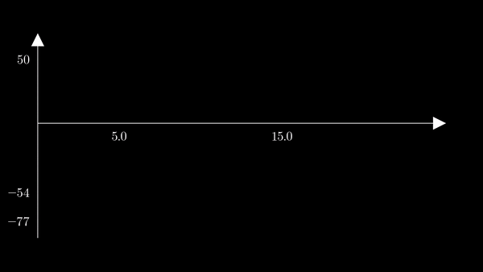
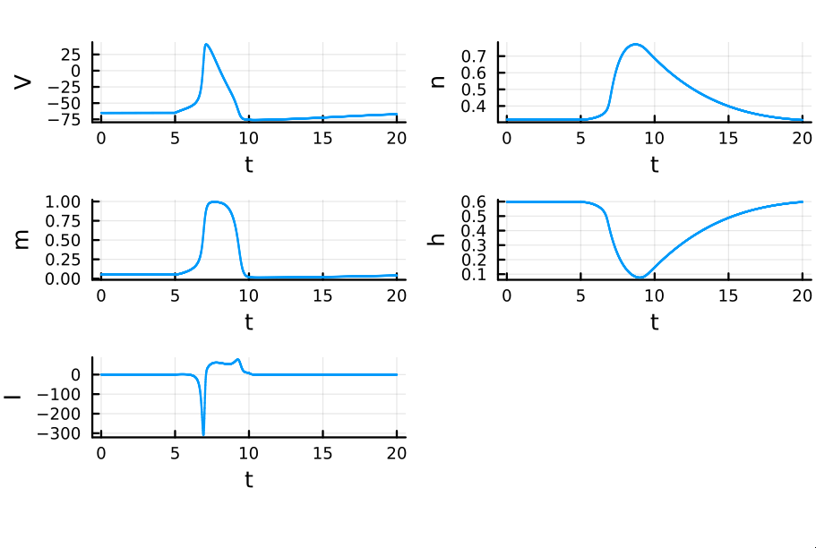
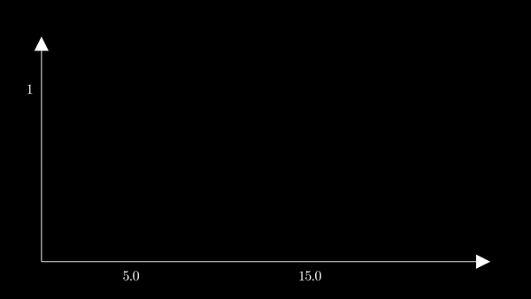
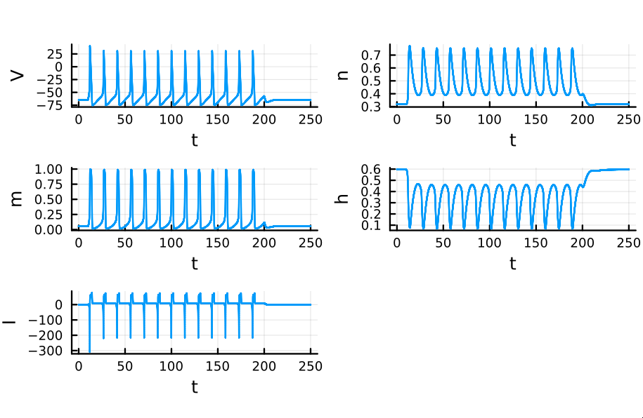

This is an action potential - or rather an accurate simulation of one. The curve
represents the membrane potential of a single neuron, to which an external
current is applied from $t = 5$ to $t = 15$. At first glance, the membrane
potential might look like a simple spiking curve. However, highly complex
biophysical mechanisms are involved in generating this electric fluctuation.

<p align="center">
  
</p>

I have reviewed elsewhere a few integrate-and-fire models, such as the
[Leaky](https://slopezpereyra.github.io/2024-01-01-Leaky/) and
[Adaptive](https://slopezpereyra.github.io/2024-01-01-Adaptive/) models. These
treat the conductance of a given current as a constant $g$ and model action
potentials as sudden spikes that appear whenever the membrane potential
surpasses a certain threshold. In reality, conductances are not constant and vary
with several factors, such as the membrane potential, the influence of
neurotransmitters, and other biochemical factors. The seminal Hodgkin-Huxley
model deals with voltage-dependent conductances. Curiously, the model was
developed studying the squid giant axon. 

In this model, which I used to generate the animation above, membrane channels
are treated as gating mechanisms that open and close due to voltage-dependent
conformational changes in their structure. The "gates" in these channels are
comprised of several sub-units, all of which must be in an open state for the
gate to be opened. Although the treatment of this gating structures is simple in
the model, it reflects actual (but highly complex) cellular mechanisms.

---

*Basic mechanism*. As noted in [Notes on computational
neuroscience](https://slopezpereyra.github.io/2023-03-26-CompNeuro/), at least
two types of voltage-dependent ion channels are required to evoke an action
potential in a neuron. Sodium channels open up in response to an increase of the
membrane potential—for example, due to the opening of neurotransmitter-gated
ion channels and subsequent depolarization—. The influx of
$\text{Na}^{\text{+}}$, due to the lower concentration of this ion in the
interior of the cell, brings the membrane closer to the sodium resting potential
of $\approx +65 \text{mV}$.  This is the mechanism behind the rising phase of
the action potential. This depolarization provokes two separate but
simultaneous phenomena, both occurring about $1 \text{ms}$ after the opening of
the sodium channels: 

- $i.$ A protein blocks the sodium
channels, stopping the influx of this ion;
- $ii.$ Voltage-dependent potassium channels open, and a subsequent efflux of
  $K^{+}$ drives the membrane potential towards its related potassium resting
  potential $(\approx -80 \text{mV})$.

The hyperpolarization caused by $ii$ forces both voltage-dependent channels to
close, which restores the neuron to its resting state.

---

### Potassium

We will first model potassium channels. The gating mechanism of
these channels is modeled as having $k$ sub-units that open and close, so that
when all gates are open the ionic current can flow. We let
$g_{i} = \bar{g_i}P_i$ where $\bar{g_i}$ is the *maximal conductance*
(the product between the conductance of a single channel of type $i$
and the number of said channels) and $P_i$ is the fraction of channels of type
$i$ that are open. Because $P_i$ is a relative frequency it is in fact the
probability that a particular channel of type $i$ is open.

Let $n$ be the *activation variable*, denoting the probability that any given
sub-unit of a potassium channel is open. Since all $k$ sub-units must open in
order to allow for ions to flow through the channel,

$$ P_K=n^{k} $$

is the probability that the channel is open. 

Let $\alpha_n(V)$ be the voltage-dependent opening rate of the sub-units over
a small interval of time. Let $\beta_n(V)$ be the closing rate. Naturally,

$$ P(\text{A sub-unit opens}) =\alpha_n(V)(1-n) $$

$$ P(\text{A sub-unit closes}) =\beta_n(V)n $$

> The functions $\alpha_n, \beta_n$ are fitted using experimental data.
> Themordynamical reasons discussed in Dayan and Abbot's book suggest that
> $\alpha_n$ should be of the form
> 
> $$
> \alpha_n(V) = A_{\alpha}\exp(-qB_{\alpha}V/k_{B}T)
> $$
> 
> where $\exp(-qB_{\alpha}V/k_BT)$ is the Boltzmann factor. $\beta_n$ should have
> such form as well though with different constants $A_{\beta}, B_{\beta}$. 

Now, we may ask how does the *activation variable* $n$ vary with time.
Naturally, this probability should grow with the probability that sub-units open
and fall with the probability that sub-units close:

$$ \frac{dn}{dt} = \alpha_n(V)(1-n)-\beta_n(V)n $$

The equation above states that the probability that a sub-unit is open grows
linearly with the probability that sub-units open and falls linearly with the
probability that sub-units close.

> *Note.* It is important to understand the difference between $n$ and the
> rates given by $\alpha_{n}$ and $\beta_{n}$. The
> *activation variable* $n$ is the probability that a sub-unit *is* open. The
> others are the probability that a sub-unit *becomes* open or closed,
> respectively. In other words, the first is the probability of encountering a
> specific state (open); the others are the probability that a state transition
> occurs.

If we divide the last equation by $\alpha_{n}(V) + \beta_{n}(V)$, we obtain

$$ \tau_n(V)\frac{dn}{dt} = n_{\infty}(V) - n $$

where $\tau_{n}(V) = 1/(\alpha_{n}(V) + \beta_{n}(V))$  and 

$$ \begin{align} n_{\infty}(V) = \frac{\alpha_n(V)}{\alpha_{n}(V) +
\beta_{n}(V)} \ \end{align} $$

This is useful because now $dn/dt$ is entirely described in terms of
$\alpha_{n}, \beta_{n}$. Furthermore, the first equation states that $n$
approaches the limiting value $n_{\infty}$   exponentially with time constant
$\tau_n$. Indeed, for a fixed $V$,

$$ 
\begin{align*} &\tau_{n} \int \frac{1}{n_{\infty} - n} dn &&= t + C \newline
&-\tau_{n}\ln |n_{\infty}-n| +C' &&= t+C \newline  &n_{\infty}-n &&=
\exp\left(\frac{-t}{\tau_{n}}\right) C'' \newline & n(t) &&=n_{\infty}
+\exp\left(-\frac{t}{\tau_{n}}\right) C'' \newline \end{align*} 
$$ 

Solving for
$C''$ we have 

$$ n(t)=n_{\infty}+\exp\left(-\frac{t}{\tau_n}\right)\left(n(0)
-n_{\infty}\right) $$

or numerically 

$$ n(t +\Delta t) = n_{\infty}+\exp \left( -\frac{\Delta
t}{\tau_{n}}\right)(n(t) - n_{\infty}) 
$$ 

Since $\exp(-u)$ decreases
exponentially to zero, the functional form of $n$ clearly shows how $n$
approaches $n_{\infty}$ indefinitely. From the definition of $n_{\infty}$, it is
obvious that this value ranges in $[0, 1]$. This result can be interpreted as
follows: At any given voltage level $V$, the probability that a gating sub-unit
is in the open state approaches $n_{\infty}$ exponentially. This limiting value
is the weight of the opening rate with respect to the transition rate.

### Sodium

Sodium channels are modeled as being gated with with two types of gates that
open transiently with depolarization. One gate type is the same as the one
modeled for potassium channels; their activation variable is termed $m$ and
$m^k$ is the probability that said gate is open if it has $k$ sub-units. The
second type is a blocker gate that may suppress ionic flow when the other gate
is open, and thus the probability $h$ that it is open (not blocking) is termed
*inactivation variable*. This second gating mechanism models the blocking
protein described in our summary of the minimal mechanisms behind action
potential generation. $m$ and $h$ have opposite voltage dependences; $m$
increases with depolarization and $h$ increases with hyperpolarization.
Naturally, the probability that a transient conducting channel is open is given
by

$$ P_{Na}=m^{k}h $$

As in the potassium case, $m$ and $h$ are described by rates $\alpha_{m},
\alpha_{h}, \beta_{m}, \beta_{h}$ with similar properties as before. The values
used by Hodgkin and Huxley to fit these functions are in page 188 of Dayan and
Abbot's book *Theoretical neuroscience*. As before, the limiting value to which
$m, h$ tend is defined as
where $z_{\infty}(V)$ with

$$ \begin{align} z_{\infty}(V) = \frac{\alpha_z(V)}{\alpha_{z}(V) +
\beta_{z}(V)} \ \end{align} $$

where $z$ can be either $m$ or $h$. Because the functional form of the
activation variables are the same, from the derivation of $n(t)$ we can
immediately conclude that for any activation variable $z$ we have


$$ z(t)=z_{\infty}+\exp\left(-\frac{t}{\tau_z}\right)\left(z(0)
-z_{\infty}\right) $$

or numerically 

$$ z(t +\Delta t) = z_{\infty}+\exp \left( -\frac{\Delta
t}{\tau_{z}}\right)(z(t) - z_{\infty}) 
$$ 

### The model 

The Hodgkin-Huxley model is based on the channel kinetics we have so far
described. The current $I$ is given by 

$$
i_{m}=\bar{g_L} (V- E_{L}) + \bar{g_K}n^{4} (V-E_{K) +}\bar{g_{Na}} m^{3}h(V-E_{Na})
$$

The model is implemented using the equation above plus the fact that

$$
c_m \frac{dV}{dt} = -i_m + I_e/A 
$$

and the equations for each activation variable $z$ with their corresponding
limiting values $z_{\infty}$. A possible implementation in Julia is the
following:

```julia
using Plots 

function hh(s, e, T)
    # Maximal conductances used by Hodgkin and Huxley. The order is 
    # Potassium, Sodium, Leakage.
    gmax = [36, 120, 0.3]  
    # Equilibrium potentials fitted by Hodgkin and Huxley in the same order. 
    E = [-77, 50, -54.387]
    I_ext = 0; V = -10; x = [0, 0, 1]; dt = 0.01
    x_plot = []; y_plot = [];
    y_plot_n = []
    y_plot_m = []
    y_plot_h = []
    y_plot_i = []
    for t in range(-30, T, step=dt)
        # Turn external current on or off according to time.
        if t == s  I_ext = 10 end
        if t == e I_ext = 0 end

        # Alpha functions as fitted by Hodgkin and Huxley
        αₙ = 0.01*(V+55)/(1 - exp(-0.1*(V+55)))
        αₘ = 0.1*(V+40)/(1 - exp(-0.1*(V+40)))
        αₕ = 0.07 * exp(-0.05*(V+65))
        α = [αₙ, αₘ, αₕ]

        # Beta functions as fitted by Hodgkin and Huxley
        βₙ = 0.125 * exp(-0.0125*(V + 65))
        βₘ = 4 * exp(-0.0556*(V + 65) )
        βₕ = 1 / (1 + exp(-0.1*(V + 35)) )
        β = [βₙ, βₘ, βₕ]

        # τₓ and x₀, where x₀ is an expression needed to compute 
        # the activation variables
        τₓ = 1 ./ (α + β)
        x₀ = α .* τₓ

        # Numerical integration of activation variables
        x = x₀ + exp.(-dt./τₓ) .* (x .- x₀)

        # Compute conductances 
        g = [gmax[1] * x[1]^4, gmax[2] * x[2]^3*x[3], gmax[3]]

        # Ohm's law 
        I = sum(g .* (V .- E))

        # Update voltage (membrane potential) 
        V += dt * (I_ext - I)

        if t >= 0 
            push!(x_plot, t)
            push!(y_plot, V)
            push!(y_plot_i, I)
            push!(y_plot_n, x[1])
            push!(y_plot_m, x[2])
            push!(y_plot_h, x[3])
        end 
    end
    p1 = plot(x_plot, y_plot, label="")
    ylabel!("V")
    p2 = plot(x_plot, y_plot_n, label="")
    ylabel!("n")
    p3 = plot(x_plot, y_plot_m, label="")
    ylabel!("m")
    p4 = plot(x_plot, y_plot_h, label="")
    ylabel!("h")
    p5 = plot(x_plot, y_plot_i, label="")
    ylabel!("I")
    plot(p1, p2, p3, p4, p5, layout=(5, 1))
    xlabel!("t")
end

```

To show the behavior of the different factors in the model, I first used the
`hh` function above to generate a unique action potential. This action potential
is clearly depicted in the voltage $V$ of the membrane in the plot below.

<p align="center">
  
</p>

I animated the activation variables using Manim in order to illustrate their
reciprocal fluctuations dynamically. The red curve is $n$, the blue curve is
$m$, and the white curve is $h$.

<p align="center">
  
</p>

Recall that $m$ is the probability that a sodium gating sub-unit (of the first
type) is in the open state. The opening of these subunits is the mechanism
behind the rising phase of the action potentials. Initially, $m$ is very close
to zero and virtually no Na$^{+}$ flow exists. At $t = 5$ we inject an external
current, where the rise of $m$ reflects the opening of the sodium channels. For
some brief time, just after $m$ rises, both $h$ and $m$ are active; this
provokes a sudden influx of $Na^{+}$ ions as reflected in the sharp downward
spike of the current $I$. This influx causes the membrane potential to rise
close to the equilibrium potential of Na$^{+}$. However, the rise in the
membrane potential causes $h$ to fall very close to zero, which reflects the
increase in the probability that Na channels are blocked by the blocking
protein. This blocking shuts the Na current. Simultaneously, the rise in
membrane potential provoked a rise in $n$, which reflects an increase in
K$^{+}$. This, combined with the shutting of the Na current, provokes
the hyperpolarization observed in the membrane potential. 

If we do not pause the simulation after the first action potential, but rather
perpetuate the external current for a certain amount of time, action potentials
are repeatedly generated. Each spike in the simulation below is provoked by the
same mechanism as discussed before. The external current was sent from time $t = 0$
to $t=200$.


<p align="center">
  
</p>

