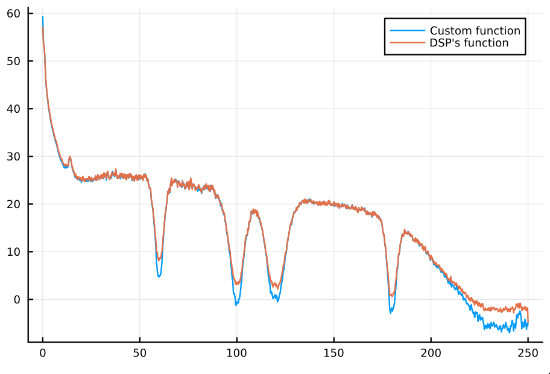
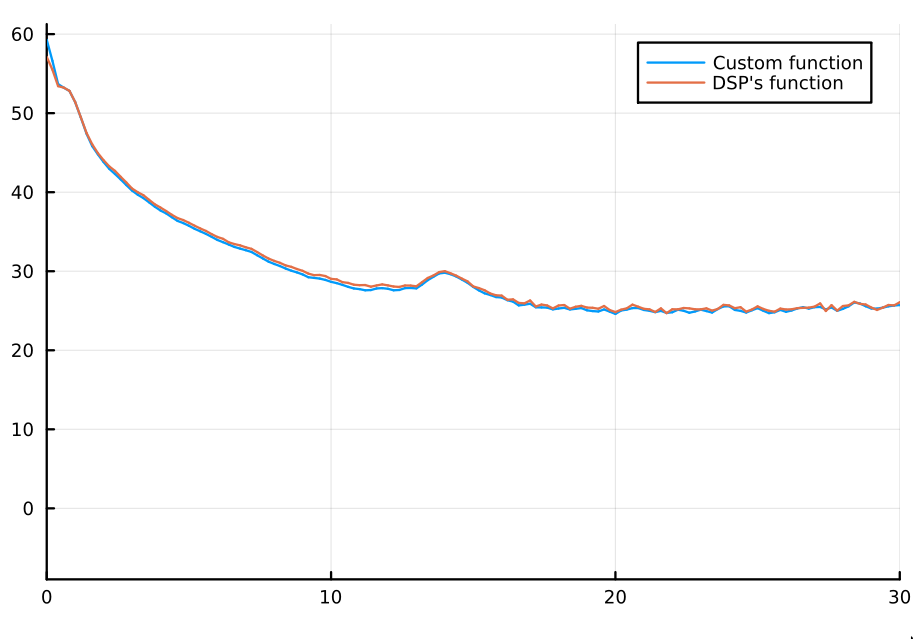

In [another entry](https://slopezpereyra.github.io/2024-04-07-PSDInR/), I gave
a quick review of the fundamental concepts of power spectral analysis and
provided R functions for power spectral density (PSD) estimation. This was
motivated by the fact that, though R is commonly used by social scientists,
packages with PSD estimation functions tend to be rather obscure. A clear
example of this obscurity is `gsignal`'s lack of documentation on the fact that
their `pwelch` function, which uses Welch's method to estimate the PSD of a
vector, normalizes the result to units of power over Hertz.

Here I present Julia algorithms for PSD estimation and show that they correctly 
match other PSD estimation libraries from the Julia environment.

---

```jl
using FFTW
using DSP 

mutable struct PSD
    freq::Vector
    spectrum::Vector

    function PSD(x::Vector, sampling_rate::Int)
        N = length(x)
        hann = hanning(N) # Hanning window
        x = x .* hann
        ft = abs2.(fft(x))
        ft = ft[1:(div(N, 2) + 1)] # Make one sided
        freq = [i for i in 0:( length(ft) - 1)] .* sampling_rate/N
        normalization = 2/(sum(hann.^2)) 
        spectrum = ft * normalization
        new(freq, spectrum)
    end

    # Welch's method. It would be more efficient to create a helper function
    # and perform a single `map`. But this is good and easy to read enough.
    function PSD(x::Vector, fs::Int, L::Int, overlap::AbstractFloat)
        hann = hanning(L)
        segs = overlaps(x, L, overlap)
        map!(x -> x .* hann, segs, segs) # Apply Hanning window
        map!(x -> abs2.(fft(x)), segs, segs) # Compute |H(f)|²
        map!(x -> x[1:(div(L, 2) + 1)], segs, segs) # Make one sided
        map!(x -> 2 .* x ./ ( sum(hann.^2)  ), segs, segs) # (2 * |H(f)|²) / (∑ wᵢ²)
        w = sum(segs) ./ length(segs)
        freq = [i for i in 0:(length(segs[1])-1)] .* fs/L
        new(freq, w)
    end
end
```

where 

```jl
function overlaps(v::Vector{T}, L::Int, overlap_frac::Float64) where T
    if L > length(v)
        throw(ArgumentError("Segment length L must be less than or equal to the length of the vector."))
    end
    
    if overlap_frac < 0.0 || overlap_frac >= 1.0
        throw(ArgumentError("Overlap fraction must be in the range [0, 1)."))
    end

    D = L * overlap_frac
    M = Int(ceil(( length(v) - L )/(L - D)))
    
    segments = Vector{Vector{T}}(undef, M)
    step = Int(floor((1 - overlap_frac) * L))  # Calculate step size
    
    for i in 1:M
        start_idx = 1 + (i - 1) * step
        end_idx = start_idx + L - 1
        
        # Ensure the last segment does not exceed the length of the vector
        if end_idx > length(v)
            break
        end
        
        segments[i] = v[start_idx:end_idx]
    end
    
    return segments
end
```

I compared our estimation with `DSP`'s `welch_pgram` function, with almost
identical results. For the comparison, I used a full-night EEG (8 hours) with a
sampling rate of $500\text{Hz}$. In particular, I used the C3 channel. I did it
without filtering nor artifact-rejecting the data. The result looked like this.


<p align="center">
  
</p>

If I limit the plot to frequencies below $30\text{Hz}$, this is the agreement.
<p align="center">
  
</p>

Pretty good.
