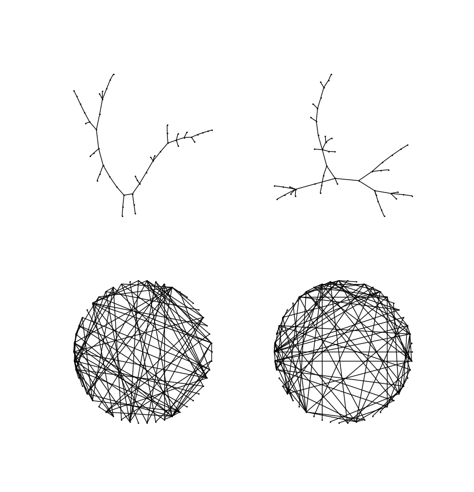
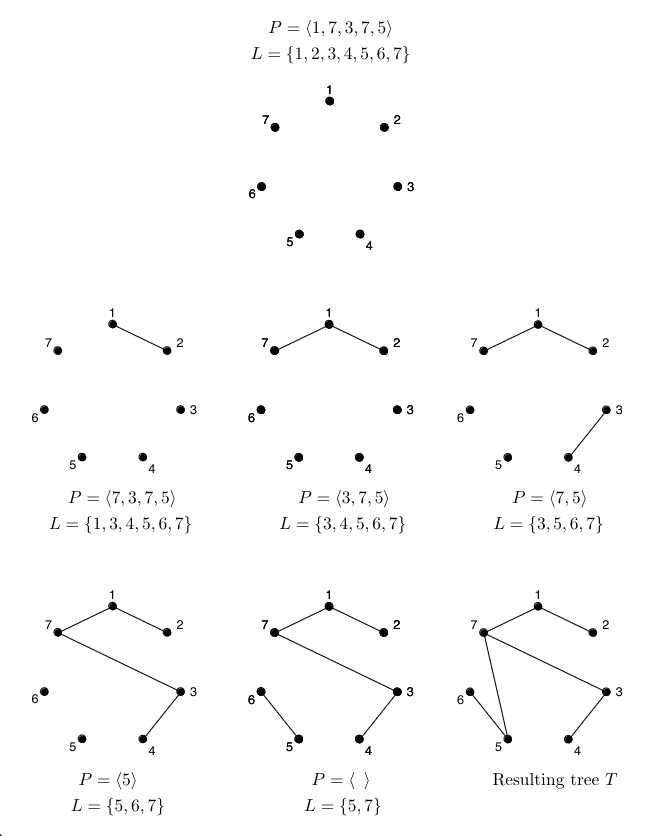
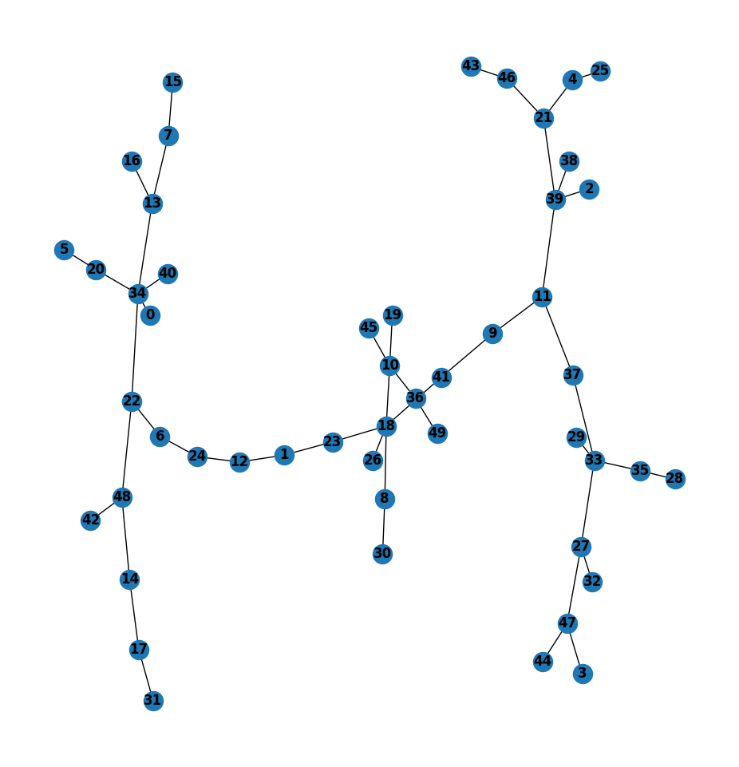
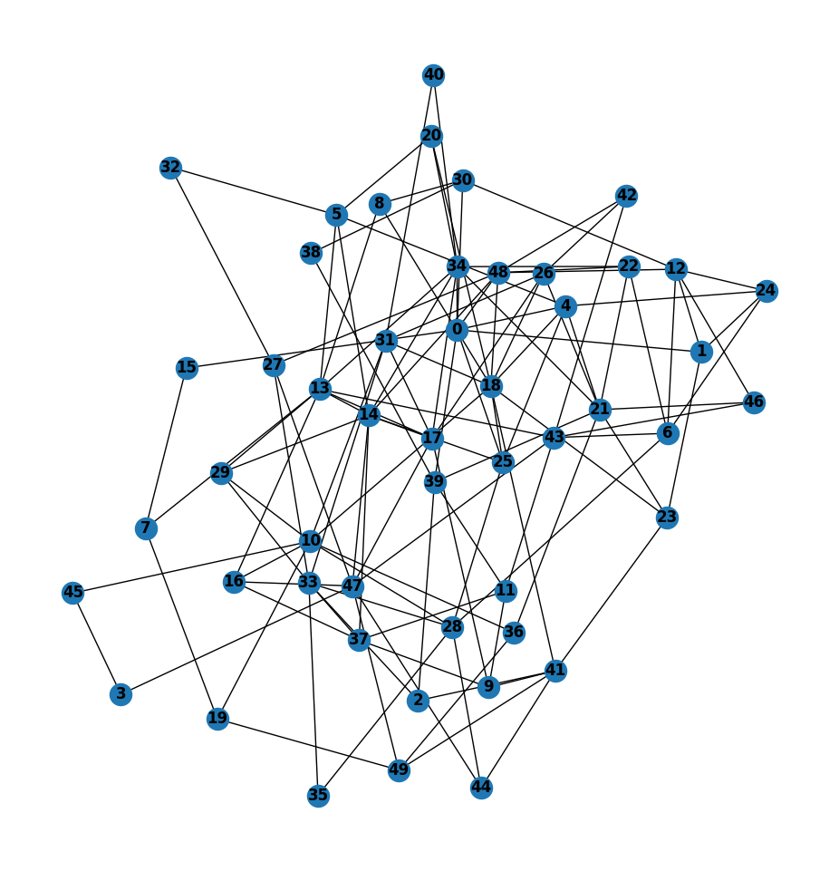
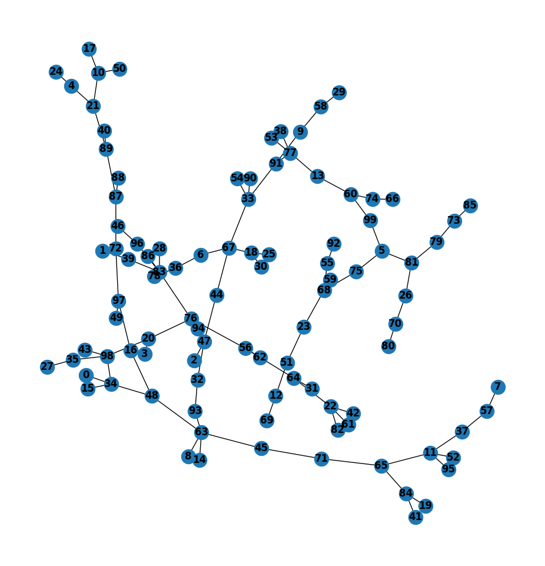
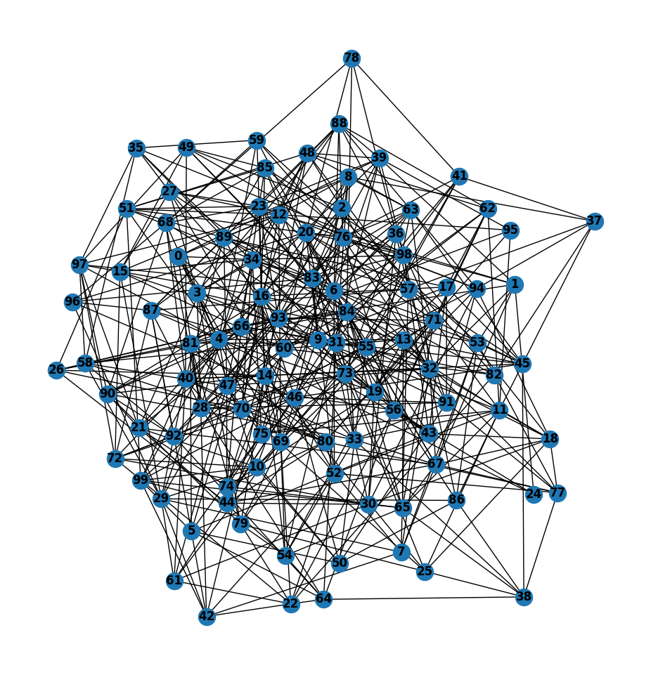
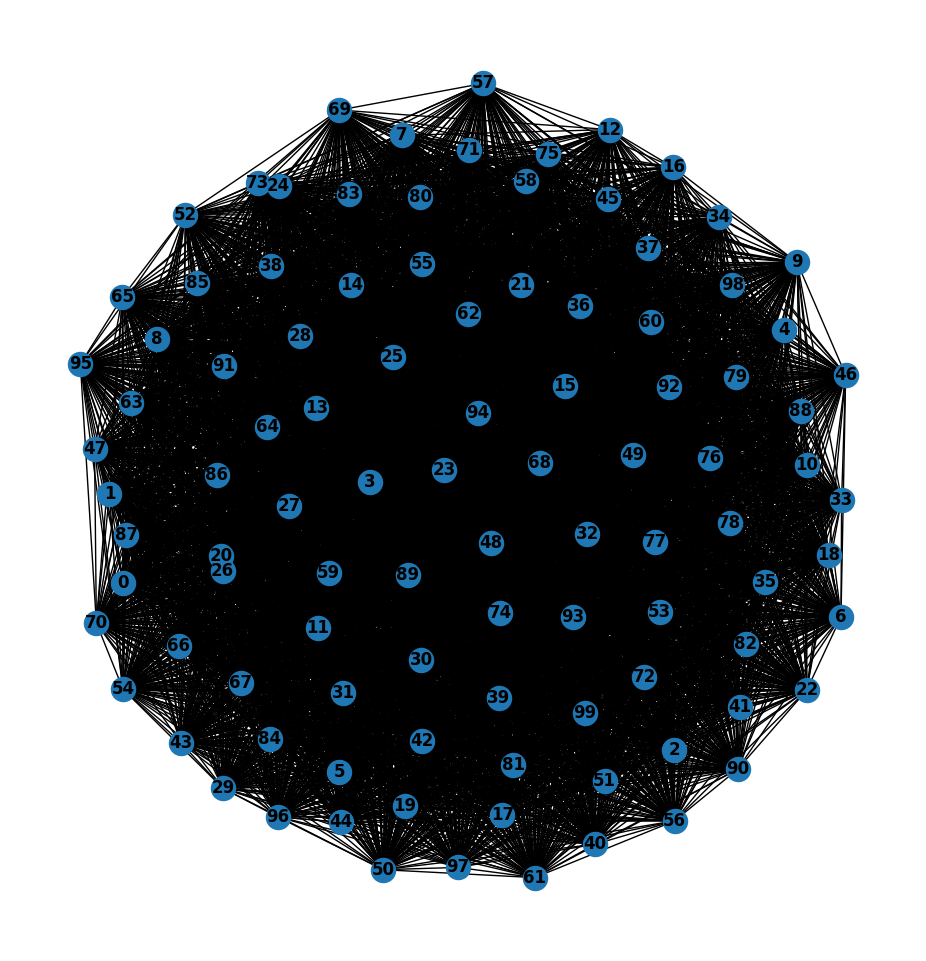
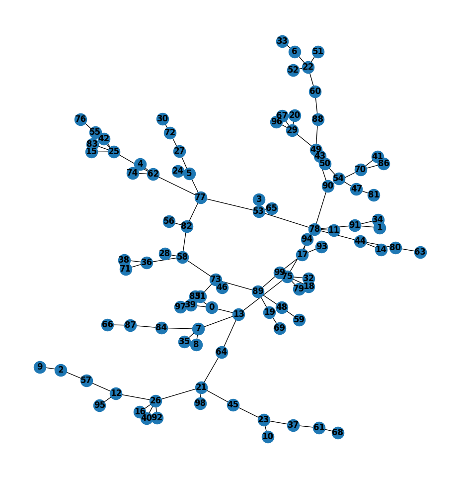

The generation of connected random graphs is non-trivial and important to many
applications. In general, given$n, m \in \mathbb{N}$,  it is not difficult to
sample a random graph from the space of all graphs of $n$ vertices, $m$ edges.
The problem becomes more difficult when we require $(a)$ that the randomly
generated be *connected* and, if possible, $(b)$ that any possible such graph
has the same probability of being generated (i.e. that we sample the connected
graphs with uniformity).

This entry contains two algorithms for sampling random connected graphs. Both
algorithms are of reasonable complexity, as a formal analysis as well as
practical benchmarking will show. Only one of them however, samples graphs with
uniformity, at the expense of some extra computational expense.

  

## Bottom-up approach

The bottom-up approach consists in generating a random spanning tree and
constructing a random graph from it by adding edges. The advantage of this
approach is that, once a spanning tree is generated, edge-adition is guaranteed
to preserve the connectivity invariant.

Before proceeding, let us give a few definitions.

-   We use $\mathcal{T}_n$ to denote the set of all trees of $n$ vertices,
$\mathcal{G}_n$ the set of all graphs with $n$ vertices, and $\mathcal{G}\_{n,
m}$ the set of all graphs with $n$ vertices and $m$ edges. We shall assume the
vertices of these graphs are labeled $1, \ldots, n$.

-   For any $T \in \mathcal{T}_n$, we define $\mathcal{U}_T := \left\\{ G \in
\mathcal{G}_n : T \subseteq G  \right\\}$ and refer to it as *the universe* of
$T$. Thus, the universe of $T \in \mathcal{T}_n$ is the set of graphs spanned
by $T$.

-   Let $\Lambda(n) = \\{ \\{ x, y \\} : x, y \in \\{ 1, \ldots, n\\}    \\}$,
the set of all possible edges in a graph of $n$ vertices.

### Prüfer sequences

The Prüfer sequence of $T \in \mathcal{T}_n$ is a word over the alphabet
$\Sigma = \\{0, \ldots, n - 1\\}$ of length $n - 2$. Prüfer proved that there
is a bijection between $\mathcal{T}_n$ and $\Sigma^{n-2}$ (which incidentally
provided a nice proof of the fact that there are $n^{n-2}$ distinct trees of
$n$ vertices). We will use random Prüfer sequences to construct random trees. 

Let $T_2$ denote the unique tree of two vertices. Let $L$ be the label-set,
i.e. the set of natural numbers which label the vertices of our graphs. Then, a
recursive algorithm for constructing the tree corresponding to a Prüfer sequence $p
= p_1\ldots p_{n-2}$ over a label set $L$ is the following:

$$
\\begin{align*}
&\\textbf{ begin } \\textbf{f}(p, L) \\\\
&\\quad\\quad\\textbf{if } |p| = 0 \\textbf{ do} \\\\ 
&\\quad\\quad\\quad \\quad  \\textbf{return } T_2 \\text{ with labels in } L\\\\ 
&\\quad\\quad\\textbf{else} \\\\ 
&\\quad\\quad\\quad\\quad k := \\min_j \\{ j \\notin p\\} \\\\ 
&\\quad\\quad\\quad\\quad L' := L - \\{k\\}\\\\
&\\quad\\quad\\quad\\quad p' := p_2\\ldots p_{n-2} \\\\ 
&\\quad\\quad\\quad\\quad T := \\textbf{f}(p', L') \\\\ 
&\\quad\\quad\\quad\\quad V(T) := V(T) \\cup \\{k\\} \\\\ 
&\\quad\\quad\\quad\\quad E(T) := E(T) \\cup \\{\\{k, p_1\\}\\} \\\\ 
&\\quad\\quad\\quad\\quad \\textbf{return } T\\\\ 
&\\quad\\quad\\textbf{fi} \\\\ 
&\\textbf{end}
\\end{align*}
$$

Here is an illustration of the algorithm ran on $p = 17375$, $L =
\mathbb{N}_7$. The illustration is taken from [this
source](https://www.cs.tufts.edu/comp/150GT/documents/Prufer%20sequences%20-%20from%20[%20Gross,%20Yellen%20]%20%20Graph%20Theory%20and%20Its%20Applications,%203e.pdf).

  

### The bottom-up algorithm

Let $T_w$ denote the graph corresponding to the Prüfer sequence $w$. Given a
tree $T$ we define the *spanning edges* of $T$ as $S_T = \Lambda(n) - E(T)$.
Observe that $\emptyset \in S_T$ and is the set of edges required to span $T$
out of $T$.

Then, for any fixed $n$, we let the language $\left\\{ 1, \ldots, n
\right\\}^{n-2}$ be the index set of an indexed family of functions
$\mathcal{F}$ defined as:

$$\begin{align*}
    \mathcal{F}(w) : \mathcal{U}_{T_w} &\to S_T  \\\\
    \mathcal{F}(w)(G) &= E(G) - E(T_w)\end{align*}$$

It is easy to see that $\mathcal{F}(w)$ is a bijection, and that with it 
we are ready to provide the following generation pipeline:

$$
\text{Random Prüfer sequence} \to \text{Tree} \to S \in S_T \to G \in \mathcal{U}_T
$$

obvious procedure is the following. Given an desired number of vertices $n$,

> *(1)* Generate randomly $p = p_1\ldots p_{n-2} \in \Sigma^{n-2}$.
>
> *(2)* Span the tree $T = (V, E)$ of the Prüfer sequence $p$.
>
> *(3)* Let $k \in_R \left\\{ 0, \ldots, \frac{ n(n-1) }{2} \right\\}$.
>
> *(4)* Let $\ell_1, \ldots, \ell_k \in_R S_T$, all
> distinct.
>
> *(5)* Let $E = E \cup \left\\{ \ell_1,\ldots, \ell_k \right\\}$

Because all trees of $n$ vertices correspond to a sequence, all trees can be
sampled. And all connected graphs can be derived from the set of all spanning
trees. Then this procedure generates all graphs in $\mathcal{G}_n$.

The question is whether it is equally likely to generate any two graphs
in $\mathcal{G}_n$. It is obvious that it is equally likely to generate
any tree. And the probability that a given graph is generated depends
entirely on the number of spanning trees it contains. Not all graphs
have the same number of spanning trees. $\therefore$ It is more likely
to generate a graph with many spanning trees than a graph with few
spanning trees.

--- 

The second effective procedure extends the input from only $n$, the number of
vertices, to $m$, the number of edges. Thus, it specifies the problem further
into the question of how to generate more or less dense graphs of $n$ vertices.
The effective procedure consists simply in generating $T_w$ and sampling $\ell
\in_R S_T$ repeatedly until $|E_T| = m$.

$$
\begin{align*}
    &\\textbf{Input: } n, m\\\\
    &T := (V, E) = \\textbf{genRandomTree}(n)\\\\
    &S_T := [\\Gamma^c(v_1), \\ldots, \\Gamma^c(v_n)]  \\\\
    &C := [ |S_T[1]|, \\ldots, |S_T|[n]|]  \\\\
    &V := [1, \\ldots, n]   \\\\
    &n' := n\\\\
    &\\textbf{while } |E(T)| < m \\textbf{ do } \\\\ 
    &\\qquad i := \\textbf{random}(1, n') \\\\ 
    &\\qquad v := V[i]\\\\
    &\\qquad \\textbf{if }  d(v) == n - 1  \\textbf{ do } \\\\ 
    &\\qquad \\qquad \\textbf{deleteAt}(V, i)\\\\ 
    &\\qquad\\qquad n' := n' - 1 \\\\ 
    &\\qquad\\textbf{else } \\\\ 
    &\\qquad\\qquad j = \\textbf{random}(1, C[v])\\\\
    &\\qquad\\qquad w := S_T[v][j] \\\\ 
    &\\qquad\\qquad E(T) := E(T) \\cup  \\left\\{ v, w \\right\\} \\\\
    &\\qquad\\qquad C[v] := C[v] - 1 \\\\ 
    &\\qquad\\qquad \\textbf{deleteAt}(S_T[v], j)  \\\\ 
    &\\qquad\\qquad\\textbf{deleteElement}(S_T[w], v)\\\\ 
    &\\qquad\\textbf{fi}\\\\
    &\\textbf{od}\\\\
    &\\textbf{return }
\end{align*}
$$

Generating a tree from a random Prüfer sequence is $O(n^2)$. Forming $S_T$ is
also $O(n^2)$. Within the while loop there are simply index manipulations, so
the complexity of the loop is $\varphi \times O(1) = \varphi$, with $\varphi$
the complexity of the number of iterations.

All iterations add an edge except those where a saturated vertex is
chosen. A saturated vertex may be chosen at most once. $\therefore$
There are $O(n)$ iterations where a saturated vertex is chosen. Since
the rest of the iterations add an edge, their number is fixed:
$m - (n-1)$, where $(n-1)$ is the number of edges in the spanned tree.
$\therefore$ There are exactly $m -n + 1$ edge-adding iterations.

$\therefore  \varphi = O(n) + O(m - n + 1) = O(n) + O(m) = O(m)$

$\therefore$ The complexity of the algorithm is
$O(n^2) + O(m) = O(n^2)$.

I showcase here random graphs with their source random trees as generated by
this algorithm. The left-most graph is the random tree which spanned the
right-most graph. The algorithm was implemented in C but the generated graphs
were plotted using the `networkx` Python package.

  
  

  
  

## Top-down approach

A top-down approach analogous to the previous algorithms would in principle
consist in the generation of a $K_n$ and the random removal of edges in the
graph. This involves some extra complexity: while adding edges to a connected
graph cannot disconnect it, removing edges from a graph may do so. Thus, on
each iteration, some algorithmic process should determine if an edge can be
deleted or not without violating the connectivity invariant. 

Thus, an effective procedure goes as follows. Given $n$ and a desired number 
of edges $m$,

> *(1)* Generate $K_n = (V, E)$.
>
> (2) Let $V_c = V$ the list of vertices which can be pruned.
>
> *(3)* Let $v \in_R V_c$, $w \in_R \Gamma(v)$.
>
> (4) Check if removing $\\{v, w\\}$ preserves connectivity; if so, remove it from $E$.
>
> (5) Define $\Gamma(v) = \Gamma(v) - \\{w\\}$, $\Gamma(w) = \Gamma(w) - \\{v\\}$, regardless 
> of whether the edge was removed.
>
> (6) If $d(z) = 1$ or $\Gamma(z) = \emptyset$, remove $z$ from $V_c$, where $z \in \\{v, w\\}$.
>
> *(7)* If $|E| \neq m$, go to (3).

Assume $\textbf{BFSFind}(E, x, y)$ is an algorithm that checks if there
is a path from $x, y$ in a given edge set. Then a pseudo-code 
implementation of the effective procedure above is:

$$
\begin{align*}
&(V, E) := \\textbf{genKn}(n)\\\\
&\\Gamma := [\\Gamma(v_1), \\ldots, \\Gamma(v_n)]\\\\
&V_c := [v_1, \\ldots, v_n]\\\\ 
&\\textbf{while } |E| \\neq m \\textbf{do } \\\\ 
&\\quad\\quad v = \\textbf{randFrom}(V_c) \\\\ 
&\\quad\\quad w = \\textbf{randomFrom}(\\Gamma[v]) \\\\ 
&\\quad\\quad \\Gamma[v] = \\Gamma[v] - \\{w\\} \\\\ 
&\\quad\\quad \\Gamma[w] = \\Gamma[w] - \\{v\\} \\\\ 
&\\quad\\quad \\textbf{if BFSFind}(E - \\{v, w\\}, v, w) \\textbf{ do}  \\\\ 
&\\quad\\quad\\quad\\quad E := E - \\{v, w\\}\\\\
&\\quad\\quad \\textbf{fi}  \\\\ 
&\\quad\\quad \\textbf{if } d(v) = 1 \\lor \\Gamma[v] = \\emptyset \\textbf{ do } \\\\
&\\quad\\quad\\quad\\quad V_c := V_c - \\{v\\} \\\\ 
&\\quad\\quad\\textbf{fi}  \\\\ 
&\\quad\\quad \\textbf{if } d(w) = 1 \\lor \\Gamma[w] = \\emptyset \\textbf{ do } \\\\
&\\quad\\quad\\quad\\quad V_c := V_c - \\{w\\} \\\\ 
&\\quad\\quad\\textbf{fi}  \\\\ 
&\\textbf{od}
\end{align*}
$$

Generating a $K_n$ is $O(n^2)$. The $\textbf{while}$ selects a random vertex
from $V_c$ and attempts to erase one of its edges. There is only one case one
an edge is not removed; namely, when the sampled edge is a bridge. This happens
at most once per bridge. There are at most $n - 1$ bridges in a graph.
$\therefore$ There are $O(n)$ iterations which do not remove an edge.

The remaining iterations will remove an edge and there will be exactly
$\frac{n(n-1)}{2} - m$ of them.

$\therefore$ There are $O(n) + O(\frac{n(n-1)}{2} - m) = O(n^2 - m)$
iterations.

The operations in each iteration are $O(1)$ except BFS. The complexity of BFS
grows linearly with the number of edges. $\therefore$ BFS is $O(n^2)$.

$\therefore$ The algorithm is $O(n^2) + O(n^2 - m)O(n^2) = O(n^4 - n^2m)$.

In practice the algorithm will perform better than this. BFS is stops whenever
$w$ is find starting from $v$. This still is asymptotically $O(|E|)$, but in
practice the bound will seldom be reached. Furthermore, BFS is ran on
increasingly sparser graphs. Its asymptotic complexity is given by the number
of edges in the initial $K_n$, but it decreases with each edge-removing
iteration.

Below, I display a $K_{100}$ and the random tree generated from it.

  
  

To prove that the algorithm is correct and unbiased requires more
formalization. Let $\mathcal{C}\_{n,m} \subset \mathcal{G}\_{n,m}$ be the set
of connected graphs of $n$ vertices, $m$ edges. Let $\mathbb{C}(n,m) =
|\mathcal{C}\_{n,m}|$. Let $\mathcal{E}\_{n, m}$ be the
class of edges which, if removed from a $K_n$, produce a graph in
$\mathcal{C}\_{n, m}$. Since any $G \in \mathcal{C}\_{n, m}$ corresponds
univocally to a set of edges $W \in \mathcal{E}\_{n,m}$,

$$
|\mathcal{E}_{n, m}| = \mathbb{G}(n, m)
$$

and there is a bijection $f\_{n,m} : \mathcal{E}\_{n,m} \mapsto \mathcal{C}_{n,
m}$ mapping a set of edges to the connected graph generated by removing those
edges from $K_n$.

We shall prove that *(1)* our algorithm effectively constructs a $W \in
\mathcal{E}\_{n,m}$ and computes $f(W)$ and *(2)* that any $W \in
\mathcal{E}\_{n,m}$ has an equal probability of being constructed.

*(1)* The algorithm iteratively removes edges ensuring that the
connectivity invariant is preserved. It is trivial to see that it removes $k :=
\binom{n}{2} - m$ edges. Let $S = \\{e_1, \ldots, e_{k}\\}$ be the set of
randomly sampled edges, where $e_i$ was sampled at the $i$th edge-removing
iteration.

Preserving the invariant entails that, across iterations, the sampling spaces
$E_1, \ldots, E_r$ from which edges to remove are sampled are:

- $E_1 = \\{ e \in W : W \in \mathcal{E}\_{n,m}  \\}$
- $E_2 = \\{ e \in W : W \in \mathcal{E}\_{n,m} \land \\{ e_1 \\}  \subseteq  W  \\}$
- $E_3 = \\{ e \in W : W \in \mathcal{E}\_{n,m} \land \\{ e_1, e_2 \\}  \subseteq  W  \\}$

etc. Thus, the general form is $E_i = \\{ e \in W : W \in \mathcal{E}\_{n,m} \land \\{ e_1, \ldots, e\_{i-1}\\} \subseteq W \\} $.

It follows that $S = \\{ e_1, \ldots, e_k \\} \subseteq W$ for some $W
\in \mathcal{E}\_{n,m}$. But $|S| = |W| = k$. Then $S = W$ and $S \in
\mathcal{E}\_{n,m}$. And since $S$ is the set of removed edges, the algorithm
computes $f(S)$.

*(2)* Since there is a bijection between $\mathcal{C}\_{n,m}$ and
$\mathcal{E}\_{n,m}$, a graph is more probable than others if and only if there
is a set $S \in \mathcal{E}\_{n,m}$ that is more probably constructed than others.
This could only be true for two cases: *(1)* An edge or set of edges in
$S$ is more likely to be chosen, or *(2)* $S$ contains more elements
than other members of $\mathcal{E}\_{n,m}$. But *(1)* is impossible if
the selection is random, and *(2)* contradicts that $|S| = \binom{n}{2} - m$ for every $S \in \mathcal{E}\_{n,m}$.

$\therefore$ The algorithm is correct and unbiased.

--- 

As an appendix, let us derive $\mathbb{C}(n,m)$. It is straightforward to
reason that 

$$
\begin{align*}
    |\mathcal{G}_{n,m}| = \binom{\frac{n(n-1)}{2}}{m}
\end{align*}
$$

This inspires the definition of a generating function for the class
$\mathcal{G}_{n, m}$ of graphs of $n$ vertices, $m$ edges:

$$
\begin{align*}
    A(z, u) &= \sum_{k=0}^{\infty}\left(\sum_{r = 0}^{\infty} \binom{\frac{k(k-1)}{2}}{r}  u^r\right) \frac{z^k}{k!}\\\\
                                                               &=\sum_{k=0}^{\infty}(1 + u)^{\frac{k(n-1)}{2}} \frac{z^k}{k!} \\\\
                                                               &= 1 + \sum_{k=1}^{\infty} (1+u)^{k(k-1)/2} \frac{z^k}{k!}
\end{align*}
$$

An important observation is that any $G \in \mathcal{G}\_{n,m}$ is a set of
elements $G_1, \ldots, G_r \in \mathcal{C}\_{n, m}$. Informally, any graph is a
set of connected graphs. Since the relationship of the class $\mathcal{G}\_{n,
m}$ and the class $\mathcal{C}\_{n, m}$ is the set-of relation, the generating
function $C(z, u)$ of $\mathcal{C}\_{n,m}$ is satisfies

$$A(x) = e^{C(z, u)}    $$

Then

$$
\begin{align*}
    C(z, u) &= \ln \left[1 + \sum_{k=1}^{\infty} (1+u)^{k(k-1)/2} \frac{z^k}{k!}\right] \\\\
    &= \sum_{q=1}^{\infty} \frac{ (-1)^{q+1} }{q} \left[ \sum_{k=1}^{\infty}\left( 1+u \right)^{k (k-1) / 2} \frac{z^k}{k!}  \right]^{q} 
\end{align*}
$$

Thus, $C(z, u)$ is the generating function of the composite sequence
$\\{\\{|\mathcal{C}\_{n, m}|\\}\_{n\geq 1}\\}\_{m\geq 0}$. The resulting 
expression for the number of connected graphs of $n$ vertices, $m$ edges is:

$$
\begin{align*}
    \mathbb{C}(n, m) = n! ~ [ z^n ][ u^m ] \sum_{q=1}^{\infty} \frac{ (-1)^{q+1} }{q} \left[ \sum_{k=1}^{\infty}\left( 1+u \right)^{k (k-1) / 2} \frac{z^k}{k!}  \right]^{q} 
\end{align*}
$$

where $[z^n][u^m]C(z, u)$ are the $n$th and $m$th coefficients of the
generating functions for the polynomials dependent on $z$ and $u$,
respectively. 

> **Example**. For $m = n - 1$ (i.e. connected trees) across $n = 2, 3,
> \ldots$, $\mathbb{C}$ effectively produces the sequence
> 
> $$    1, 1, 3, 16, 125, 1296, \ldots  = \{n^{n-2}\}_{n\geq2 }$$
> 
> which we know is correct because there are $n^{n-2}$ Prufer sequences of
> length $n$.

