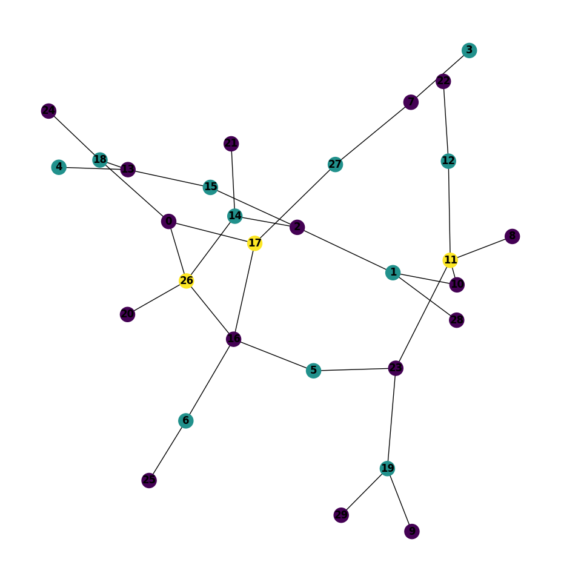

--- 
title: Climbing the Hill of Seven Colors
categories: [ Science ]
---

The [Hill of Seven
colors](https://en.wikipedia.org/wiki/Cerro_de_los_Siete_Colores) is a
beautiful hill bordering the *Quebrada de Humahuaca* in Jujuy. Here, we shall
climb a different, though also colored, hill. We shall see how the optimization
algorithm commonly called *Hill climbing* can improve the coloring of a graph.

Hill climbing is a mathematical optimization algorithm. Given a function $f :
\mathbb{R}^n \to \mathbb{R}$, the algorithm takes an arbitrary
$\overrightarrow{x} \in \mathcal{D}_f$ and compares $f(\overrightarrow{x}),
f(\Delta \overrightarrow{x})$. If the sfhit increases the function, it lets
$\overrightarrow{x} := \Delta\overrightarrow{x}$; otherwise it lets
$\overrightarrow{x} := -\Delta\overrightarrow{x}$. The process is repeated
until some criteria is met.

Hill climbing can be used to optimize the greedy coloring of a graph. The use
of this algorithm for greedy coloring is justified by a nice theorem.

Given a graph $G = (V, E)$, the parameter of the Greedy coloring algorithm
$\mathcal{G}$ is an order $\mathcal{O} = v_{i_1}, \ldots, v_{i_n}$ of the
vertices, where the $i_j$ define the coloring order of $V = \\{ v_1,
\ldots, v_n \right\\}$. Thus, shiftes in the parameter space correspond to
changes in the coloring order.

Such permutations lack a nice property of real functions; namely, that
their parameters can only be shifted in two directions: positive or
negative. Instead of these two choices, an order $\mathcal{O}$ of $n$
vertices has $n!$ permutations. We cannot try them out and chose the one
that maximizes our function.

However, there is a property which points to permutations that may not
necessarily improve the coloring, but are guaranteed not to worsen it.
Such property reduces drastically the space of candidate permutations.
In fact, given an initial ordering $\mathcal{O}$, this space of
alternative permutations is often so small that none of them improve the
coloring. Thus, it is common to generate $k$ random initial orderings
$\mathcal{O}_1, \ldots, \mathcal{O}_k$, so as to explore their (reduced)
permutation spaces, in hope that one of their permutations will in fact
improve the coloring.

> **Theorem.** Let $G = (V, E)$ a graph with a proper coloring of $r$
> colors $C = \\{ c_1, \ldots, c_r \\}$. Let
> $V_{c_i} := \\{ x\in V
>     : c(x) =c_i \\}$. Let $P : C \to C$ a permutation of
> $c_1, \ldots, c_r$; i.e. $P(c_i) = c_j$ entails the $i$th color
> becomes the $j$th color.
>
> $\mathcal{G}$ with the order $V_{P(c_1)}, \ldots, V_{P(c_r)}$ colors
> $G$ with at most $r$ colors.

The proof of this theorem is simple to do inductively over $r$. I will not 
write it here. All that matters is that, if $\mathcal{G}$ colored $V$ into
groups $V_{c_1}, \ldots, V_{c_r}$, then coloring first the vertices with color
$P(c_1), P(c_2), \ldots, P(c_r)$ is at least as good as the original coloring.
The permutation $P$ of the theorem is arbitrary. In general, one uses
permutations that put vertices with highest colors or highest degrees first,
since these are the problematic ones. We will define a few such permutations.

**Permutation 0.** The first permutation will order the vertices from
last to first color. Thus, assuming $\mathcal{G}$ used $r$ colors, the
order will be $V_{c_r}, \ldots, V_{c_1}$.

A pseudo-code implementation:

$$\begin{align*}
    &\\mathcal{O} = \\textbf{int } Array[n]\\\\
    &\\mathcal{D} := \\textbf{Queue } Array[r] \\\\
    &\\textbf{for } 1 \\leq i \\leq n \\textbf{ do} \\\\ 
    &\\qquad push!(i, \\mathcal{D}[c(v_i)])\\\\
    &\\textbf{end}\\\\
    &\\textbf{int } i := 0\\\\
    &\\textbf{for } queue \\textbf{ in } \\mathcal{D} \\textbf{ do}\\\\
    &\\qquad\\textbf{while } queue \\neq \\emptyset \\textbf{ do}\\\\
    &\\qquad \\qquad O[i] = pop(queue) \\\\ 
    &\\qquad \\qquad i = i + 1\\\\
    &\\qquad\\textbf{end}\\\\
    &\\textbf{end}\\\\
    &\\textbf{return } \\mathcal{O}
\end{align*}$$

The first for loop is $O(n)$. Since $\sum_{i}^r |\mathcal{D}_i| = n$,
the second for loop with its inner while is $O(n)$. $\therefore$ The
algorithm is $O(n)$.

**Permutation 1.** The second permutation we will write is a simple
cardinality permutation. The color with the most number of vertices goes
first, the color with the least number of vertices goes last. There are
at most $O(n)$ sets $V_{c_i}$. Using QSort we have $O(n \log n)$
complexity.

**Permutation 2.** We will order the colors using their divisibility.
First will come all colors divisible by four, then all colors divisible
by 2, and then all other colors. In pseudo-code,

$$
\begin{align*}
    &x = | \\left\\{ c \\in C : c \\equiv 0 \\mod 4 \\right\\}  |\\\\
    &y = | \\left\\{ c \\in C : c \\equiv 0 \\mod 2 \\land c \\not\\equiv 0 \\mod 4 \\right\\}  |\\\\
    &\\mathcal{O} = \\textbf{int } Array[n] \\\\ 
    &\\textbf{int }u = v = w = 0 \\\\
    &\\textbf{int } index\\\\
    &\\textbf{for } i \\in \\left\\{ 1, \\ldots, r \\right\\}  \\textbf{ do }\\\\ 
    &\\qquad\\textbf{while } \\mathcal{D}[i] \\neq \\emptyset \\textbf{ do}\\\\
    &\\qquad\\qquad v = pop(\\mathcal{D}[i]) \\\\ 
    &\\qquad\\qquad \\textbf{if } i \\equiv 0 \\mod 4 \\textbf{ do} \\\\ 
    &\\qquad \\qquad \\qquad index = u \\\\ 
    &\\qquad\\qquad\\qquad u = u + 1 \\\\ 
    &\\qquad\\qquad\\textbf{else if } i \\equiv 0 \\mod 2 \\textbf{ do } \\\\ 
    &\\qquad\\qquad\\qquad index = x + v\\\\ 
    &\\qquad \\qquad \\qquad v = v + 1 \\\\ 
    &\\qquad\\qquad\\textbf{else do}  \\\\ 
    &\\qquad\\qquad\\qquad index = x + y + w\\\\ 
    &\\qquad \\qquad \\qquad w = w + 1 \\\\ 
    &\\qquad\\qquad\\textbf{fi}\\\\
    &\\qquad\\qquad \\mathcal{O}[index] = v \\\\ 
    &\\qquad\\textbf{od}\\\\
    &\\textbf{od}
\end{align*}
$$

which is $O(n)$ of course.

I generated a random graph of $n = 30$ vertices and $m = 32$ edges. I
tested the permutations and found that the last permutation coloured the
graph with $1$ less color than the other ones. To the left, the Greedy
coloring over the natural order of the vertices; to the right, the
coloring over the order of **Permutation 2**.

  
  

It is the same graph, but the plotting algorithm displayed it differently.
Importantly, the coloring to the left, over the natural order, uses four
colors; the coloring to the right, over the order of **Permutation 2**, uses
three colors.

Graph coloring is an extremely difficult problem which cannot be solved in practice 
for most graphs. Hence, heuristics that approximate decent solutions, such as the one
presented here, are important. 
