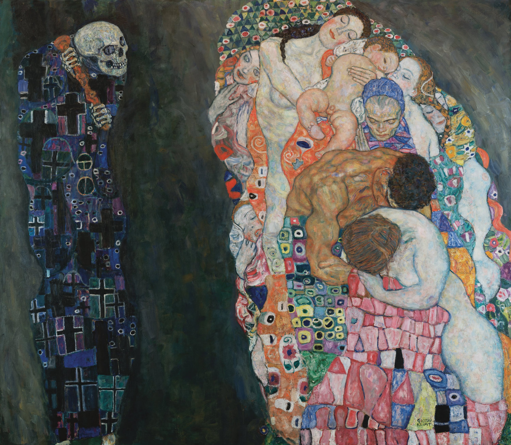

Quand j'avais dix-sept ans, je visitai le temple jaïniste de Ranakpur. J'y
appris l'existence d'une pratique encore répandue aujourd'hui. Les moines
jaïnistes mènent une vie d'ascétisme silencieux. Certains d'entre eux, ayant
atteint l'émancipation suprême, s'abandonnent à la méditation et à la
désintégration par inanition.

Durant le même voyage, je visitai le fort de Jaisalmer, érigé à l'aube du
deuxième millénaire après Jésus-Christ. Au XIIIe siècle, tandis que les femmes
commettaient le jauhar, les quelques hommes survivants, succombant au siège de
l'envahisseur Alâ ud-Dîn, quittèrent le fort pour mourir au combat.

Gödel, qui était paranoïaque, mourut d'inanition par peur d'être empoisonné.
Mishima, cet écrivain exquis, commit le seppuku lorsque son coup d'État échoua.
Caton d'Utique rechercha la mort d'une manière semblable : vaincu par Jules
César, il plongea son épée dans sa poitrine et déchira ses entrailles avec ses
propres mains. Sénèque mourut d'une mort lente et bureaucratique sur ordre de
Néron. L'agent bolivien qui assassina le Che Guevara raconta que ses derniers
mots furent: «Calmez-vous et visez bien: vous allez tuer un homme». Severino Di
Giovanni, faisant face à l'exécution, dit à son avocat: «Je suis conscient de
ma situation et je n'ai pas l'intention de me dérober à quelque responsabilité
que ce soit. J'ai joué, j'ai perdu. Comme tout bon perdant, je paie le prix de
ma vie». Socrate, par respect pour un verdict qu'il savait injuste, refusa
d'être sauvé par ses amis. Le moment venu, il but la ciguë calmement, et sa
dernière pensée fut à propos d'une dette qu'il ne voulait pas laisser impayée.

<figure style="text-align: center;">
  
  <figcaption>La vie et la mort de Gustav Klimt</figcaption>
</figure>

Au cœur de l'ethos chrétien se trouve la volonté de mourir. Dieu
lui-même s'incarna pour souffrir une mort terrestre. Origène souffrit deux annés
de torture aux mains de Dèce: il jugea la mort un moindre mal que de renier sa
foi. La Bible est du même avis: Dans l'Évangile selon Marc, Pierre dit à Jésus:
«Quand il me faudrait mourir avec toi, je ne te renierai pas». Dans les
*Samuel* 31:4, on nous dit que Saül, vaincu par les Philistins, dit à son
écuyer:

>Tire ton épée, et m'en transperce, de peur que ces incirconcis ne viennent me
>percer et me faire subir leurs outrages. Celui qui portait ses armes ne voulut
>pas, car il était saisi de crainte. Et Saül prit son épée, et se jeta dessus.

Hilaire de Poitiers, quand il était en Syrie, sut que sa fille était courtisée
par des hommes très riches et puissants. Inspiré par l'idée qu'aucun mariage
n'était préférable pour sa fille que le mariage avec Dieu, il pria pieusement
pour sa mort. Curieusement, elle mourut, et il se consola de sa mort. Son
épouse, qui trouva aussi du bonheur en la mort de sa fille, lui demanda de prier
pour sa propre mort. Et, peu après, elle mourut d'une mort qui les satisfit tous
les deux.

Bien que nous sentions une certaine inclination à considérer la mort volontaire
comme un mal, c'est en fait surprenant avec quelle résolution une personne peut
renoncer à la volonté de vivre ou se consacrer à la volonté de mourir. Quand
j'étais jeune, me surprenait la facilité avec laquelle certains organismes
peuvent renoncer à la volonté de perpétuer leurs propres vies. (Je ne comprenais
pas la théorie de l'évolution.) Il est fascinant que la nature soit assez
complexe pour produire des agents qui semblent la contredire. Sur ce point, elle
ressemble à un créateur qui confère à sa création la faculté de se rebeller,
concept qui est la racine du mythe chrétien, comme le dit Milton:

>Because we freely love, as in our will 
>To love or not; in this we stand or fall: 
>And some are fall'n, to disobedience fall'n (...).

Bien des destinées sont pires que la mort, et la mort n'est pas le pire des
malheurs, si toutefois elle est un malheur. Lucrèce soutenait, de manière
irréfutable, que nos sentiments par rapport à la mort devraient être similaires
à ceux que nous éprouvons à l'égard de notre inexistence avant de naître. Lucain
considérait la mort comme si précieuse qu'il estimait injuste que tout le monde
puisse mourir. L'immolation collective est tragique et grotesque, mais il paraît
indiscutable que le destin qui attendait les femmes et les enfants du fort de
Jaisalmer était encore pire. C'est vrai que la plupart d'entre nous éprouvent un
attachement à la vie, et que nous ne désirons pas «go gentle into that good
night». Mais les exemples que j'ai donnés montrent qu'il y a place pour la paix,
y compris la satisfaction, dans ce crépuscule éternel.

