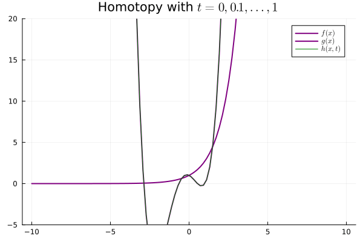

Let $(X, \mathcal{U}_X), (Y, \mathcal{U}_Y)$ two topological spaces. As
in most structures, we say these are homeomorphic if there is a
bijection $f : X
\mapsto Y$ s.t. $f$ and $f^{-1}$ are continuous maps. We must recall
that, in a topological context, a map is continuous iff for any
neighborhood $V$ around $f(x)$ there is a neighborhood $U$ around $x$
satisfying $f(U) \subseteq V$. Informally, all points \"around\" $x$ are
mapped to points \"around\" $f(x)$.

The intuitive idea is that two spaces are homeomorphic when one is a
deformation of the other that involves only stretching and bending
(tearing up or gluing together sections is forbidden). Naturally, if $f$
is a homeomorphism, then it induces a bijection between the set of path
components of $X$ and the set of path components of $Y$.

The notion of equivalence induced by homeomorphisms is stronger than one
might in principle desire. For instance, a disk in $\mathbb{R}^2$ and a
point $\\{ x \\}$ have the same number of path components and
could in some sense be deemed to have the same shape. However, they are
not homeomorphic, since there is no bijective map from the disk to
$\\{ x \\}$.

The \"weak\" notion of equivalence we are looking for is that of a
*homotopy*. Two functions $f, g : X \mapsto Y$ are homotopic if there is
a continuous map $h : X \times [0, 1] \mapsto Y$ s.t.

$$
\begin{aligned}
    \begin{cases}
        h(x, 0) &= f(x)\\\\
        h(x, 1) &= g(x)
    \end{cases}\end{aligned}
    $$

We say $h$ is a homotopy and we write $f \simeq g$ to say they are
homotopic.

The second paramter $t$, ranging from $0$ to $1$, induces a family of
maps that interpolate \"between\" $f$ and $g$. In other words, for each
$t \in [0, 1]$, $h(-, t) : X \to Y$ is a continuous mapping.

---

  

  
  

---

  
  

---

  
  

---

Our weak notion of equivalence thus emerges, considering maps
$f : X \mapsto Y$ that admit continuous inverses up to homotopy. In
particular, if $X, Y$ are topological spaces, we say they are homotopy
equivalent if $f, g$ are continuous and

$$f\\circ g \\simeq \\mathbb{I}_Y ~ ~ ~ ~ ~ ~ g \\circ f \\simeq \\mathbb{I}_X$$

In other words, two spaces are homotopy equivalent if we can map one onto
the other, and if their compositions result in the identity.

On one hand, any spaces which are homeomorphic are homotopy equivalent.
But take our problematic case of $\\{ x \\}$ and
$B_\epsilon(x)$ a disk with radius $\epsilon$ around $x$. The inclusion
$i : \\{ x \\} \mapsto B_{\epsilon}(x)$ and the constant map

$$p : B_\\epsilon(x) \\to  \\{ x \\}$$

induces a homotopy equivalence. Evidently,

$$( p \\circ i )(x) = p(i(x)) = p(x) = x$$

Now, we can prove $i \circ p \simeq \mathbb{I}_{ B\_\epsilon(x) }$ by
defining the radial contraction

$$h( (r, \\theta), t ) = (tr, \\theta)$$

using polar coordinates. This contraction is equal to the disk when
$t = 0$, "shrinks" it around its center as $t$ increases, and is equal
to the point when $t = 1$. This proves that $i \circ p$ is homotopic to
the identity.
