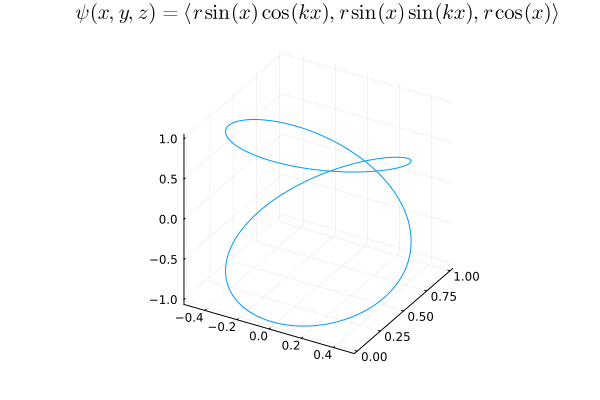

Some things can never be. I draw a curve today which dreams to be a sphere. It
never will be. It reaches, it aspires - but it cannot achieve. 

  

It is beautiful, isn't it? As $k$ tends to infinity, there is no point in an
origin-centered sphere with radius $r$ which cannot be traversed by the curve.
But the curve will never be the sphere.

If you asked me to make it $99\\%$ the sphere, I could. $99.9\\%$? I could.
$99.9999\\%$ percent? I could. But I could never make $100\%$ the sphere.

To live is not to be, but to become. Whatever *is*, is dead.
