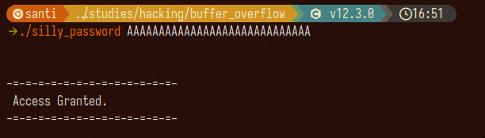
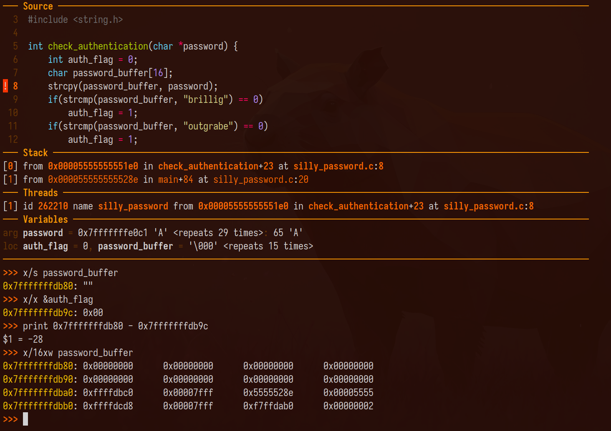
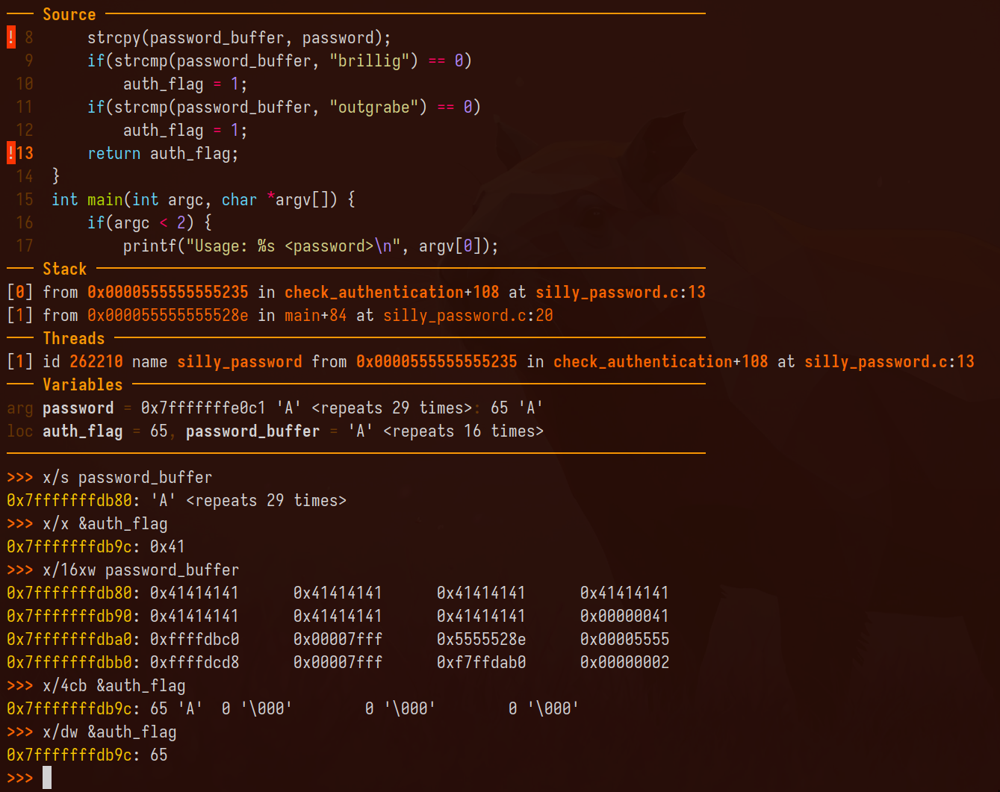
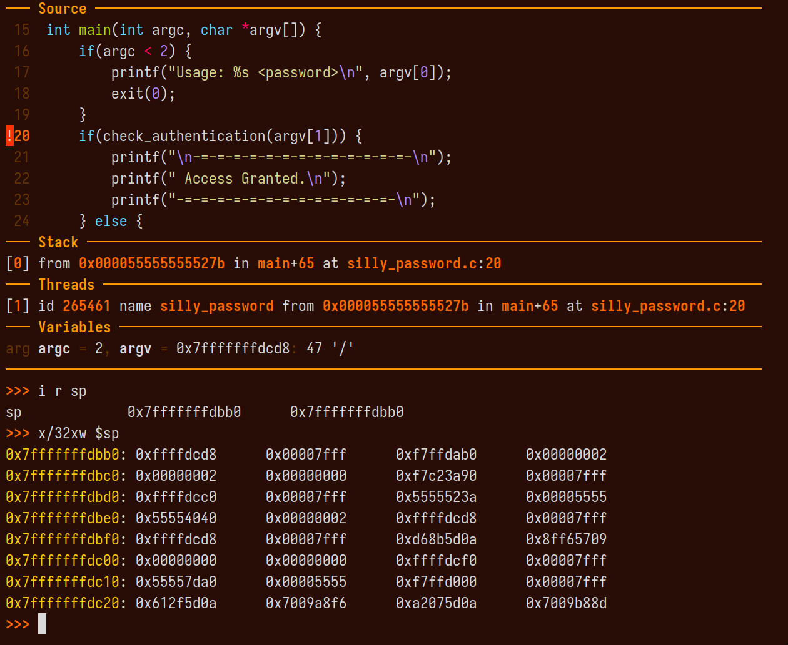
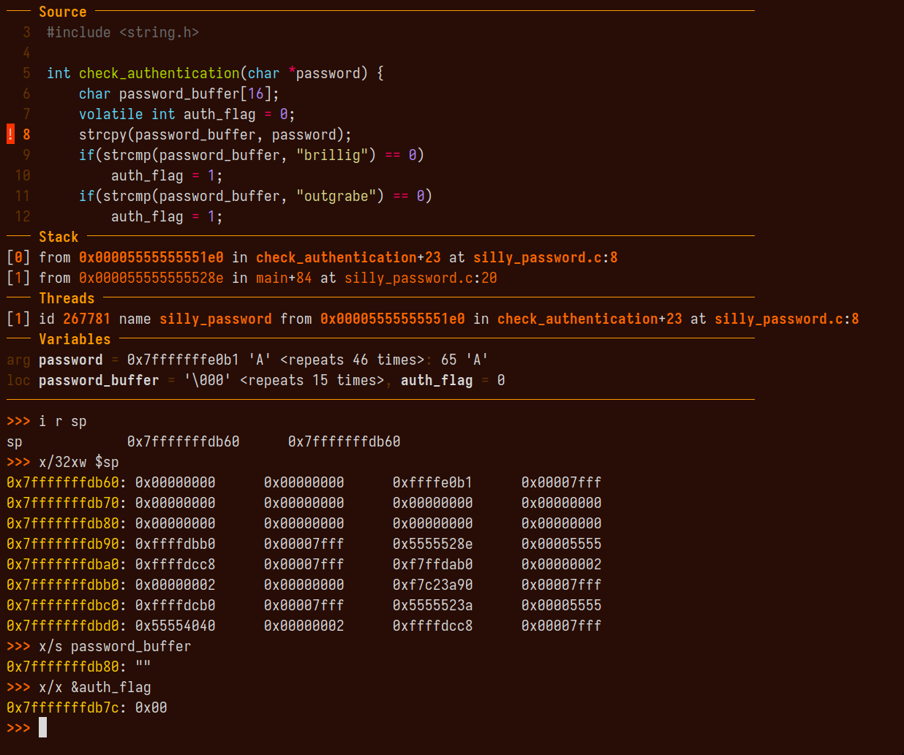
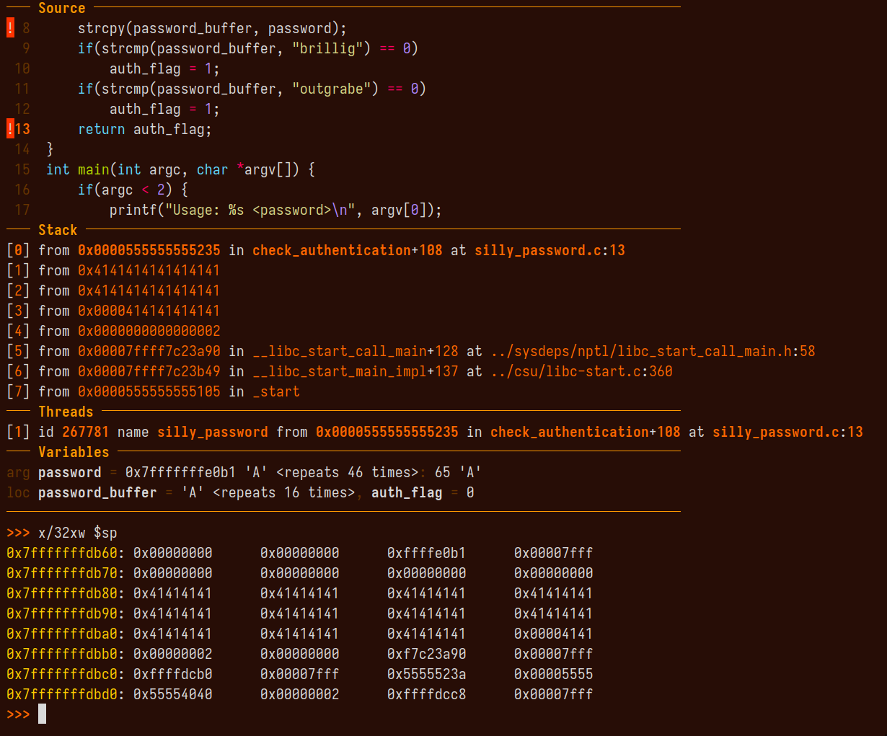

> Ver *Hacking: The art of exploitation*, de Erickson, para referencia.

Un *buffer overflow* es un fenómeno que ocurre cuando $k$ bytes son escritos en un
buffer para el cual sólo habían $w < k$ bytes asignados. Los $k - w := r$ bytes
restantes se "derraman" fuera de la memoria asignada y sobreescriben los bloques
de memoria adyacentes. Si el derrame sobreescribe piezas críticas de
información (por ejemplo, el valor de otra variable del programa), pueden
producirse *crashes* o comportamientos inesperados.

Los *buffer overflows* son una linda excusa para estudiar vulnerabilidades
típicas que pueden ser explotadas de manera linda y creativa. Pero, además, el
estudio de dichas vulnerabilidades se presta bien al análisis de cómo funciona
el stack de un programa y algunos otros mecanismos de bajo nivel. El propósito
de esta entrada es mostrar resumidamente estas cosas bonitas. 

Consideremos el siguiente programa, que llamaremos `silly_password.c`. El
programa toma un *command line argument* (una contraseña) y verifica que sea
idéntico a una de dos strings predefinidas. Si lo es, setea la flag de 
autenticación en 1; de otro modo, la flag permanece en cero. ¿Simple, no?

```c
#include <stdio.h>
#include <stdlib.h>
#include <string.h>

int check_authentication(char *password) {
    int auth_flag = 0;
    char password_buffer[16];
    strcpy(password_buffer, password);
    if(strcmp(password_buffer, "brillig") == 0)
        auth_flag = 1;
    if(strcmp(password_buffer, "outgrabe") == 0)
        auth_flag = 1;
    return auth_flag;
}

int main(int argc, char *argv[]) {
    if(argc < 2) {
        printf("Usage: %s <password>\n", argv[0]);
        exit(0);
    }
    if(check_authentication(argv[1])) {
        printf("\n-=-=-=-=-=-=-=-=-=-=-=-=-=-\n");
        printf(" Access Granted.\n");
        printf("-=-=-=-=-=-=-=-=-=-=-=-=-=-\n");
    } else {
        printf("\nAccess Denied.\n");
    }
}
```

Sí, el programa es bastante tonto: asigna 16 bytes al `password_buffer`
pero jamás chequea que la contraseña quepa en este espacio. ¡Mal! Pero lo que 
nos interesa es ver cómo esta pequeña tontería puede explotarse.

Compilemos el programa con la flag `-fno-stack-protector`, que desactiva los
mecanismos que tiene gcd para prevenir buffer overflows, y ejecutemos

``` 
./silly_password AAAAAAAAAAAAAAAAAAAAAAAAAAAAA
```
Esperaríamos que el programa nos niegue el acceso, dado que nuestra 
contraseña es una total patraña... ¡Pero no! He aquí el resultado:

<p align="center">
  
</p>

Oops... Usemos el `gdb` debugger para entender mejor lo que está pasando.
Como el problema claramente está en la authentication flag, que debería
ser cero, vamos a poner line breaks en la línea 8 y la 13, que corresponden 
a `strcpy(password_buffer, password)` y `return auth_flag`. El primer break 
point se ve así:


<p align="center">
  
</p>

Vemos que el `password_buffer` contiene una string vacía, como es de esperarse,
y la `auth_flag` tiene el valor 0. Pero al imprimir la distancia entre la
dirección de memoria a la que apunta el `password_buffer` y la de la
`auth_flag`, vemos que la misma es -28. Es decir, el `password_buffer` está
ubicado 28 bytes *antes* que la `auth_flag`. Esto se puede ver en la impresión
del bloque de memoria que comienza en `password_buffer`: en la segunda fila,
última columna, hay un registro `0x00000000`. Es precisamente el registro de
`auth_flag`. 

> Observe que hay 16 bytes por registro; esto es, 8 dígitos hex. Del primer registro,
que coresponde al comienzo de `password_buffer`, al anterior del registro de 
`auth_flag`, hay 56 dígitos hex. Y como dos tales dígitos son un byte, allí 
tenemos nuestros 28 bytes de diferencia.

Tal vez ya se empiece a notar la trampa... Veamos el siguiente 
breakpoint.

<p align="center">
  
</p>

Vemos que en el `password_buffer` se escribió la repetición de $A$s que 
escribimos, pero curiosamente el `auth_flag` tiene el valor `0x41`...
Si estudiamos el bloque de memoria que inicia en `password_buffer`, vemos 
que hubo un overflow desde `password_buffer` hacia varios de los registros 
adyacentes, incluyendo (lamentablemente) el último de la segunda fila:
es decir, el de `auth_flag`. El valor `0x41` proviene de que la letra $A$
es el valor ASCII 65, que es `0x41` en hexadecimal. Como escribimos A 
29 veces, el valor `0x41` se repite 29 veces. 

Observemos que las primeras 16 repeticiones de `0x41` son las que están
propiamente contenidas en `password_buffer`, pues tal era el tamaño en bytes
del buffer. De la número 17 a la número 28, los registros de memoria ocupados 
ya son ajenos a `password_buffer`, pero no parecen ocupar la posición de memoria 
de un elemento crítico del programa. Pero como la distancia (en memoria) del buffer 
y la `auth_flag` es 28 bytes, la repetición número 29 de `0x41`, correspondiente a la 
última A, se escribe en la dirección de `auth_flag`. Esto se ve claramente tanto 
en el bloque de memoria de `auth_flag`, que tiene el valor (en formato little-endian)
`0x00000041`, como en la línea 

```c
>>> x/dw &auth_flag
0x7fffffffdb9c:	65
```

donde vemos que el contenido de `auth_flag` es el número 65. 

> Como `auth_flag` es un `int`, `0x41` se interpreta no como la letra `A`,
sino como el número 65.

Consecuentemente, la línea `if(check_authentication(argv[1]))` es equivalente,
en el estado del programa, a `if(65)`, y como `65` es distinto de `0` la
evaluación devuelve `true`.

--- 

*Fair enough*. Pero cuanto hemos dicho depende de la posición relativa (en memoria)
de los dos variables de interés: `auth_flag` y `password_buffer`. Cambiemos nuestro 
código de manera tal que el orden en que estas variables son declaradas es 
invertido:

```c
#include <stdio.h>
#include <stdlib.h>
#include <string.h>

int check_authentication(char *password) {
    char password_buffer[16]; 
    int auth_flag = 0;
    strcpy(password_buffer, password);
    if(strcmp(password_buffer, "brillig") == 0)
        auth_flag = 1;
    if(strcmp(password_buffer, "outgrabe") == 0)
        auth_flag = 1;
    return auth_flag;
}

int main(int argc, char *argv[]) {
    if(argc < 2) {
        printf("Usage: %s <password>\n", argv[0]);
        exit(0);
    }
    if(check_authentication(argv[1])) {
        printf("\n-=-=-=-=-=-=-=-=-=-=-=-=-=-\n");
        printf(" Access Granted.\n");
        printf("-=-=-=-=-=-=-=-=-=-=-=-=-=-\n");
    } else {
        printf("\nAccess Denied.\n");
    }
}
```

La única diferencia entre este código, que llamamos `silly_password2.c`, y el
primero, es que `password_buffer` se declara antes de `auth_flag`. Recordemos 
que el stack no es una cola sino una estructra FILO a la que los elementos 
son *pusheados*. Es decir que la última variable declarada es la que queda 
primero, o "más arriba", en el stack. Por lo tanto, como `auth_flag` se 
declara luego de `password_buffer`, su posición de memoria es *anterior*
a la de `password_buffer`. En otras palabras, ya no podemos usar `password_buffer`
para "derramar" datos hacia `auth_flag`.

> Por supuesto, el lector puede usar gdb para comprobar que la ubicación de 
> `auth_flag` es anterior a la de `password_buffer`.

¿Quiere decir esto que el programa está a salvo? Y... no tanto. Existe otro
punto de acceso que podemos explotar, uno que siempre se encuentra *después* de
las variables locales de un stack frame: su
*return address*.

> ¿No sabe qué es la *return address*? Conside el código 
> ```c 
> printf("Hello"); 
> my_custom_function(); 
> printf("Bye");
> ``` 
> 
> La ejecución de cada una de estas líneas se corresponde con muchas instrucciones 
> en assembly. Cada una de tales instrucciones está guardada en alguna
> dirección de memoria. Un registro especial (en las arquitecturas 
> x86) llamado *Extended instruction pointer* (EIP) contiene, en cada estado, la 
> dirección de la instrucción que debe ejecutarse ahora. En nuestro caso, 
>
>  Cuando se ejecuta una función (por ejemplo, `my_custom_function`), se crea
>  un nuevo stack frame, que contendrá las variables locales de dicha función, sus
>  argumentos, y otros detalles. En particular, contendrá un valor especial
>  llamado *return address*, que guardará la dirección que está en el EIP en el
>  momento en que el stack fue creado Usando el *return address*, el programa
>  sabe qué debe ejecutar una vez la ejecución localizada de la función
>  termina. Por ejemplo, justo antes de ejecutar `my_custom_function`, el EIP 
> apuntaría a la dirección de la primera instrucción de `printf("Bye")`, y tal 
> dirección sería el contenido del *return address* en el stack frame de `my_custom_function`.

Para ver esto más de cerca, examinemos el código con gdb, agregando un nuevo break justo
antes de que se ejecute la función `check_authentication`.

<p align="center">
  
</p>

Vemos que, en este punto, el stack pointer register (SP) es `0x7fffffffdcd8`.
Con `x/32x2 $sp` imprimimos la parte superior del stack. Pasemos al siguiente 
break, en la línea que llama `strcpy`.

<p align="center">
  
</p>

Acá ya vemos un par de cosas interesantes. En primer lugar, la dirección del SP
ahora es `0x7fffffffdb60`. Esta dirección es menor a la anterior. Esto se debe
a que, al hacer lugar en el stack para el nuevo stack frame (es decir, el stack
frame de la función `check_authentication`), el SP se mueve hacia arriba. Además, 
podemos ver en el stack dónde están guardadas las variables `password_buffer`
y `&auth_flag`, y comprobar que esta última está ahora ubicada antes de la
primera. Toda la tercera fila (que empieza en `0x7fffffffdb80`) corresponde a
los 16 bytes de `password_buffer`, mientras la última columna de la segunda
fila corresponde a `&auth_flag` (`0x7fffffffdb7c`). 

Si ejecutamos `info frame`, veremos que la *return address* es `0x5555528e`, es
decir es el valor guardado en la dirección `0x7fffffffdb9b` (cuarta fila,
tercera columna). La idea es simple: `password_buffer` ya no puede sobreescribir 
`auth_flag`, ¡pero puede sobreescribir la *return address*! Pasemos al siguiente 
breakpoint.

<p align="center">
  
</p>

Oops! Acá vemos que, tras la ejecución del `strcpy`, la dirección donde 
guardábamos la return address ha sido arruinada por el derrame de $A$s,
y ahora contiene `0x41414141`. ¿El output?

``` 
Program terminated with signal SIGSEGV, Segmentation fault.
The program no longer exists.
```

En otras palabras, rompimos todo. Esto es lógico, porque una vez terminada la función,
el programa intenta retornar a una dirección que, seguramente, no contiene una instrucción 
válida. Al fin y al cabo, reemplazamos el *return address* con ruido: `0x41414141` no significa 
nada. Pero, asumiendo que usted es pillo, ya debe estar pensando triquiñuelas.
¿Qué pasaría si pudiéramos derramar, en la *return address*, la dirección de una instrucción válida?
¿No tendríamos entonces control sobre el flujo de ejecución? ¿Y qué
podríamos hacer con eso?


