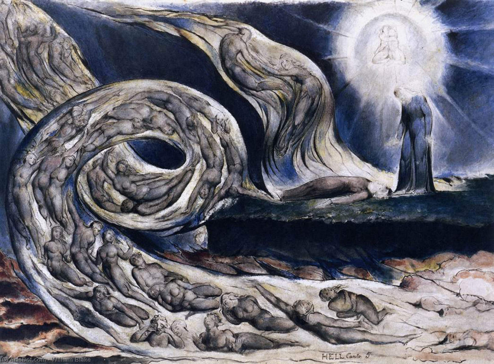
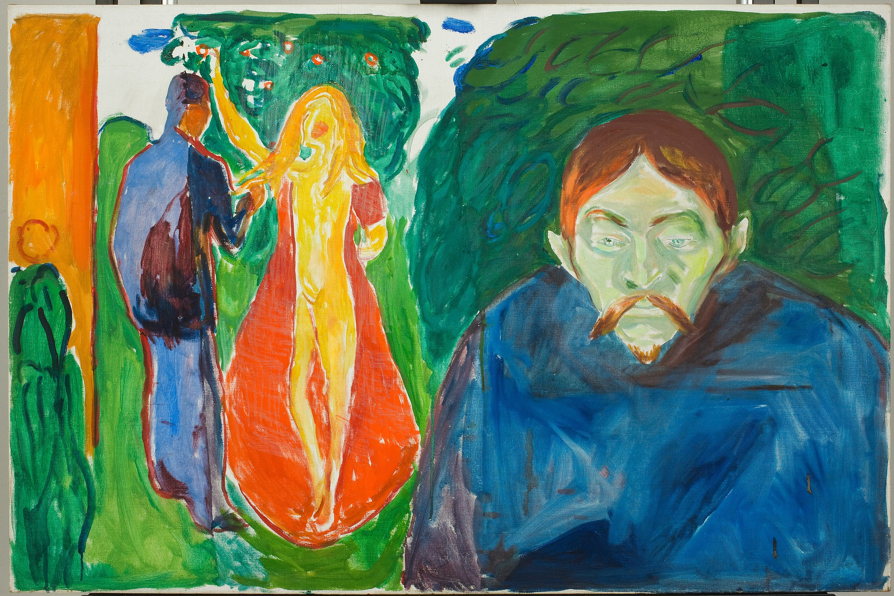

My beliefs about love and sexual freedom are inspired by two convictions which
I hold close to heart: the idea that a rational approach to life is more likely
to produce happiness, and a desire for consequence and integrity.

A rational life does not mean an unsentimental coldness of character. As I
understand it, it means an honest disposition to consider above all, with
regards to any matter, what are the facts. It means an irredeemable abstention
from letting oneself entertain total certainty in any question, and from
believing what feeling, wish, prejudice or whim may make one want to believe. 
It means, lastly, that custom and authority only ought to be accepted when they
can justify themselves. In consequence, a rational life is guided by principles
which genuinely belong to the individual and not to exterior imposition. This is
the romantic archetype which inspired every form of anarchism and, in my view,
classical liberalism. 

Such a disposition, from a psychological perspective, is the most fundamental
precursor of tolerance and liberty. A conscience which equates their like or
dislike for a certain act with its objective moral value will necessarily fall
to egotistical sin. It will always take its own inner structure, with all its
sweet and stormy sentiments, as measure of the world, and therefore pretend that
law, society and customs should forbid what it finds reprehensible, while
fostering what it finds deserving. It will force the shapeless world to its own
disfigured shape, like water poured into a warped vessel, until the world itself
is lost in the impenetrable *maya* of psychological projection. Above all, it
will bring suffering to itself and others, for every interaction will be plagued
with ghosts and myths and omens, all of which have been inadvertently cast by
itself.

My aspiration for a rational life is nothing but that: an aspiration. I often
fail to rise to the standard I set myself. However, it has assisted me in
understanding sex and love, two matters typically filled with prejudice and
stifling superstition, in a manner which I find propitious to happiness. I do
not pretend to be wiser than anyone, nor do I wish to teach. I simply believe
that my reluctance to accept customs alien to my own ideals has aided me in
finding an outlook which, at least, is different from the conventional one.
This, and only this, is what I should like to share.

# Introduction

The term *free love* has two meanings, one philosophical and one
practical. Its philosophical meaning consists of a theory of love—this
is, a set of ideas with respect to what love is, how it ought to be
exercised, and what is its purpose and place in human life. The
practical meaning is the consensual practice and exercise of free love
with others.

I should wish to discuss the philosophy of free love. But before delving
into it, I think it is important to contextualize our discussion and
understand its place and relative importance in human affairs. From the
perspectives of social organization as well as the individual pursuit of
satisfaction and happiness, the matter is of definite importance. The
organization of family, with its wide range of variation across the
temporal and cultural domains, has implications on social order which
cannot be disregarded, and which anthropology has pointed out from
Morgan and Engels onwards. Furthermore, love is, beyond any doubt, one
of the deepest wells of meaning, and one of the most important drivers
of human action alongside the search for knowledge, the desire of money
or power, and the pursuit of creative and artistic realization.

Of course, as love is a source of joy, it is perhaps among the cruelest
sources of anguish, conflict, and hatred. Even the most loving couple
can disintegrate and lose itself to misunderstanding, wickedness
and confusion, and otherwise decent people can commit cruel,
manipulative and unworthy acts under the influence of a broken heart. It is my
belief that, as in most things, love is lived with conflict and
unhappiness due to a lack of a proper education and an incorrect
understanding of its nature and the way it bounds us with one another.
If we could reach a better understanding of love, one guided by freedom,
compassion and tolerance, we would reduce much of the pains it typically
brings about in individual life.

To seriously grasp the intolerance and superstition with which Western culture
(and perhaps most others) has dealed with the passions of love and sex, one need
only consult the ominous depictions of sin and eternal doom which Christianity
and classical works of art have produced. To name a single but extraordinary
example, consider Dante's vision of the doom of sinful lovers, *Canto V*, which
was in turn marvelously depicted in [William Blake's *Whirlwind of lovers*](https://artmuselondon.com/2021/05/11/misery-and-hope-through-motion-visual-musings-of-william-blakes-the-whirlwind-of-lovers/):

    

        I came into a place mute of all light, 
        Which bellows as the sea does in a tempest, 
        If by opposing winds 't is combated. 
        The infernal hurricane that never rests  
        Hurtles the spirits onward in its rapine; 
        Whirling them round, and smiting, it molests them. 
        When they arrive before the precipice, 
        There are the shrieks, the plaints, and the laments, 
        There they blaspheme the puissance divine. 
        I understood that unto such a torment 
        The carnal malefactors were condemned, 
        Who reason subjugate to appetite. 
    

---

    

---

In general, one ought to live an unsuperstitious life. Superstition is founded
in taboo, prejudice, and ignorance, all of which can only produce evil and
sorrow in one's life. If one is to have a negative view of sexuality and love,
let it at least be one founded in noble sentiments and a transparent intellect,
instead of medieval obscurantism and irrational repudiation. But no: most people
still have a supernatural fear of sexuality and love. Especially men seem to
fear and dread the idea of female sexuality. They make it seem as if the
medieval witch, the one bestowed with frenzied and orgiastic spells, is still a
living archetype. Of course, this fear is primarily directed towards their
long-term partners: their girlfriends, their wives, and naturally their mothers.
Outside of this domain, women are either incomprehensible creatures that dwell
somewhere outside the familiar world, or at worst an object from which to derive
a satisfaction that grows more morbid and obscene the more impure and vile it is
conceived to be. Such is the triad of all women before many men’s eyes:
Sanctity, Mystery, and Sin. Nothing exists in-between: there is no individual.
And though this perverse conceptions are certainly disappearing, though rather
slowly, they are still far from eradicated.

Having said that, it is also crucial to understand that the question of whether
love ought to be exercised freely or not—in the sense in which we will
discuss—pales in comparison with other matters. The concentration of power, the
fragility of the democratic order, the fight against state and private tyranny,
and the threat of nuclear or climate disaster, are all examples of questions
which surpass the one we will discuss in importance.

It may seem superfluous to emphasize the relative inferiority of our
question with regards to, for instance, nuclear disaster or state
tyranny. But I believe my generation has mistakenly devoted too much
energy into questions surrounding love, sexuality and identity, while
disregarding others which are more important to human dignity and which
affect a greater number of people. It is impossible not to observe that,
in general, only the privileged have the time as well as the cultural
resources to inquire on the philosophy of free love, not to mention that
so aristocratic form of irreverence that allows certain people to follow
practices which stand completely opposite to accepted customs. As a
rule, an irreverence which would have a significant social cost to a
marginalzed person is, with some luck, condescendingly tolerated as a
curious eccentricity in more educated or privileged circles.

# Philosophy of free love

## What is free love

From my perspective, free love is entirely reducible to anarchism as
applied to personal relations[^1]. Insofar as anarchism is the prosaic
continuation of classical liberalism, one might also conceptualize free
love as an application of classical liberal principles to love. Some of
such principles are a rejection of all authority which cannot survive
scrutiny, a non-renounceable respect of individual freedom, and, as
Bakunin wrote in *God and State*, that

> the liberty of man consists solely in this: that he obeys natural laws
> because he has himself recognized them as such, and not because they
> have been externally imposed upon him by any extrinsic will whatever,
> divine or human, collective or individual.

Thus, the philosophy of free love claims that everyone should be able to
exercise their love of others without the exterior imposition of any
limiting conditions. It accepts axiomatically that love is a virtuous
thing, and therefore that limiting its exercise and expression is
morally equivalent to limiting the exercise and expression of generosity
or kindness.

Exterior impositions to love come in many ways. For centuries, the state
has taken upon itself to handle the private affairs of men and women
alike. The legal institution of marriage, the informal and
consuetudinary precepts of this or that culture, the various religious
principles which establish what forms of love are chaste and which are
vile, are all examples of exterior limitations to the free exercise of
love. All of these, if one adheres at least rudimentary to liberal
principles or their anarchist continuation, ought to be utterly
rejected: their social existence should be dismantled, and their laws,
when organizing our individual life, should be exchanged for others
which we have set for ourselves.

Equivalently, if one believes in free love, one gives up completely any
pretension to impose limitations on the way others exercise, express,
and practice their love affairs. This includes our partners, our sons
and daughters, our friends, and our neighbours. One must recognize that
an individual's pursuit of affective or sexual satisfaction lies
absolutely without the scope of one's domain, surrender altogether all
desire to influence it, and achieve a radical acceptance of it. One must
accept as axiomatic that romantic or sexual interactions between
consenting adults lack any inherent evil and, on the contrary, comprise
at least potentially a virtuous and positive act.

It should be evident that advocating for free love is not logically
equivalent to advocating for non-monogamy. The advocacy of free love is
simply this: that no exterior element—be it a person or an
institution—can impose any restriction upon you with regards to who
you love, how you express your love, nor how many people you love. Such
matters fall entirely within the boundaries of your individual freedom.
A more or less monogamous couple may be in pure accordance with the
principles of free love, and a purely non-monogamous couple may fall in
entire violation of them. The kind of contract which suits a couple is a
highly idiosyncratic matter, and one cannot seriously propose that a
*generally* superior one exists. As stated earlier, to believe in free
love is to believe that *exterior* impositions are utterly contrary to
the spirit of all virtue, including love and affection. Interior
conditions are not only appropriate, but unavoidable.

Notwithstanding, two things ought to be said in this regard. Firstly, it
is easier to conceive non-monogamous arrangements if one believes in
free love. The philosophy of free love simply makes one more open to the
idea, and free from the misconception that love or sex among consenting
adults can, under any circumstance, be a sin. Secondly, an absolutely
rigid form of monogamy—i.e. a form of monogamy which allows absolutely
no exceptions—is inconsistent with the philosophy of free love.
Everybody will, sooner or later, feel sexual or romantic attraction to
people beyond their partner: this is natural and lies well within normal
human nature, and only a dishonest denial of facts could pretend
otherwise. When this happens, insofar as the desire already exists, the
free expression of their romantic or sexual desire is being limited.
Their past self has agreed to this limitation, but their present self,
ignited by desire, infatuation or even love, will feel it as alien and
exterior. To avoid such contradiction, any agreement respecting of the
philosophy of free love must lie, so to speak, in a semi-open interval
between absolute anarchy (included in the spectrum) and absolute
monogamy (excluded from the spectrum). Mary Wollstonecraft, in her
famous *Vindication*, said with respect to women:

> Make them free, and they will quickly become wise and virtuous

I venture, with regards to free love and non-monogamy, that an
equivalent statement holds: *Make them free, and they will quickly
become non-monogamous*. This, in my opinion, is a positive thing: a
world where love and affection are abundant is superior to its
alternative. Non-monogamy, just like monogamy, is filled with
bittersweetness, gains, and losses. However, human affection is the
purest form of ecstasy, and the benefits non-monogamy brings not only to
the individuals, but (surprisingly to many) to the couple involved, far
surpass the costs.

## Objections to free love

I should wish to examine some common objections to free love. It is my
belief that these objections are invalid and should not be accepted.
Some of these are the fact that people suffer when their partners have
romantic or sexual relations with others, the importance of true
commitment, the risk of spreading disease and unwanted pregnancies, and
the need for relational stability and a nurturing environment in the
raising of children.

### Free love produces suffering

Any self-respecting philosophy which deals with human affairs must be
inspired by compassion and kindness. It should strive to produce beliefs
whose corresponding acts induce the proliferation of joy and happiness
or, at least, the avoidance of suffering. Though a certain degree of
pain is unavoidable in all human relations, I am not inclined to the
romantic idea that inextricably ties love to suffering, turmoil, and
sorrow. If conditions are met for love to be exercised, it should be
exercised with innocence, delight and candour.
 

However, as pointed out before, love can be a terrible source of
anguish. Among the causes which make love an unhappy matter, there are
exogenous and endogenous ones. Among the first, we have the existence of
objective obstacles which split lovers apart—e.g. distance, jail, war,
or death—and the submission to institutions which bound the expression
and exercise of love within socially acceptable bounds—e.g. marriage,
religious prohibitions, state intervention, etc—. The latter may be
reduced to the lack of a proper sentimental education, a lack which impedes
people from enjoying love even when its potential for free and spontaneous
expression is not limited from without.
 

Discussing the exogenous factors which limit the free exercise of love
lies not within the scope of this writing. Those which are forceful
factors, like war and death, are not the subject of philosophy; those
which are social or political factors, like certain social institutions,
have been widely discussed in the anarchist and feminist traditions. So,
I should wish to discuss the manners in which we impose endogenous
limitations both on the expression of our love and on that of others.
The suffering which is caused by the idea or the fact of a loved one
having a sexual or romantic interaction with another, which is the core
of the objection we are dealing with, lies within the category of
endogenous evils against the enjoyment of love.

Any worthy sentimental education must begin by recognizing the facts.
Thus, we must accept that, in most people, true suffering is felt when
their partners have sexual or romantic affairs with others. Though there
are exceptions, the majority dislikes the idea of \"sharing\" their
partners with others, due to insecurity, possessiveness, jealousy, or
fear of losing them. It is important to recognize that this is a
visceral reaction, which typically occurs without much cognitive
elaboration: it simply feels bad, and we may not know exactly why. There
is nothing inherently vile about these feelings, and they lie well
within the bounds of normal human experience.

It is also a fact, however, that these feelings can be nullified, or at
least alleviated, if a proper outlook is taken. Since these feelings are
not equally caused in people by the idea of their partners loving
someone else, on one hand, and their partners having sex with someone
else, on the other, we should discuss the sexual and (so to speak)
romantic freedom of our partners, with the feelings they cause in us,
separately for the time being.

With regards to sex, it is obvious that it is not a transformative act.
After a sexual encounter, the same individuals persist. Thus, it is not
rational to conceive that, if we love another person, this love could
suffer any change after that person had sex with another. More
radically, we must accept that sex, assuming normal conditions—no
coercion involved, no diseases are spread, unwanted pregnancies are
avoided—is a positive thing. If a person feels sexual desire towards
another, it is certainly a source of joy and happiness to realize that
desire, and a world where such realization is not bounded by exterior
limitations is morally superior to its alternative.

With regards to love, the matter is different, insofar as love can be
transformative. The influence of love, when the passion is too strong,
can begin wars, induce the abandonment of children, and revolutionize a
person's life. Thus, it is not irrational to conceive that if a partner
falls in-love with someone else, they may forget or leave us. However,
three things ought to be said with regards to what we do with this
legitimate fear.

Firstly, it is a fact that a person can love many others, and hence that
multiple loves do not cancel each other out. This is obviously true in
friendship and it is a moral mistake not to acknowledge that it is true
in all other kinds of love. Thus, if our partner falls in-love with
someone else, it really does not mean that it will love us any less. We
may feel certain sadness if our partner has less time for us now, but
this feeling is not peculiar to love: many feel the same when a friend
befriends a new person. And even if, for some strange reason, we cannot
overcome these distasteful feelings, we cannot argue that because of
this our partner should limit their romantic lives to us only. This
would be as absurd as arguing that our friends should limit their
friendship only to us due to the feelings of jealousy, discomfort, or
abandonment induced by them making new friends.

Secondly, we may assume our fear is true and that our partner finds
somebody who satisfies them more than us. Should
this be the case, there is no non-selfish reason to prevent them from
exploring the opportunity. We have absolutely no right to limit the scope
of another person's reach, specially in matters which relate directly to
their personal development and the exercise of their passions and
virtues. And it is simply a display of brutality to respond to this
scenario with a limitation to another person's freedom, instead of with
a willingness to let people discover freely who they belong with.

Thirdly, not exercising free love does not protect us from the suffering
induced by the idea or fact of a partner loving, or having sex with,
someone else. Monogamous and non-free couples constantly suffer from
this, either in imagination (jealousy) or in fact (infidelity). Monogamy
provides only an illusory protection against the possibility of our
partner (or ourselves, for that matter) falling in-love with someone
else. One may argue that allowing for the exploration of an infatuation
increases the risk of such infatuation growing into love, while the
monogamic limit extinguishes the fire before it begins to grow. However,
I would argue the exact opposite: infatuation grows more passionate and
idealistic the less its exploration is allowed, and generally the person
which infatuates us quickly becomes real, or even uninteresting, when we
are allowed to pursue them. Thus, an illusion which may cause serious
distress in a monogamous arrangement can be rapidly dissolved in
non-monogamy, if only we allow ourselves and our partners to pursue a
romantic affair with the illusion master.

In summary, not only a reasonable understanding of sex and love educates
our feelings into accepting, alleviating, and perhaps extinguishing the
pain of our partner loving someone else, but it is also false that this
pain is avoided in non-monogamous arrangements. Thus, even if we do not
accept the points in which I conceive free love to be superior, we must
recognize that it is *at least* as bad as monogamy in this regard.

A final point of principle is to be made. It is a general rule that we
do not have the right to limit the freedom of others simply because
their acts dislike us. No material nor moral harm is done unto us or
others when our partner shares a sexual or romantic bond with another
person. Furthermore, if we accept love is a virtue and sex is a positive
thing, not only our partners aren't doing us any harm: they are acting
virtuously. Hence, the fact that we dislike our partners seeing other
people may be unpleasant, but it constitutes no argument in favour of
restricting our partner's liberty to do so.

### The importance of true commitment

When asked to justify their rejection of non-monogamy, it is quite
common for people to respond that they value true commitment. The hidden
assumption is that true commitment is impossible without monogamy. This
assumption is of course factually wrong, insofar as many cultures,
across the temporal and cultural domains, practise or have practised
non-monogamy without a lack of allegiance, responsibility, and
dedication between the parts. However, putting aside its disregard of
facts, the assumption is also revealing of a perverse concept of
commitment.

Commitment should consist of the voluntary dedication to another person,
the satisfaction of their affective needs, and the advancement of
whatever life project one has with them, if any. It is true that it is
easier to become inattentive of a person's needs, or careless with a
relationship, if one has to attend romantically to many people. However,
once more, lack of commitment and inattentiveness are widespread
problems in monogamous arrangements too. It seems to me that, in this
regard, *les extrêmes se touchent*: both not seeing other people as well
as seeing other people carry the risk of producing emotional negligence.

People underestimate how much sharing a romantic affair with a person
can boost our romantic connection with another: my virtues and
singularities become apparent when you get the chance to explore those
of others, while at the same time the acknowledgement of flaws in others
will allow you to become more compassionate with my own. Monogamy
produces negligence because it produces boredom, it makes couples take
each other for granted, it erodes the positive impression which virtues
produce, and it exacerbates our partner's flaws. Seeing other people,
for the reasons aforementioned, makes it easier for true commitment and
genuine connection to last in time.

Furthermore, depending on one's life conditions, it is conceivable that
having not too great a number of other romantic bonds still leaves time
for managing a true commitment with another person. Here, however, I
believe a certain hierarchy is unavoidable: a working adult has little
time for leisure, and dividing such time equally among their partners
will necessarily leave too little time for each, making commitment
impossible. Some people dislike the idea of placing their romantic
affairs in a hierarchy, but in my view this is a natural phenomenon
which occurs spontaneously. For instance, this occurs spontaneously in
friendship: not all friends are equally close to us, nor do we
distribute our time equally among them. This is reasonable, because we
cannot expect to click with everybody in equally profound fashion. And,
as usual, what here applies to friendship applies to love as well.

### The risk of disease and unwanted pregnancies

The more sexual encounters one has, the greater the risk of having an
unwanted pregnancy or getting a disease. These two factors, I believe,
were absolutely paramount in making sense of monogamy. Maternal death
was, and still is, a widespread and serious issue, specially among the
great majority of the population living with limited resources. Assuming
the mother survived an unwanted pregnancy, the caring of an unplanned
child still implied severe changes in life conditions for the whole
family. Sexually transmitted diseases were more common and harder to
avoid in the past, due to a lack of scientific sophistication in
medicine as well as poorer understanding of sexual affairs in the
general public.

If material conditions were the same as before, true sexual freedom would not
only be impossible, but immoral, insofar as it would produce mostly negative
effects in social and individual life. The fact that these material conditions,
and not intrinsic or religious moral laws, were the reasonable justification of
monogamy, was apparent even to philosophers of the Enlightenment. For instance,
in his second *Enquiry*, describing the social utility of fidelity in the
raising of children as its moral justification, Hume writes:

> These rules [of fidelity and chastity] have all a reference to generation; and
> yet women past child-bearing are no more supposed to be exempted from them
> than those in the flower of their youth and beauty. General rules are often
> extended beyond the principle whence they first arise; and this in all matters
> of taste and sentiment.

In other words, it was conceivable to him that nothing immoral existed in what
we would today call sexual freedom once the risk of pregnancy was eliminated. It
just so happens that we live in a time when this risk is, if not totally
eliminated, reduced to a negligible degree. The existence of contraceptive pills
and prophylactics, the (slowly) increasing degree of sexual education among the
general public, and in some places the legalization of abortion, have radically
changed the risks associated with sexual relations. If protection is used, from
a lens which only concerns itself with the risk of disease and unwanted
pregnancies, even extreme promiscuity falls well within reasonable behavior.

In other words, insofar as the conceivable negative effects of sexual freedom
are now in the past, specially with regards to women, how could we conceive any
immorality in it? What was obvious to Hume three hundred years ago ought to be
obvious to us.

### The need for a nurturing environment in the raising of children

It is unclear whether the exercise of free love is compatible with the
raising of children. The free love spectrum is too wide and comprises
too many forms of organizing an eventual family for a general position
to be taken. For instance, we cannot take as the same a polyamorous
family where children live with many adults in the same household, all
or many of whom are romantically related, with a quasi-monogamous family
where the children live with two biological parents who occasionally see
other people outside the familiar home. Furthermore, there are too many
factors to control for: the same arrangement may produce a stimulating
and rich environment provided that children are nurtured with quality
education as well as material stability, while producing a negative
environment if some of these factors are lacking.

I would venture that those forms of free love which are closer to
monogamy are at least as bad for the raising of children, and arguably
better, than monogamy itself. But arguing in favour of this conjecture
would take too long, and it is best not to spend too much energy on a
conjecture which I myself deem so weak and insecure. The question is
strictly empirical, and cannot be answered through arm-chair reasoning.
Thus, in what comes to the raising of children, I suspend my judgement
for the time being, and concede that it is the one objection against the
exercise of free love which has reasonable grounds.

## Obstacles to free love

Upon every form of love, free or not, we ourselves impose obstacles and
difficulties which are entirely avoidable. Since all human relations are
inherently so complex and strange in nature, should not we avoid the
addition of extra complications, when these are evitable?

Some difficulties are either peculiar to free love or exacerbated by
free love. In my experience, three in particular stand out when
discussing this philosophy with people: jealousy, the need for primacy,
and the payment of a reputational cost.

The meaning of jealousy, though difficult to give abstractly, is known
by everyone. The need for primacy is quite curious: among people who do
accept the idea of their partner's loving someone else, we still
typically find the wish to be the primary relationship of the other, to
be \"the first\". In other words, for some people, non-exclusivity is
tolerable only if they occupy the supreme position in their partner's
hierarchy. Lastly, the payment of a reputational cost comes from the
fact that people, for some inextricable reason, feel pity and loose
respect for those involved in non-monogamous relationships. This is
particularly predominant in men, who believe a man whose partner is not
sexually devoted to him only is giving up his masculinity. Let us
discuss these issues separately.

### Reputational cost

One would expect people of my generation would be more open to
non-monogamy, but even among them one sees absolutely hysterical
reactions to the idea. For instance, I recall quite distinctly having
lunch with a young lady and her boyfriend: when learning that I
practised free love, his jaw dropped so low that it could have touched
his ribs, with his eyes as open as if he had seen a mortal ghost.
Meanwhile, she dropped her fork and knife loudly upon her plate, seized
by a strange paralysis which seemed to me excruciating, in such
theatrical and bizarre fashion that it seemed she was a bad actress in
the climatic scene of a soup opera novel. She gasped for air and
proceeded to mumble: \"Oh, I could never...\", as they reached for each
other's hands in a sudden need of reaffirmative allegiance.

Such scenes are common among my generation, and one needs only imagine
what the reactions and opinions are among people of older generations,
such as our parents and senior relatives. In general, anyone in a
relationship respecting of freedom and individual liberty is taken for a
madman, either weak, pitiful, bizarre, promiscuous, untrustworthy,
mischievous, or lunatic. Furthermore, freedom-respecting relationships
are assumed to be inherently unstable, insecure, damaged or
unsustainable.

These are, in my opinion, simply projections of the infinitely many
fears and misconceptions people have with regards to sex, individual
freedom, and liberty, and neither of them survive rational scrutiny.
However, the fact that they are irrational or false does not mean the
reputational cost associated to them disappears. Some people can allow
themselves the pleasure of completely disregarding any reputational
issue—I count myself among them—due to a mixture of independence of
character and suitable life conditions. However, others lack the
courage to lead a life that is so poorly judged by most, or are bound to social
opinion by their profession. (For instance, a lawyer whose
capacity to find clients partly relies on his reputation, or a campaigning
politician, cannot allow themselves total independence from public opinion.)

If life conditions are suited for independence, the matter lies entirely
within the question of moral integrity, consequence, and courage. If one
aspires to be consequent and true to his own ideals, one should
absolutely and entirely disregard the opinion of other men and practice
whatever form of life one finds harmonious and true. Failing to do so
can only be attributed to cowardice and lack of virtue, which can, in
any case, be corrected by any mean of personal development which the
individual may find useful. I am in no position to give advice on this
matter, being so ill-prepared myself, but can at least attest that moral
growth is possible.

If life conditions are not suited for total independence from public
opinion, the matter becomes more complex and no advice can be given. In
general, it should be possible for people to practice free love in a
private manner, and at least reduce to the minimum the reputational cost
associated to it. After all, the concept of free love contains and
implies as well the idea that the manner in which one exercises love is
absolutely private, and there is no need for people to know more than
one allows them to. Secrecy is inconvenient and contrary to the spirit
of virtue—why should one hide something that isn't wrong in any way?
However, in the real world, sometimes concessions must be made.

A final point to make in this regard is this: most people will not
accept free love, and their prejudices will not be broken, unless they
experience positive instances of it. In this sense, if one desires to
take a more militant approach, it is best to practice free love publicly
and openly. If people see sane individuals involved in happy relationships
which follow the principles of free love, it is likely that this would make
them more acceptant of them.

### Jealousy

Jealousy is a complex emotion which takes innumerable forms, some so strange
that would be unconceivable to an ordinary imagination. (For instance, the
exquisite Thomas Hardy [tells the
story](https://www.simple-poetry.com/poems/the-rival-90682725062) of a mature
women who rips apart a picture of herself in younger days, jealous of the way
her husband looks at it.) The *Song of Solomon* warns: *Love is strong as death;
jealousy is cruel as the grave*. Whoever has felt this emotion must know how
true the warning is: jealousy, like Phthonus in Greek
mythology, conjures hate, vice and dissension wherever it goes.

In his *Maxims*, La Rochefoucauld accurately writes that jealousy consists
in self-love more than in love of others. It should not be too hard to recognize
that the source of jealousy generally lies within ourselves, and not in our
partner's actions. As a first point, let us say one more time that our own
shortcomings and fears do not justify the restriction of anybody's liberty. It
is our own responsibility to deal with our own feelings. That said, less
principled approaches can be taken to reduce or dissolve jealousy altogether. I
should wish to point out two of them.

The simplest one is to imagine our partner with someone else with as
much detail and intensity as we can. Frame the situation in the same
context in which you frame the memories of yourself having sexual
encounters with other people—give it no more and no less entity than
this. See how in the touching of their skins nothing supernatural
exists, nor in their kiss nothing eternal, nor in their words nothing
evil. Conceive now that there is joy. Ask yourself: *What is wrong with
this?* Repeat this enough times—you shall find the answer to be:
*Nothing*.

The second one, less imaginative, is to have sex with other people. If
your contract allows for it—this is, if this involves no
dishonesty—this empirical test should suffice to dissolve jealousy
altogether. For you will find that your love for your partner remains
untouched and as pure as always after a sexual encounter with someone
else. You shall see that if the sex meant little then it carried not
relevance at all—that if it meant something, this something does not
affect whatever love you felt before. Asking yourself the question:
"*What was evil about this?*", you shall find the answer to be:
*Nothing*. And it is your moral obligation (and an easy intellectual
step) to concede that if it implied no evil when you did it then it
implies no evil when someone else does it—and this includes your
partner.

<figure style="text-align: center;">
    
    <figcaption>Evdard Munch's: Jealousy (1933)</figcaption>
</figure>

### The need for primacy

I have stated earlier that I believe a certain hierarchical ordering of
our affective relationships is not only unavoidable, but a spontaneous
occurrence in human relations. The desire to occupy the top position of
this hierarchy in someone else's life is widespread even among
open-minded people. This desire is clearly egotistical, but insofar as
it is a desire and not a philosophical position, it leaves very little
place for discussion. I should only point out that this desire is quite
common, although not always recognized, in friendship, whereby we wish
and work in order to become the closest or more significant friend of
another individual.

Such desire can be instrumented in positive or negative manner, and
therefore lacks an intrinsic moral character. A narcissistic approach
would begin with the premise that one deserves the first place in
another person's life. This makes little sense, insofar as emotional
closeness and trust are built slowly and with time, and people that
enter a relationship with this premise will probably fail to transform
their desire for primacy into anything more than a demand. However, if
instead of assuming one axiomatically deserves a protagonist position in
another person's life, but rather wishes that the other person freely
chooses to devote most of their time, attention, and affect to oneself,
the desire can be instrumented positively. In other words, if instead of
assuming one deserves to be a priority, one takes the more humble
position of believing one must earn or, more accurately, build a
priority position, then it is more likely that one will act in that
relationship in attentive and responsible fashion. In this sense, a sane
form of competence aids the development of positive relationships.

One may think it is somewhat inhumane to speak of competing for primacy
in another person's affective life. But, again, one must recognize the
facts: this occurs in friendship spontaneously and with positive
effects. We all have one or two friends which we deem are the closest to
us, and it is obvious that they have not become so close by virtue of
axiomatically assuming we should have placed them in that position. On
the contrary, their closeness to us probably grew with time, shared
positive experiences, and mutual sympathy. Inversely, we all have
friends who grew cold or distant with us due to shared negative
experiences, unmatching personalities, or non-negotiable flaws. Thus,
when we wish to become a close friend of someone else, we usually take
the time to build that friendship in time in spontaneous and natural
fashion, understanding that this takes effort, dedication, and care. How
could it be different in love?

## Conclussion 

I have discussed the philosophy which inspires free love, as well as the
material conditions which make any claim of its immorality absolutely
groundless. I have examined arguments, some rational and some sentimental, which
are typically given against sexual freedom and the principles which inspire free
love, and proven at least to the extent of my own satisfaction that they are not
justified.

A critic of the ideas hereby presented may disagree with my conclusions or the
steps which led me to them, but could not pretend that they were inspired by
nothing else than common sense and a willingness to take facts as honestly as
possible. I have simply strived to take matters for what they are, and to
conceive virtue not as the intrinsic accordance with a metaphysical principle,
but with the actual production of joy and happiness. 

--- 

[^1]: Only after writing this entry, I came upon a very intelligent
    [letter](https://mirror.anarhija.net/es.theanarchistlibrary.org/mirror/e/ea/emile-armand-america-scarfo-carta-a-emile-armand-y-respuesta-de-emile-armand.a4.pdf)
written by América Scarfó, the love of the famous anarchist Severino Di
Giovanni, to Émile Armand. (Impressively, she was only sixteen years old at the
time of writing.) Only then I learnt of this intellectual, who insisted
before me (as many others surely did) on the necessary relationship between the
philosophies of anarchism and free love. His work is recommended.

