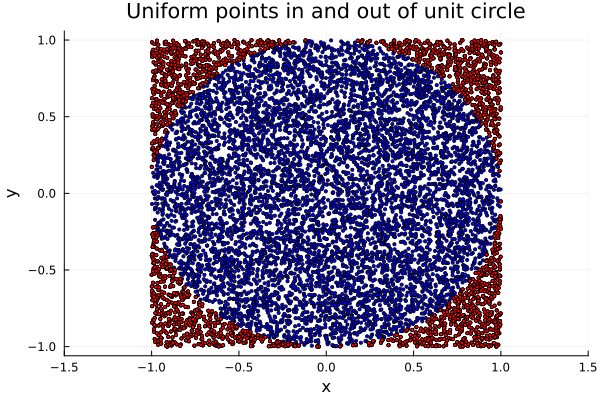

> Monte Carlo simulations are an interesting a peculiar thing, insofar as they
> allow us to approximate deterministic values through non-deterministic random
> processes. In particular, I show in this entry how (and why) we can use Monte
> Carlo simulations  to approximate the value of $\pi$.

We all know $\pi$ is the ration between a circumference's radius $r$ and length
$l$. But $\pi$ is also the area within a unitary circle, i.e.

$$
\begin{equation*}
\pi =\int_{-1}^{1} \int_{-1}^1 \chi_{x^2 + y^2 < 1}(x, y) ~ dx ~ dy
\end{equation*}
$$

where $\chi_S$ is the characteristic function of $S$. 

If we let $X, Y$ be i.i.d. uniform in $(-1, 1)$ with density 

$$
\begin{equation*}
  f_X(x) = f_Y(y) = \frac{1}{2} \cdot \chi_{(-1, 1)}(x)
\end{equation*}
$$

then their joint density is 

$$
\begin{equation*}
  f(x, y) = \frac{1}{4} \chi_{(-1, 1)\times (-1, 1)}(x, y)
\end{equation*}
$$

In particular, $(X, Y)$ is a random vector with uniform distribution in $(-1, 1)
\times (-1, 1)$ and then 

$$
\begin{equation*}
  \pi = \int_{-1}^{1}\int_{-1}^1 \chi_{x^2 + y^2 < 1}(x, y) ~ dx ~ dy =
  \int_\mathbb{R} \int_\mathbb{R} 4 \cdot \chi_{x^2 + y^2 < 1}(x, y) f(x,
  y) ~ dx ~ dy
\end{equation*}
$$

This entails that

$$
\begin{equation*}
  \frac{\pi}{4} = \mathbb{E}\left[ g(X, Y) \right], \qquad g(x, y) =
  \chi_{x^2 + y^2 < 1}(x, y)
\end{equation*}
$$

Thus, we can generate $N$ pairs $(X_i, Y_i)$ with $X_i, Y_i \sim
\mathcal{U}(-1, 1)$ and estimate $\pi$ as 

$$
\begin{equation*}
  \frac{4}{N} \sum_{j=1}^N \chi_{x^2 + y^2 \leq 1}(x_i, y_i)
\end{equation*}
$$

In other words, $\pi$ is estimated by the proportion of pairs $(X, Y)$ which
fall within the circle of radius $1$, multiplied by $4$. In Julia,

```julia
function π_estimation(n_simulations::Integer)

  in_points = []
  out_points = []

  for i in range(1, n_simulations)

    x, y = rand(Uniform(-1, 1)), rand(Uniform(-1, 1))

    if x^2 + y^2 <= 1
      push!(in_points, (x, y))
    else 
      push!(out_points, (x, y))
    end

  end

  return 4 * length( in_points ) / n_simulations, in_points, out_points

end

π_approximation, in_points, out_points = π_estimation(10000)
π_approximation
# Extract x and y coordinates from the list of tuples
x = [p[1] for p in in_points]  # Extracting the x values from each tuple
y = [p[2] for p in in_points]  # Extracting the y values from each tuple

# Plot the points
scatter(x, y, label="Points", xlabel="x", ylabel="y", title="Scatter plot of points (x, y)", xlim=(-1.5, 1.5), markersize=1.8, color=:blue)

x = [p[1] for p in out_points]  # Extracting the x values from each tuple
y = [p[2] for p in out_points]  # Extracting the y values from each tuple
scatter!(x, y, label="Points", xlabel="x", ylabel="y", title="Uniform points in and out of unit circle", xlim=(-1.5, 1.5), markersize=1.8, color=:red, legend=false)
```

Here, `π_approximation` equaled $3.1288$, and the plot produced simply shows in
blue the uniformly generated points which fell within the unit circle, and in
red those which did not. 

---

<p align="center">
    
</p>


--- 

I also produced an animation of the random process through which we are
estimating $\pi$:


---

<p align="center">
    
</p>


--- 
