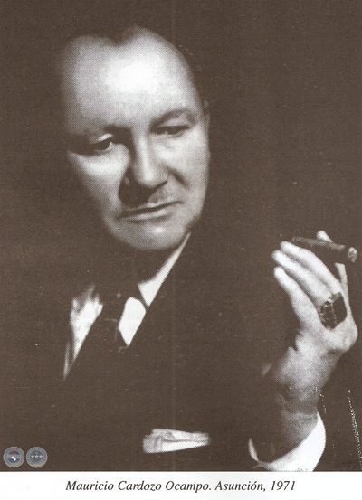

Mauricio Cardozo Ocampo fue un hombre que llamó a la música *pan espiritual*.
Dedicó su vida a la forma más honesta de la música, que es la música folklórica.
Fue el prolífico compositor de las guaranias más hermosas que dio el Paraguay, y
el conductor de sus interpretaciones clásicas.

    

Hay algo nostálgico y hondo en la guarania que es imposible de expresar.
Musicalmente, es notable que la guarania logre este carácter incluso compuesta
en tonalidad mayor. El efecto en parte se debe al uso ampliado del acorde de
tónica con sexta, que tiene un *algo* añorante. 

Considérese la hermosa guarania *Mi destino* si se quiere un ejemplo, acá
referenciada bajo la conducción de Cardozo Ocampo y con la voz Edmundo
Pizarro.[^1]

  <iframe width="560" height="315" 
      src="https://www.youtube.com/embed/CUQwQrUVd2Y" 
      title="YouTube video player" 
      frameborder="0" 
      allow="accelerometer; autoplay; clipboard-write; encrypted-media; gyroscope; picture-in-picture" 
      allowfullscreen>
  </iframe>

Luis Alberto del Paraná, el principal difusor de la guarania paraguaya en el
mundo, formó casi todo su repertorio con obras de Cardozo Ocampo. Abajo se ve,
por ejemplo, la extraordinaria rendición en vivo que hicieron de *Malagueña* en
un concierto en Ucrania.

  <iframe width="560" height="315"
      src="https://www.youtube.com/embed/srb0Qx4PI54"
      title="YouTube video player"
      frameborder="0"
      allow="accelerometer; autoplay; clipboard-write; encrypted-media; gyroscope; picture-in-picture"
      allowfullscreen>
  </iframe>

Debo decir que la música de Cardozo Ocampo está muy dentro de mí, porque quiero
al Paraguay y a su hermoso folklore. Crecí cerca del Paraguay y más cerca aún de
su extraordinaria música. No tengo lectores: este no es un acto de difusión,
sino un diminuto homenaje. Por lo menos pronunciar su nombre.

---

[^1] Edmundo Pizarro es otro de esos nombres olvidados. Lo conocí sólo a través
del disco homenaje a Cardozo Ocampo, pero tiene [otras joyas](https://www.youtube.com/watch?v=2U8TQ1_dCaw&list=RD2U8TQ1_dCaw&start_radio=1)
dando vueltas.
