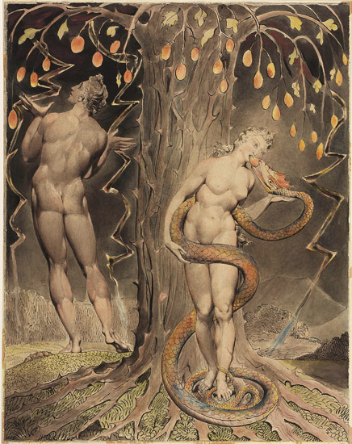

One of the finest acquisitions I have made is an edition, by the University of
Michigan, of the extraordinary *Child Ballads*. I was first made aware of the
existence of these ballads by the appearance of some of them in Louis
Untermeyer's *Albatross Book of Verse*, which I found perchance in a second-hand
library in Buenos Aires, at seventeen years of age, and which was my first
awakening to the world of English poetry.  

Child's anthology contains poems of great antiquity and beauty, among which
*Thomas the Rhymer* fascinated me the most. The poem, in all its dreamlike
strangeness, had one particular characteristic which I found intriguing. It
tells that Thomas the Rhymer was forced upon the gift of prophecy—and this
very much against his will—by virtue of a mystical apple given to him by the
«Queen of Elfland». The gift of prophecy is but the «tongue that can never
lie», and the traditional commentary upon the ballad informs that the apple by
virtue of which it is acquired is taken from the fatal tree of knowledge. Thus,
when the ballad reads that *they came on to a garden green*, it means
the Garden of Eden.

«Why—thought I—does the forbidden fruit, whose flavour is the root of my very
own guilt, endow not falsehood but a truthbound state?». The Bible speaks of
the tree of knowledge of good and evil, 

> But of the tree of the knowledge of good and evil, thou shalt not eat of it: for in the day that thou eatest thereof thou shalt surely die. —Genesis 2:9 (KJV)

and thus it is unsurprising that we should hear that the fruit of the tree is
the source of true knowledge. But why should it be the source of truthfulness? 

Of course, I consulted the few works at my disposal. Philo of Alexandria was
the first, whose work *Quaestiones et solutiones in Genesim* I had read with
devotion in my youth. Questions 15 and 40, which I transcribe below, were the
ones which spoke about the matter most directly, yet not in any fashion which
could elucidate it to my satisfaction. It reads:

> (15) Why does (God) say, when He commands (Adam) to eat of every
>tree which is in Paradise, ‘“‘Eat” in the singular number; but, when He forbids
>eating of the tree which gives knowledge of good and evil, says, in the plural
>number, ‘“‘Do not eat, for on the day when ye shall eat, ye shall die”?
>
>First, because though it extends over many things, the good is one, and not
>less for this reason, namely that He who gave the benefit is one, as is also
>the one who received the benefit. This ‘‘one’’ I speak of, not with reference
>to the number which precedes the number two, but with reference to the unitary
>power, in accordance with which many things are harmonized and agree and by
>their concord imitate the one, such as a flock, a herd, a drove, a chorus, an
>army, a nation, a tribe, a household, a city. For all these, extending over
>many, are one community and embrace lovingly ; but when they are unmixed and
>have nothing in common, they fall into duality and into a multitude and are
>divided. For duality is the beginning of division. But two who use the same
>philosophy as one enjoy an unadulterated and clear virtue which is free of
>evil. But when good and evil are mixed, they have as their beginning a mixture
>of death. 

Then he speaks thus of the discrimination brought upon by the forbidden fruit:

> (40) What is the meaning of the words, “‘For they knew that they were naked”’? 
> 
> It was of this, that is, of their own nakedness, that they first received
> knowledge by eating of the forbidden fruit. And this was opinion and the
> beginning of evil, for they had not used any covering, inasmuch as the parts
> of the universe 'are immortal and incorruptible'; but (now) they needed that
> which is made by hand and corruptible. And this knowledge was in being naked,
> not that it was in itself the cause of change, but that now a strangeness was
> conceived by the mind toward the whole world.

Origen of Alexandria, in his *Homilies on Genesis*, though extensively covering
the image of the fruit of the land in his characteristic allegorical manner,
speaks not once of the forbidden fruit nor of Eve's transgression.

Closer to the ballad's depiction of the fruit's endowments is Milton, when
writing that Satan spoke thus to Eve of the tree of science:

>O Sacred, Wise, and Wisdom-giving Plant, 
Mother of Science, Now I feel thy Power 
Within me cleere, not onely to discerne 
Things in thir Causes, but to trace the wayes 
Of highest Agents, deemd however wise. 
Queen of this Universe, doe not believe 
Those rigid threats of Death; ye shall not Die: 
How should ye? by the Fruit? it gives you Life 
To Knowledge, By the Threatner? look on mee, 
Mee who have touch'd and tasted, yet both live, 
And life more perfet have attaind then Fate 
Meant mee, by ventring higher then my Lot. 

Not much later, Eve declares that the fruit gives «elocution to the mute, and
taught The Tongue not made for Speech to speak thy praise», and eating of it 
wishes to «grow mature in knowledge, as the Gods who all things know».

    

Does Eve's *hubris* contain the secret meaning of the ballad? Is the knowledge
which the fruit bestows so rich that it equates to that of *the Gods who all things
know*? And is this what Thomas was granted in his own incursion into the Garden
of Eden?

Another interpretation is possible, one more suited to explain the inability to
lie. It is conceivable that the fruit does not so much bestow knowledge as it 
incarnates at least some aspect of the divine essence. If Thomas cannot lie, it
means one of two things: either he cannot speak what will not occur, or he can
freely speak, thus mastering faith. Perhaps, then, the power of the fruit would
be that of infusing into common language the creative power of the λόγος. To lie
becomes a metaphysical impossibility, for language is no longer a representational faculty,
but an ontological one. Adam and Eve's transgression would not be then that
of acquiring knowledge, but that of stepping into the creative prerogative of
the Word. 

In support of this interpretation, we have Saint Augustine's words in *De
Mendacio*, when he comments on the following judgment:

> The son that receives the word is far from perdition; receiving it, he
> receives it for himself and nothing false comes out of his mouth.

and identifies truth with God himself. Also, in the Gnostic tradition, at least
as presented in *The Secret Book of John*, it is Jesus himself who coaxes Eve to
eat of the tree of knowledge, and he also calls the tree «Epinoia (ἐπίνοια) of
light».

