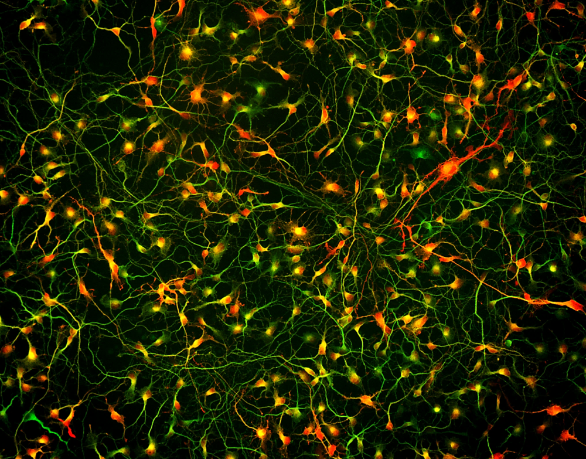

> Estas son notas rápidas y esquemáticas para recordar algunas cosas que olvidé
> del neurotransmisor GABA.

### Nota esquemática: GABA.

El ácido γ-aminobutírico (GABA) es el principal neurotransmisor inhibitorio en
el cerebro humano. Dependiendo de la región cerebral, entre un 20% y un 40% de
todas las neuronas son neuronas GABAérgicas. Los dos tipos principales de
receptores GABA son el receptor ionotrópico GABA$_A$ y el receptor
metabotrópico GABA$_B$.

> Los receptores ionotrópicos son canales iónicos que permiten un flujo
> rápido de corriente y, en consecuencia, una rápida hiperpolarización o
> despolarización. Los receptores metabotrópicos (o acoplados a proteínas G), en
> cambio, no son canales iónicos sino desencadenantes de una cascada de
> mensajes. En particular, cuando un neurotransmisor se une a ellos, disparan
> una serie de señales intracelulares que involucran a la proteína G y a
> múltiples segundos mensajeros, lo cual eventualmente conduce a la apertura o
> cierre indirecto de ciertos canales iónicos. Esta cascada de señalización
> puede tardar cientos de milisegundos o minutos y, por lo tanto, es lenta.

<figure style="text-align:center;">
  
  <figcaption>Interneuronas GABAérgicas en microcircuitos corticales</figcaption>
</figure>

<figure style="text-align:center;">
  
  <figcaption>Rotación de 360 grados del receptor humano GABAA α1β3γ2 alrededor del eje vertical. El sitio de unión de las benzodiacepinas está resaltado en cian.</figcaption>
</figure>

La activación de los receptores GABA$_A$ es el principal mecanismo de acción del
neurotransmisor GABA. La unión al receptor GABA$_A$ permite la difusión de Cl$^-$
hacia el interior de la célula, lo que produce una hiperpolarización de la
neurona postsináptica. El receptor GABA$_A$ es heterogéneo: está compuesto por
subunidades $\alpha, \beta, \gamma$ y $\delta$, y existe diversidad dentro de
cada familia de subunidades.

El receptor GABA$_B$ está compuesto por dos subunidades y se encuentra acoplado
a canales de $K^+$ o Ca$^{2+}$ a través de una proteína G. La cascada de
señalización de la proteína G conduce a la activación de los canales
postsinápticos de K$^+$ o a la inhibición de los canales presinápticos de
Ca$^{2+}$, donde la disminución en la conductancia de Ca$^{2+}$ reduce la
liberación de neurotransmisores por parte de la neurona presináptica.

> *Nota de color*. Los receptores ionotrópicos GABA$_A$ son la clave para 
> explicar el efecto ansiolítico de las benzodiacepinas y los barbitúricos. 
> Cada uno de estos fármacos se une a sitios correspondientes en la cara 
> externa del canal GABA$_A$. Si bien producen pocos cambios directos sobre 
> el canal en sí, en presencia de GABA las benzodiacepinas aumentan la 
> *frecuencia* de apertura del canal, mientras que los barbitúricos aumentan 
> su *duración*. Ambos efectos resultan en un incremento del flujo de Cl$^-$ 
> hacia el interior de la célula.

Las alteraciones en los niveles del neurotransmisor GABA parecen estar fuertemente
relacionadas con trastornos como la esquizofrenia, la depresión y la ansiedad.
Por ejemplo, la esquizofrenia se caracteriza por una densidad mayor de lo normal
de neuronas en la [sustancia blanca superficial/intersticial](https://www.science.org/doi/10.1126/sciadv.aaz9281),
muchas de las cuales son GABAérgicas, y una densidad reducida de estas mismas
neuronas en la sustancia gris cortical. En otras palabras, en la esquizofrenia
parece observarse una actividad GABAérgica exacerbada en regiones más profundas
de la sustancia blanca y disminuida en las regiones corticales superficiales.
Muchos otros vínculos entre la condición y el neurotransmisor GABA pueden
encontrarse en la referencia [aquí](https://pmc.ncbi.nlm.nih.gov/articles/PMC4231020/).

En lo que respecta a la depresión, existe un amplio cuerpo de literatura que
sugiere que una reducción en la actividad GABAérgica se correlaciona con la
enfermedad. La llamada *GABAergic deficit hypothesis* de la depresión sostiene
que una disminución en la actividad GABAérgica constituye el factor etiológico
más importante de la condición. Estos déficits GABAérgicos pueden observarse en
plasma, líquido cefalorraquídeo y tejido cortical resecado de individuos con
depresión. Se puede consultar información más técnica [acá](https://pmc.ncbi.nlm.nih.gov/articles/PMC3412149/).

