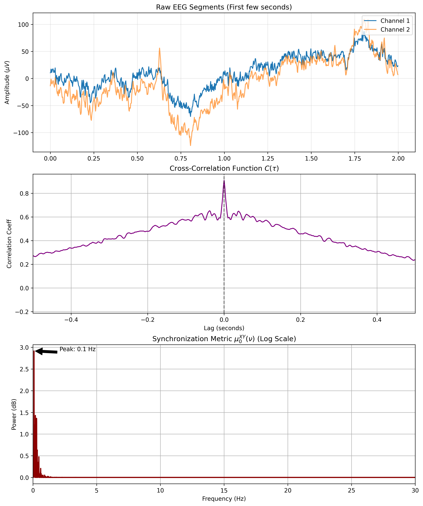
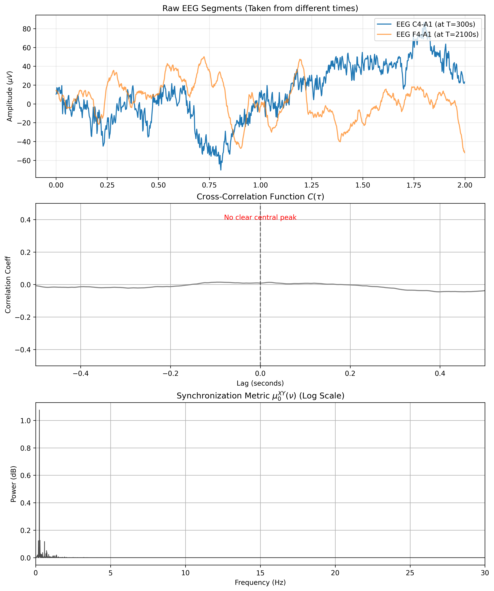

--- 
title: Cross spectrums, a lens into brain synchronicity
categories: [Science]
---

Let $X(t), Y(t)$ denote two signals viewed as random variables.
Their cross-correlation is defined as

$$(X \star Y)(\tau) = \int_{-\infty}^\infty X(t)Y(t + \tau) ~ dt$$

> As a simple note, we observe that for $\tau = 0$ their cross
> correlation becomes
> $\int_{-\infty}^\infty X(t) Y(t) ~ dt = \mathbb{E}\left[ X \cdot Y
>     \right]$. If $X, Y$ are zero-meaned then this entails
> $(X \star Y)(0) \propto \text{Cov}(X, Y)$. In short, the zero-lag
> cross-correlation of two zero-mean signals is proportional to their
> covariance.

For discrete signals, like digital EEGs, the definition is analogous,
though this time we normalize:

$$
\begin{align*}
    C(t) = \frac{1}{(N-m)\sigma_X \sigma_Y} \sum\_{j=0}^{N-(m+1)} \hat{X}_j \hat{Y}\_{j+m}, \qquad t = m\tau
\end{align*}
$$

where

-   $\hat{X}_i$ is the fluctuation of $X_i$ around its mean
    ($X_i - \bar{X}$);

-   $\tau$ is the constant sampling time, i.e. the inverse of the
    sampling rate.

-   $m$ is the discrete lag, computed as a function of the continuous
    lag $t$.

> Consider for example a sampling rate of 500Hz, which gives a sampling
> time of $0.002$ seconds per sample. If we wish to compute the discrete
> cross-correlation with a time phase of two seconds, then
> $2\text{sec} = m
>     \cdot 0.002 \text{sec/sample}$ giving $m = 1000\text{ samples}$.
> In short, a two second shift would correspond to a discrete shift of
> 1000 samples.

To further understand the concept which I wish to present, let us pose a
few questions beforehand.

\(1\) First, let us ask how the existence of certain *common* frequency
in both signals affects their cross-correlation function. Say, for the
sake of the example, that both signals are strongly composed of a 10Hz
frequency oscilation, meaning that their power spectrums show «high»
energy at said frequency.

When evaluating their cross-correlation, we effectively «slide» signal
$Y$ across $X$ checking for similarity; and since by assumption both
contain a periodic 10Hz oscilation, they will align and misalign
cyclically at the exact same rate. Importantly, even if both signals
contain noise, random noise in $X$ will not generally correlate with
random noise in $Y$, so the 10Hz oscilation will be exposed in the
correlation function.

> *Insight from question (1):* If $X$ and $Y$ share a frequency $f$, the
> cross-correlation function also oscilates at frequency $f$.

\(2\) Now we deepen the question. We may assume that both signals share
a frequency $f$, but their oscilations in that frequency may or may not
be aligned. How does this affect the cross-correlation function?

It should be clear that if the oscilations in this frequency are
perfectly aligned (i.e. shifted by an angle of $\phi = 0$), the maximum
correlation occurs at lag $\tau = 0$. If the oscilations are out of
phase, the maximum correlation will occur at the lag $\tau$ which
compensates for the delay.

> *Insight from question (2):* Aligned, shared oscilations peak at
> $\tau = 0$.

With these observations in hand, understanding our topic of interest
will be simpler. Let us proceed: we'll get back to these insights
shortly.

We now define $S_{XY}$ as the power spectrum of the cross-correlation
function of two signals $X$ and $Y$. This is known as the cross-spectral
density or simply cross-spectrum:

$$S_{XY}(\nu) = \int_{-\infty}^{\infty} C(t) e^{-i 2\pi \nu t} ~ dt$$

To further disect the meaning of the power spectrum let us decompose it
a bit. Applying Euler's formula
($e^{-i\theta} = \cos\theta - i\sin\theta$), we obtain:

$$
\begin{align*}
    S_{XY}(\nu) &= \int_{-\infty}^{\infty} C(t) (\cos(2\pi \nu t) - i \sin(2\pi \nu t) ) ~ dt \newline
    &= \underbrace{\int_{-\infty}^{\infty} C(t) \cos(2\pi \nu t) ~ dt}\_{\text{Real Part: Co-spectrum}} 
    - i \underbrace{\int_{-\infty}^{\infty} C(t) \sin(2\pi \nu t) ~ dt}\_{\text{Imaginary Part: Quad-spectrum}}
\end{align*}
$$

It is time to tie our previous insights with this expression. We can
view the formula above as asking, at each frequency component, how the
cross-correlation behaves relative to cosine and sine waves.
Importantly, the distinction is not simply between "synchrony" and
"asynchrony," but between *alignment* and *orthogonality*. To make this
clearer, note that for each frequency component we essentially have
three cases:

-   **In-Phase ($\phi = 0$):** The signals are perfectly synchronous.
    The cross-correlation peaks at zero and resembles a positive
    cosine. Its Fourier transform is purely real (only co-spectrum)
    and positive.

-   **Anti-Phase ($\phi = \pi$):** The signals are perfectly
    oppositional (one peaks when the other troughs). The
    cross-correlation is a negative cosine. Here, again, the
    activity appears only in the co-spectrum (real part), but this time
    with a negative sign.

-   **Quadrature ($\phi = \pi/2$):** The signals are shifted by a
    quarter cycle and thus are perfectly asynchronous. The
    cross-correlation resembles a sine wave (it is zero at lag 0).
    Its Fourier transform is purely imaginary.

What am I trying to say? That the co-spectrum measures the linear
relationship (whether parallel or anti-parallel) of both signals across
the range of frequencies. The quad-spectrum measures the orthogonal
relationship.

In EEG analysis, we are often interested specifically in *zero-lag*
synchrony. This is captured entirely by the real part. Therefore, the
«cross-spectrum» formula in these contexts often simplifies to the
co-spectrum. 

Furthermore, some methodologies (e.g. [this paper](https://www.researchgate.net/publication/271658253_Use_of_Cross-Correlation_Analysis_of_EEG_Signals_for_Detecting_Risk_Level_for_Development_of_Schizophrenia)) define a specific synchronization metric,
$\mu_0^{XY}(\nu)$, which not only isolates the co-spectrum but squares it.
Squaring transforms the amplitude into power and ensures that both in-phase
(positive) and anti-phase (negative) synchrony contribute positively to the
strength of the connection:

$$\mu_0^{XY}(\nu) = \left| \tau \sum_{j} c(t_j) \cos(2\pi \nu t_j) \right|^2$$

The reader might be curious to see an example. I wrote a Python script to
compute the formula above:

```python
def compute_mu0(x, y, fs):
    """
    Computes the synchronization metric mu_0:
    
    | tau * sum( C(t) * cos(2*pi*v*t) ) |^2
    
    Parameters:
    -----------
    x, y : array-like
        Two extracted EEG channels (1D arrays).
    fs : float
        Sampling frequency in Hz.
        
    Returns:
    --------
    freqs : array
        Frequency axis.
    mu0 : array
        The synchronization power metric.
    ccf : array
        The time-domain cross-correlation (for visualization).
    lags : array
        The time lags corresponding to the ccf.
    """
    # 1. Normalize the signals 
    x_norm = (x - np.mean(x)) / np.std(x)
    y_norm = (y - np.mean(y)) / np.std(y)
    
    N = len(x_norm)
    dt = 1/fs
    
    # 2. Compute Cross-Correlation Function (CCF)
    ccf = correlate(x_norm, y_norm, mode='full', method='fft')
    
    # Normalize CCF by N (standard biased estimator) to keep values between -1 and 1
    ccf /= N
    
    # Create time vector for lags (centered at 0)
    lags_indices = np.arange(-(N-1), N)
    lags_time = lags_indices * dt
    
    # 3. Compute the Cross-Spectrum via FFT
    # (rfft computes the FFT for real inputs (positive frequencies only))
    cross_spectrum_complex = np.fft.rfft(ccf)
    
    # Get the frequency axis
    freqs = np.fft.rfftfreq(len(ccf), d=dt)
    
    # 4. Extract the co-spectrum (real part) and square it
    # We multiply by dt to approximate the continuous integral definition 
    co_spectrum = np.real(cross_spectrum_complex) * dt
    
    mu0 = co_spectrum**2
    
    return freqs, mu0, ccf, lags_time
```

I then used the MNE Python library to load the full-night sleep EEG of a healthy
subject (perks of working at sleep science). I repeated the following process
twice: 

- Extract an epoch of equal duration from both channels. 
- Compute $\mu_0^{XY}(\nu)$ (and hence cross-spectrum, cross-correlation, etc.).
- Plot everything. 

The only difference is that the first time, both epochs were not only of equal
duration, but came from the exact time period. In short, they were simultaneous,
and hence the signals were more or less aligned. The second time the two epochs
were from different moments in the night and did not look similar.

> Note: in the following plots the legend states that the spectrum is in dB
> scale. This is just something I forgot to change and I am too lazy to
> recompute everything now. Raw power was plotted!

The results from the simultaneous epochs were:

<p align="center">
    
</p>

We can see that the signals aligned pretty well, that their cross-correlation
peaks at zero, and that they share a lot of energy across many frequencies. For
the non-simultaneous signals, these were the results:


<p align="center">
    
</p>

We see a close-to-flat cross-correlation, as expected, and very little power
shared across frequencies. 

> Last note: frequencies below 0.3Hz are rather meaningless and typically
> removed. I also did not remove them for this example because (a) I am lazy and
> (b) the example still shows the point of the cross-spectrum neatly. 


--- 

The matter does not end here and there is still some ground to cover. There is
an argument to be made in favor of using not the co-spectrum but the
quad-spectrum. In particular, perfect synchronicity between two brain regions
might indicate *not* coordinated activity but rather the simultaneous reception
of a signal from a third source. This is termed *volume conduction* and is
considered an artifact, because it creates spurious correlation between two
records. A single electrical source within the brain is detected simultaneously
by multiple source with zero phase lag, and any co-spectrum based analysis would
be fooled into finding an interaction between them.

For this reason, an alternative strategy is to ignore not the quad-spectrum but
the co-spectrum all-together. This is the purpose of what is termed *weighted Phase Lag
Index* (wPLI).

The wPLI ignores the magnitude of the delay and looks only at the asymmetry of
the phase distribution across many observations. To compute it, we split our
signals into $N$ smaller time segments (epochs). Let $k$ denote the $k$-th
segment. The wPLI is defined is defined as

$$
\text{wPLI} = \frac{ | \sum_{k=1}^N \text{Quad-spectrum}_k | }{ \sum_{k=1}^N | \text{Quad-spectrum}_k | }
$$

is more generally written as

$$
\text{wPLI} = \frac{ | \langle \Im(S_{XY}) \rangle | }{ \langle | \Im(S_{XY}) | \rangle } = \frac{ | \sum_{k=1}^N \Im(S_{XY})_k | }{ \sum_{k=1}^N | \Im(S_{XY})_k | }
$$

The denominator ensures that $\text{wPLI} \in[0, 1]$ and is thus a normalization
factor. 

Using wPLI ensures that if quad-spectrum is very small (meaning the phase
difference is very close to zero), we don't let it vote as strongly as a clear,
large-magnitude phase lag. This effectively avoids the issue of volume conduction.
Most serious papers use the wPLI and one could say that co-spectrum-based
measures of connectivity are more or less deprecated.

> Interestingly, the wPLI of the two signals I showed above is practically zero.
This means that the two signals look almost identical not because they are
interacting with each other in some meaningful way, but rather because they are
each recording the same input.


