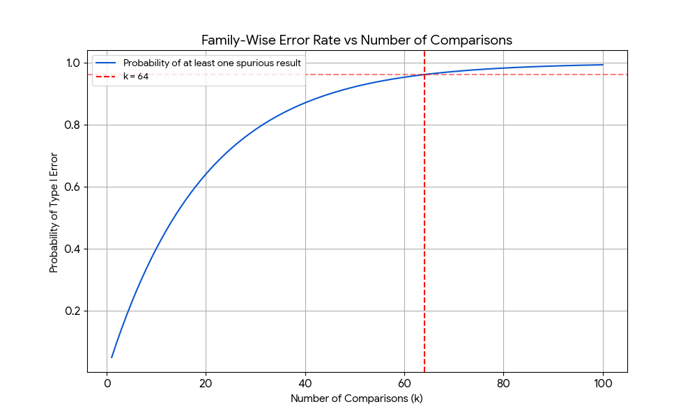
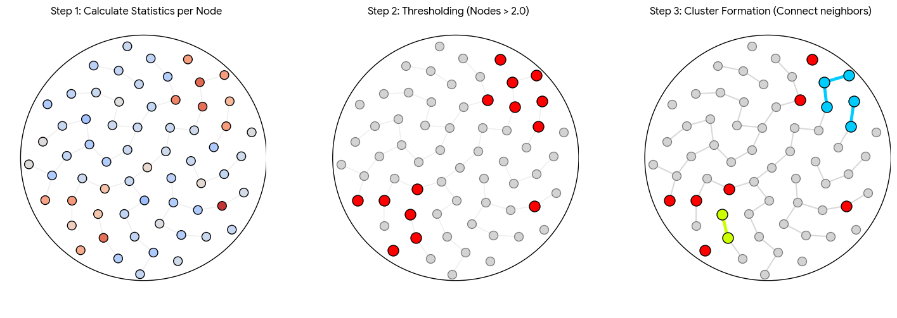

Imagine you have a dataset that is high-dimensional and highly structured. A
classic example is EEG data: you have $k = 64$ electrodes placed across the scalp,
and perhaps you have used them to measure [brain
connectivity](https://slopezpereyra.github.io/2025-11-18-CrossCorrelation/).
You've done this for $g_1$ members of a certain group and $g_2$ members of
another, so that you effectively have two $k \times g_1$ and $k \times g_2$
matrices with the resulting values. You ask the question: are the members of
group 1 significantly different from the members of group 2?

The naïve approach is to perform a $t$-test for every single electrode (i.e.
every single row). But then the good old [multiple comparisons problem
](https://en.wikipedia.org/wiki/Multiple_comparisons_problem) creeps in, and you
are either left exceedingly happy by the conclusivness of your findings, or
doubting something fishy is going on. Indeed, if you run $k$ statistical tests
with a standard significance level of $\alpha = 0.05$, and $k$ is sufficiently
high, you are almost guaranteed to find spuriously significant results by
chance. This is given by:

$$
P(\text{Number of Type I errors } \geq 1) = 1 - (1-\alpha)^k
$$

which is plotted below as a function of $k$.

    

> A point of confusion when first learning of the multiple comparisons problem,
> at least for me, was that intuitively one should think that more data should
> not lead to a greater chance of error. But data is typically two-dimensional:
> we have a number of features or variables, each with a sample size. Increasing
> the *sample size* is good. The multiple comparison problem arises when we
> increase the number of *features*. In our example, this would be the number of
> EEG electrodes.

There are *general* forms of addressing this problem, where by general I mean
that they do not leverage domain specific knowledge about the data and are thus
agnostic about its properties. An example is Bonferroni correction, which simply
divides the significant level $\alpha$ by the number of features $k$. However,
these strategies are usually too harsh. The plot below shows how the
Bonferroni-corrected significance level decays as $k$ increses, becoming
$\alpha' = \alpha/64 = 0.00078$ for $k=64$. Thus, in addressing Type I errors
(false positives), it increases the risk of Type II errors (false negatives) by
making the significance threshold too strict.

    

Agnosticism is good, but the approach we hereby presents makes use of certain
properties specific to the data—properties which are typical in biological
studies. I am speaking of statistical dependence between spatially proximate
features. Again, EEG is a good example: EEG electrodes are topologically related.
If an electrode over the frontal lobe is highly active, a neighboring electrode
will probably show similar activity. 

Whenever some adequate sense of relatedeness or hubeness appears, it means our
problem might be suited for a graph or network representation. Instead of asking
«is this data point significantly different between groups», it might make more
sense to ask: «is this *region* of points significantly different between
groups», where this «regionness» is properly defined. 

It should be clear that when shifting our view from points to regions or, as we
will call them from now on, *clusters*, reduces the number of data points. We
are in a sense lowering the data resolution, performing dimensionality reduction
in view of real-world considerations. This not only controls the false alarm
rate but improves sensitivity: if it is true that our data represents a
topologically dependent system, where activity and inactivity are to be measured
in terms of regions and not of points, then effects that are weaker at single
points but strong in the region will be detected. Furthermore, and again
assuming our topological considerations are true, single points showing
exceedingly low or high activity relative to its surrounding are most likely
spurious artifacts, and cluster based methods will effectively ignore them.

So far I have only provided an intuition, but we have to be more concrete. Once
we see our data from a topological sense, as a graph or a network, how do we
find clusters? What is a cluster and what isn't? How do we determine a node's
belonging to a given cluster?

The statistical technique I will present is called [cluster-based permutation
testing](https://www.sciencedirect.com/science/article/pii/S2352711022001042).
It models the $k$ features (e.g. the $k$ EEG electrodes) as real-valued nodes in
a graph, where two nodes are connected if the features they represent are
topologically related. Then it performs the following steps:

(1) For each feature, run a statistical test between the two groups. The choice
of the test is a matter of debate, as seen in the paper above, but let us assume
we have ran a $t$-test and thus, for each of the $k$ features, we have a
$T$-statistic.

> In our example, this would mean that, for each EEG electrode in the scalp, we
> would be able to say: according to a standard $t$-statistic, the activity of
> this electrode is/is not significantly different between the two groups.

(2) Mask the features (or nodes) whose statistic exceeded the threshold of
statistical significance.

(3) From each masked node that is not yet in a cluster, form a cluster
performing BFS and finding masked neighbours. If the initial masked node had no
masked neighbours, then it will not form a cluster.

    

(4) For each cluster, compute some measure of the statistical strength in that
cluster. Typically, the sum of the statistics of each node within it.

    

We now have clusters with an adequate notion of strength, but how do we produce
a sound statistical analysis of them? If we have a cluster with a "mass" (sum of
$t$-statistics) of, say, $T_{obs} = 50$, is that high or low? Is it rare or
usual? Since the shape of our clusters is determined by the data itself, there
is no standard distribution that can tell us the probability of observing a
cluster mass of any given mass. We must construct the distribution ourselves
using the null hypothesis.

The null hypothesis states that there is no difference between the groups. If
this is true, the labels "Group 1" and "Group 2" are meaningless; we could
shuffle the participants between the groups, and it shouldn't change the result.

To test this, we perform the following Monte Carlo permutation, which is step
(5).

- **Shuffling**: Take all $g_1 + g_2$ participants, pool them together, and
randomly assign them to two new groups of size $g_1$ and $g_2$. 

- **Recalculate**: Run the exact same steps as before (Steps 1 through 4). Perform the $t$-tests for
every electrode, threshold them, find clusters, and sum their $t$-statistics.

- **Find the Maximum**: Record only the
maximum cluster statistic found in the iteration. By tracking the single largest
cluster that arises purely by chance in each iteration, we control the
Family-Wise Error Rate (FWER). We are effectively building a distribution of
"the worst false positives that could happen by chance.

- **Repeat**: Repeat this shuffling process $N$ with $N$ sufficiently large.

This produces a distribution of maximum cluster masses under the null
hypothesis. All that is left is to compute the $p$-value.

The simulated $p$-value is simply the proportion of random permutations that
produced a cluster mass greater than or equal to the empirical mass in our data:

$$
p =\frac{\text{count}(T\_{perm} \geq T\_{obs})}{N}
$$

If our empirical cluster is larger than 95% of the maximum clusters found by
chance ($p < 0.05$), the null hypothesis is rejected and we can conclude that
there is a significant difference between the groups. 

