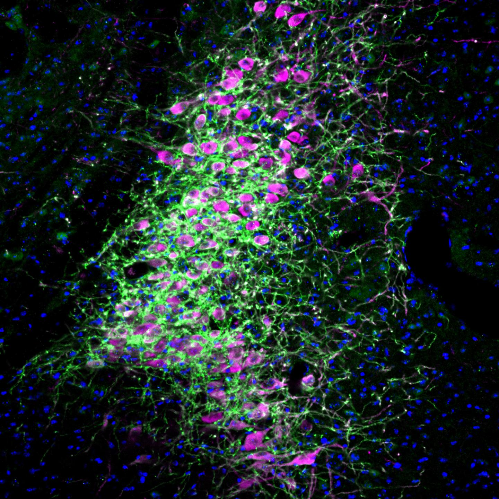
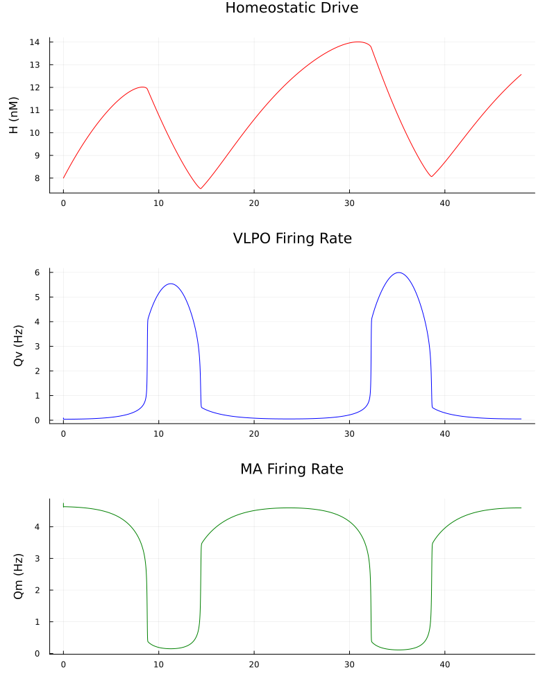
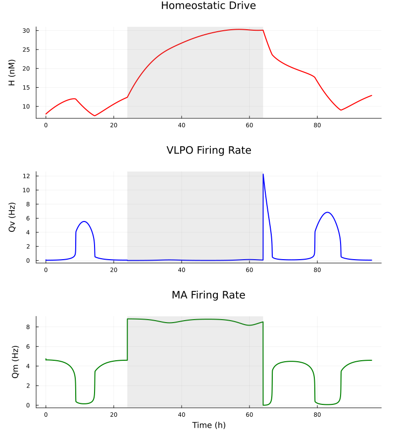

Here I present a physiological model developed by Phillips and Robinson in [a
paper publihsed in 2006](https://pubmed.ncbi.nlm.nih.gov/17440218/). The work is
of great interest because previous (and most) sleep models, such as the
two-process model, were strictly phenomenological and dealt not with the
underlying neurophysiology.

The model is based on the dynamics of the ascending arousal system
(AAS), a complex of acetylcholinic and monoaminergic nuclei in the
brainstem. The AAS, which projects difussely to the cerebrum, controls
the arousal state of the brain. Two distinct drives affect the activity
of the AAS: the circadian drive and the homeostatic drive, which are
previously integrated in the the ventrolateral preoptic area (VLPO) of
the hypothalamus. Within-system interactions of the AAS—i.e.
interactions between the nuclei conforming the AAS—produce the
ultradian rhythms characteristic of sleep, like NREM and REM cycles, but
are disregarded in the modelling of sleep-wake cycles.

<figure style="text-align:center;">
  
</figure>

The flow of information across these systems is relatively simple. The
homeostatic and circadian drives are both transmitted to the AAS from
inhibitory GABAergic projections of the VLPO. The homeostatic signal is
caused by the progressive accumulation of adenosin in the extracellular
medium of the basal fobrain, which causes the neurons in this region to
become inhibited. Since these play an inhibitory role on the VLPO, their
own inhibition induces a desinhibition of the VLPO, which itself then
signals the AAS more strongly. The circadian signal originates in the
suprachiasmatic nucleus and projects to the VLPO via the dorsomedial
nucleus of the hypothalamus. It is a fundamentally endogenous oscillator
entrained to the day mainly by the influence of light.

In general, it is understood that the monoaminergic nuclei of the AAS
promotes wakefulness by forming a mutually inhibitory circuit with the
VLPO, which is active during sleep. These two systems are therefore
self-reinforcing and conform a flip-flop switch. Contrarily, there is no
firm evidence of direct connections from the acetylcholinic nuclei to
the VLPO: it rather seems that the VLPO connects to the acetylcholinic
nuclei via inhibitory interneurorns.

<p align="center">
    
</p>

Phillips and Robinson's model, hereby termed the PRM, describes three
neural populations: the monoaminergic and acetylcholinic nuclei in the
AAS and the VLPO. As described before, the VLPO integrates the
homeostatic and circadian drives and inhibits the AAS, an aspect which
the model must capture. Since sleep-wake transitions are modulated by
the mutual inhibition between the VLPO and the monoaminergic nuclei, the
activity of the acetylcholinic nuclei is modeled at a constant
intermediate level. For further justification of this decision, see the
original paper.

As most papers, Phillips and Robinson do not provide an intuition behind
the mathematical expressions they use. I should wish to provide an
explanation not too detailed that it becomes tedious, but sufficient to
make the model accessible to, say, an undergraduate student.

First of all, the PRM model does not deal with individual neurons but
rather with neural populations. Topologically, the neural populations
may be understood as a dynamically evolving weighted graph: each node is
a cluster of neurons with some average firing rate and average voltage,
with edges representing the sense and magnitude of the interactions
between populations. The dynamism of course comes from fluctuations in
the voltage, which in turn must affect the firing rate. In general, the
relation between the firing rate of a cluster and its voltage is modeled
with a sigmoid function, thus capturing the saturation of the firing
rate as voltage increases:

$$Q_a(t) = \frac{ Q_{\text{max}} }{1 + \exp\left( \frac{ V_a(t) - \mu}{\sigma'} \right)  }$$

The function $V_a(t)$ is understood to express voltage relative to the
average resting potential of the neurons in the cluster. This means that
if $V_a(t) =
10\text{mV}$ and the mean resting potential is $-70\text{mV}$, the
actual mean voltage of the neurons in the cluster is $-60\text{mV}$. The
$\mu$ parameter defines the mean threshold voltage (also relative to
resting). This means that when $V_a(t)$ crosses $\mu$, the firing rate
$Q_a(t)$ is at half its maximum value. Thus, $\mu$ defines a critical
voltage level: below it, most neurons in the cluster are quiescent;
above it, most neurons are firing. $\sigma'$ defines the steepness of
the sigmoid around $\mu$, and is related to the standard deviation
because $\sigma = \sigma' \pi / \sqrt{3}$.

The voltage itself is modeled as a leaky integrator of incoming
post-synaptic currents into the neurons of the cluster. For the VLPO,
which receives and integrates the circadian and homeostatic drives, we
have:

$$\tau_v \frac{dV_v}{dt} = -V_v + w_{vm} Q_m + D$$

where $w_{vm}$ is the weight of the connection from the monoaminergic
nuclei to the VLPO, $Q_m$ the firing rate of the monoaminergic cluster,
and $D$ is the linear combination of the circadian and homeostatic
drives:

$$D = w_{vC} C + w_{vH} H$$

As in the two-process model, the homeostatic drive $H$ is modelled
phenomenologically, aiming to capture the metabolic activity that is
high during wake and low during sleep. Because arousal correlates highly
with monoaminergic activity, the PRM assumes that the homeostatic drive
increases proportionally to the firing rate of the monoaminergic nuclei
$Q_m$. Also as in the two-process model, $C$ is a simple sinusoidal
function with a 24 hour period:

$$C(t) = \cos(\omega t) + \mu_C, \qquad \chi \frac{dH}{dt} = - H + \mu_H Q_m$$

Note that this model of $H$ assumes that when $Q_m = 0$, i.e. during
sleep, $H$ is negligible.

The voltage of the monoaminergic nuclei depends on the excitatory input
from the acetylcholinic nuclei and the inhibitory input from the VLPO,
from which readily follows the following linear leaky integrator model:

$$\tau_m \frac{dV_m}{dt} = - V_m + w_{mv}Q_v + w_{ma} Q_a$$

The firing rates of the VLPO and the monoaminergic nuclei use the same
sigmoid parameters because empirically both populations have similar
firing rate dynamics.

As detailed in the original paper, mammalian locus coeruleus neurons
have a mean threshold of $-55\text{mV}$ and a resting potential of
$-65\text{mV}$, giving a relative threshold of $\mu = 10\text{mV}$.
Maximal firing rates under prolonged depolarization of single neurons
were around $150$sec$^{-1}$, so we set $Q_{\text{max}} = 150$sec$^{-1}$.
$\sigma'$ values within $2-6\text{mV}$ for cortical neurons are typical,
and Phillips and Robinson argue that because voltage ranges between
cortical and brainstem nuclei neurons are similar, a value of
$\sigma' = 3\text{mV}$ is appropriate.


<figure style="text-align:center;">
  
  <figcaption>LC neurons identified by the marker tyrosine hydroxylase. Source: Andrea Bari/Tonegawa Lab</figcaption>
</figure>


The weights $w_{jk}$, representing the strength and sense of the
connections from population $k$ into population $j$, have known signs.
The VLPO and the monoaminergic populations, as stated earlier, are
mutually inhibitory, from which follows $v_{mv} < 0, v_{vm} < 0$. The
acetylcholinic population excites the monoaminergic population, so
$w_{ma} > 0$. The homeostatic drive disinhibits the VLPO, so
$w_{vH} > 0$, while the circadian drive inhibits it, so $w_{vC} <
0$.

In the PRM, the flip-flop switch behavior of the sleep-wake cycle
entails an equilibrium with two stable fixed points (wake and sleep) and
an unstable fixed point (the threshold between sleep and wake). To find
steady states, they solve the system of equations given by setting the
voltage derivatives to zero:

$$\begin{aligned}
    0 &= -V_v + w_{vm} Q_m + D \\
    0 &= - V_m + w_{mv}Q_v + w_{ma} Q_a \\
\end{aligned}$$

From the second equation, we obtain that the equilibrium voltage
satisfies

$$V_m = w_{mv}Q_v + w_{ma} Q_a$$

The firing rate $Q_m$ at equilibrium is a function of the equilibrium
voltage, so that we may write $Q_m = S(V_m)$. Thus, from the first
equation, it follows

$$0 = -V_v + D + \nu_{vm} S(\nu_{mv} Q_v + \nu_{ma} Q_{ao})$$

So the equilibrium occurs at the roots of the function

$$\begin{aligned}
    f_v(V_v) 
    &= -V_v + D + w_{vm} S(w_{mv} S(V_v) + w_{ma} Q_a) \\
    &= \tau_v
    d\frac{V_v}{dt}
\end{aligned}$$

Phillips and Robinson analyze this function and approximate its roots
through the roots of two other, related but simpler functions. These
roots are

$$K_{v1} = D + w_{vm} S(w_{ma} Q_{ao}), \qquad K_{v2} = D + w_{vm}S \left(
    w_{mv}Q_{\text{max}} + w_{ma} Q_{ao} \right)$$

Similarly, they found the equilibrium points for the monoaminergic
population. Furthermore, since the firing rate of the monoaminergic and
the VLPO populations have the same parameters, they reason that the
equilibrium points of both populations should be roughly equal, reducing
the dimensionality of the problem. Their mathematical analysis is
extensive, so I will simply state that they found the wake equilibrium
voltage to fall within $-15\text{mV}$ and $-5\text{mV}$, and the sleep
equilibrium voltage to fall within $0$ and $1.5\text{mV}$.

Using the same parameters as in the original paper, I implemented the PRM in
Julia using the `DifferentialEquations.jl` package, as seen below:

```julia 
using DifferentialEquations, Plots

# Sigmoid Function (Firing Rate Q as a function of Voltage V)
# Parameters from Phillips & Robinson 2007 (Table 2)
# Qmax = 100 sec^-1, theta = 10 mV, sigma_prime = 3 mV
S(V) = 100.0 / (1 + exp(-(V - 10.0) / 3.0))

# ODE System
function phillips_robinson!(du, u, p, t)
    Vv, Vm, H = u
    
    tau_v = 10.0 / 3600.0   # 10s converted to hours
    tau_m = 10.0 / 3600.0   # 10s converted to hours
    v_vm  = -1.9            # mV*sec
    v_mv  = -1.9            # mV*sec
    v_ma_Qa = 1.0           # constant ACh excitation (mV)
    v_vc  = -6.3            # Circadian weight (mV)
    v_vh  = 0.19            # Homeostatic weight (mV/nM)
    chi   = 10.8            # Clearance time (h)
    mu    = 1.0e-3          # Production rate (nM*h)
    omega = 2π / 24.0       # Circadian frequency
    
    Qm = S(Vm)
    Qv = S(Vv)
    
    C = 0.5 * (1.0 + cos(omega * t))
    D = v_vc * C + v_vh * H
    
    du[1] = (-Vv + v_vm * Qm + D) / tau_v             # dVv/dt
    du[2] = (-Vm + v_mv * Qv + v_ma_Qa) / tau_m       # dVm/dt
    du[3] = (-H + mu * Qm * 3600.0) / chi             # dH/dt (Qm in sec^-1 converted to h^-1)
end

# Solving via DifferentialEquations.jl
u0 = [-11.0, 1.0, 8.0]   # Initial conditions (Wake state)
tspan = (0.0, 48.0)      # 48 hours
prob = ODEProblem(phillips_robinson!, u0, tspan)
sol = solve(prob, Tsit5(), reltol=1e-8, abstol=1e-8)

# Plotting data
t = sol.t
H = [u[3] for u in sol.u]
Qv = [S(u[1]) for u in sol.u]
Qm = [S(u[2]) for u in sol.u]
Qa = fill(1.5, length(t)) # Constant ACh firing rate assumed in model [cite: 96]

# 5. Multi-panel Plotting
p1 = plot(t, H, ylabel="H (nM)", title="Homeostatic Drive", color=:red, legend=false)
p2 = plot(t, Qv, ylabel="Qv (Hz)", title="VLPO Firing Rate", color=:blue, legend=false)
p3 = plot(t, Qm, ylabel="Qm (Hz)", title="MA Firing Rate", color=:green, legend=false)

plot(p1, p2, p3, layout=(3,1), size=(800, 1000), margin=5Plots.mm)
```

The resulting plot is shown below. 

<figure style="text-align:center;">
  
  <figcaption>Plot of homeostatic drive, VLPO firing rate, and firing rate of
        the monoaminergic nuclei over 48 hours</figcaption>
</figure>

As stated earlier, the homeostatic drive reflects metabolic activity, such as
the accumulation of somnogens, during wakefulness. It peaks around $12$ to
$14\text{nM}$ before declining exponentially once sleep begins and clearance
exceeds production. This build-up of homeostatic pressure, combined with the
circadian signal, eventually overcomes the mutual inhibition between the neural
populations, triggering a rapid transition. As seen in the VLPO and MA firing
rate plots, the system spent most of its time in two stable steady states:
wakefulness, characterized by high monoaminergic activity ($Q_m \approx
4-5\text{ Hz}$) and low sleep-promoting activity, and sleep, where the VLPO
becomes active ($Q_v \approx 4-6\text{ Hz}$) and suppresses the arousal system.

The model can be used to explore the dynamics of sleep deprivation as well.
Sleep deprivation is simulated by applying an external wake-promoting drive that
forces the monoaminergic (MA) system to remain active despite increasing
pressure to sleep. This forced wakefulness keeps the VLPO sleep switch
inhibited, preventing the natural flip-flop transition from occurring at the
usual time. As a result, the homeostatic drive continues to rise far beyond its
normal peak. By the end of the deprivation period, this homeostatic pressure
becomes so immense that it saturates the system. Once the external drive is
removed, the brain undergoes a rapid, intense transition into "recovery sleep".
The plot below illustrates this phenomenon: after a 24-hour period of standard
dynamics, a forced wakefulness is imposed for for 48 hours.


<figure style="text-align:center;">
  
  <figcaption>Plot of homeostatic drive, VLPO firing rate, and firing rate of
        the monoaminergic nuclei over 4 days. The first day is a normal
        sleep-wake cycle; two days of sleep deprivation ensue, with subsequent
        recovery and normalization.</figcaption>
</figure>


