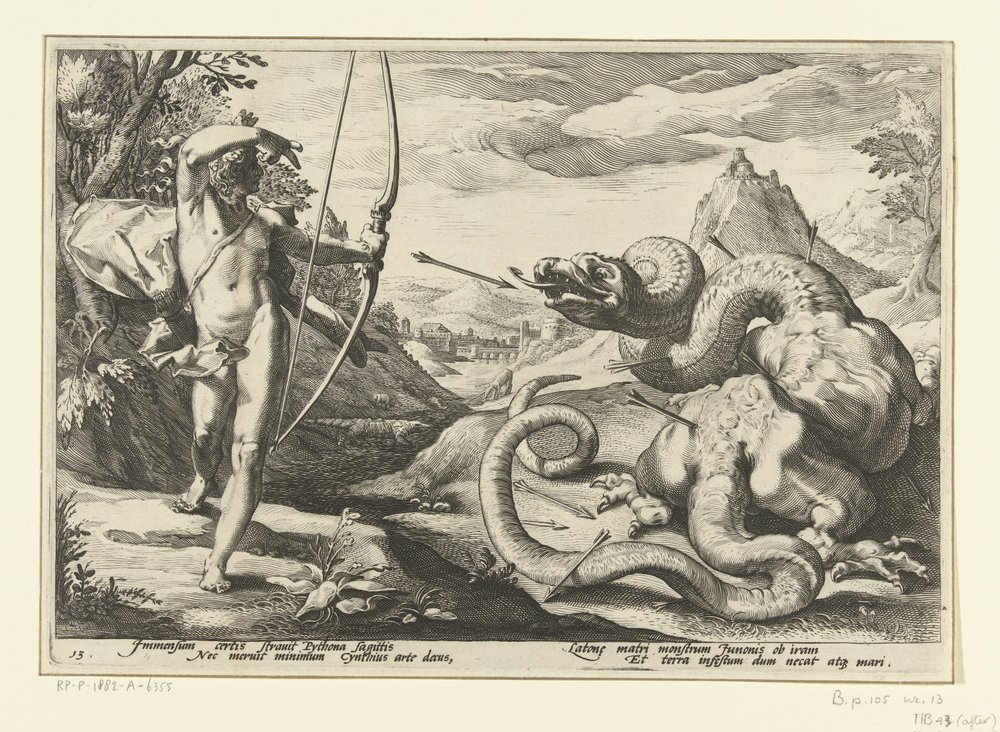
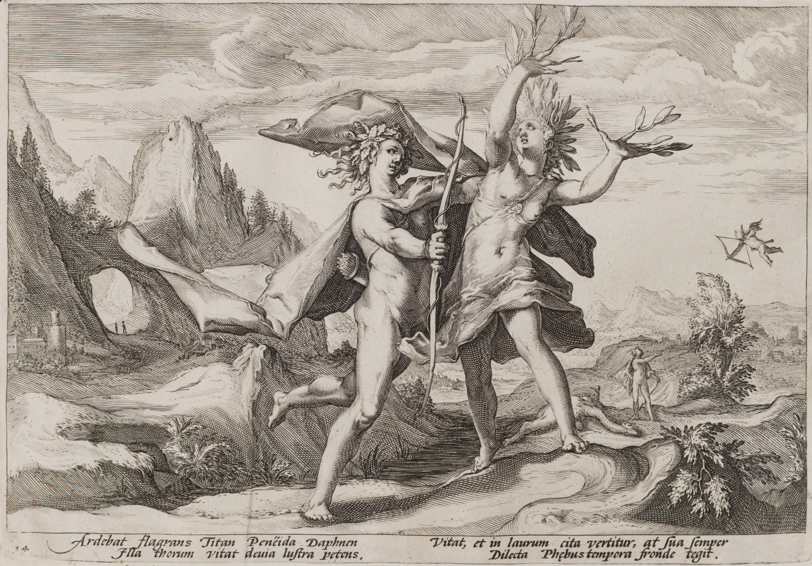
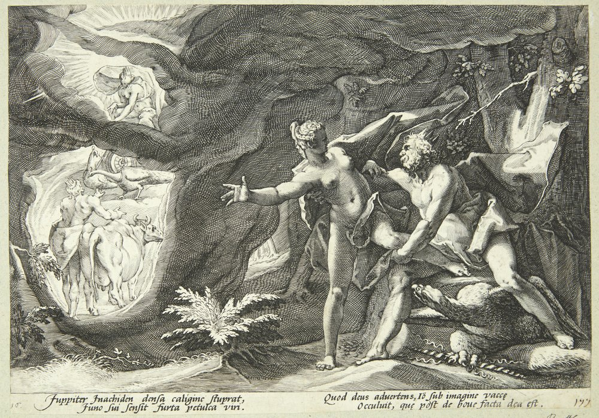
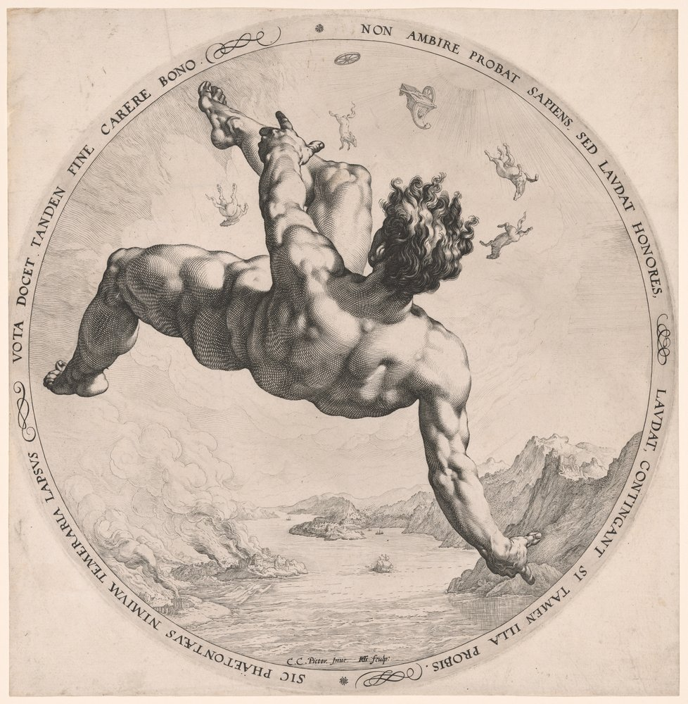
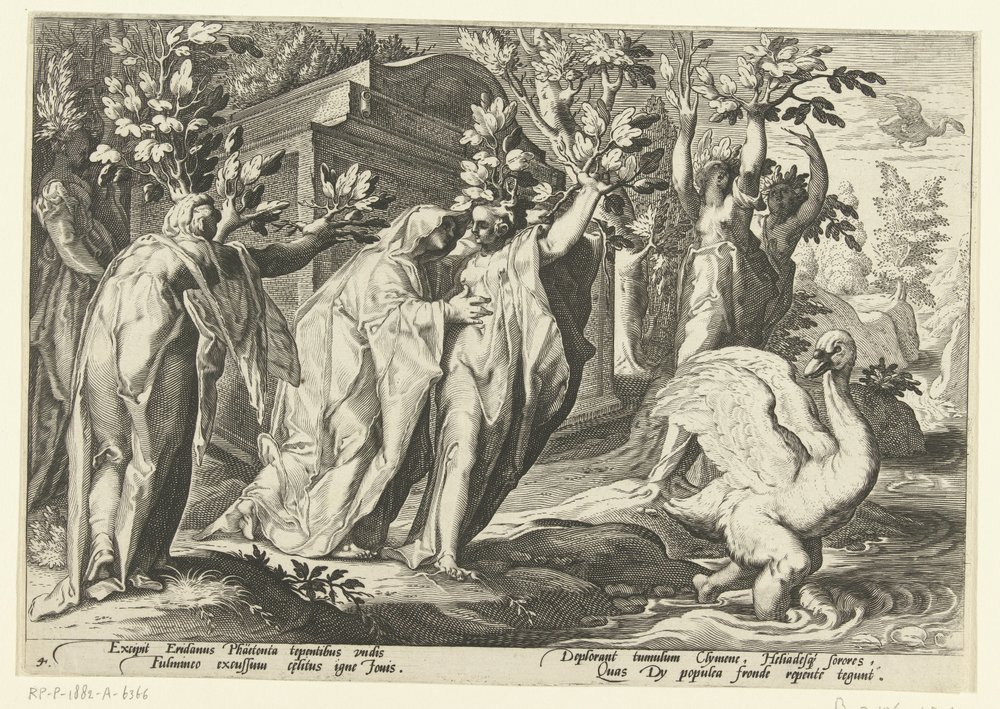
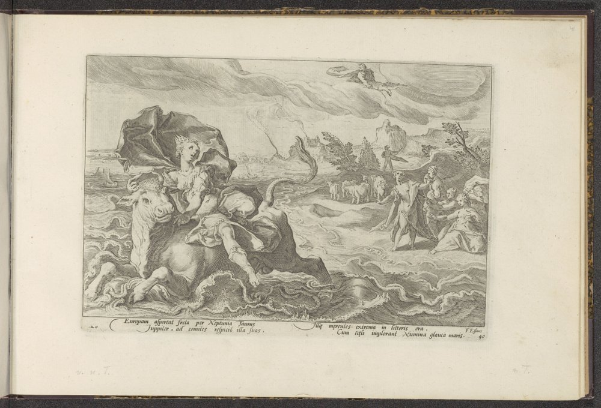
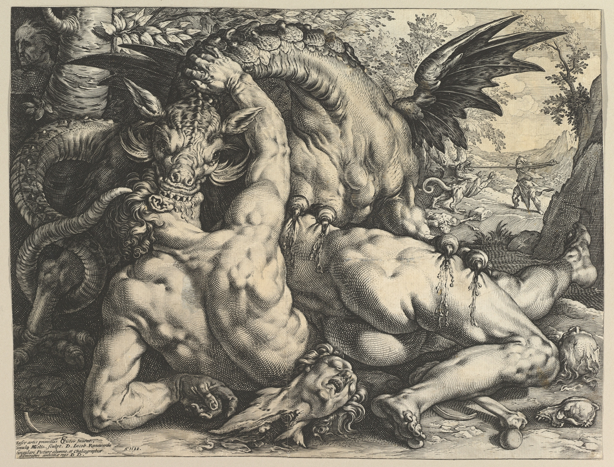
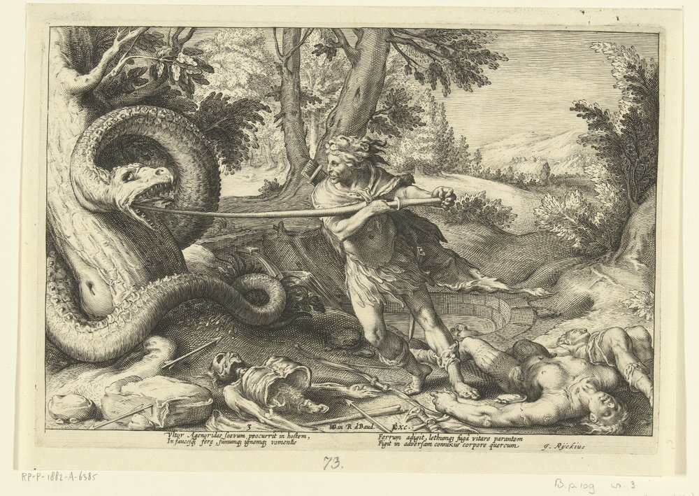
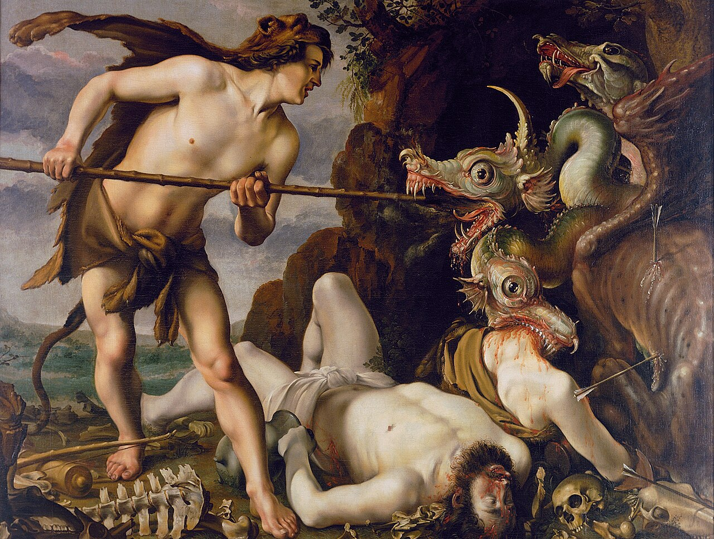

En *Las metamorfosis*, Ovidio presenta con quince breves libros la inagotable
profundidad del *ethos* grecolatino. A través de las exploraciones derivadas de
su lectura, que son en verdad infinitas, descubrí a Hendrick Goltzius, un
artista holandés del manierismo. Un interesante repaso de la trayectoria de
Goltzius puede leerse
[aquí](https://www.metmuseum.org/press-releases/first-major-retrospective-of-dutch-master-hendrick-goltzius-to-open-at-metropolitan-museum-june-26-2003-exhibitions);
por lo pronto deseo compartir sus hermosas representaciones de *Las
metamorfosis*.

Una de las primeras historias de *Las metamorfosis* es la de Apolo y Dafne. Tras
el diluvio, la tierra se puebla de monstruos y criaturas, uno de los cuales es
la gigantesca serpiente Pitón. Según las *Fábulas* de Higino, Pitón
«acostumbraba a dar las respuestas de parte del oráculo en el monte Parnaso
antes que Apolo», y «su destino era que había de morir a raíz del parto de
Latona», madre de Apolo y Diana. 

Por esta razón, al descubrir que Latona estaba embarazada, Pitón la persiguió
para matarla, aunque sin éxito. Apolo venga a su madre asesinando a Pitón con
miles de flechas, quedando luego embriagado por su propia *hubris*. Esta escena
es representada en el grabado siguiente:

    

> *Immensum certis strauit Pythona Sagittis / Nec meruit minimum Cynthius arte deus, Latonae matri monstrum Iunonis ob iram / Et terrae infestum dum necat atq[ue] mari*
>
> El dios Cintio (Apolo) abatió con flechas certeras a la inmensa Pitón, y no mereció poco crédito por su arte, mientras mataba al monstruo, infesto para la tierra y el mar, enviado por la ira de Juno contra su madre Latona.

Poco después, Apolo encuentra a Cupido y, lleno de arrogancia, se burla de que
un dios tan débil lleve un arco. Para vengarse, Cupido lo enamora de la ninfa
Dafne, clavándole una flecha con punta de oro en el corazón. A Dafne, por otra
parte, le clava una flecha con punta de plomo, garantizando que nunca pueda
corresponder a Apolo, quien la persigue incansablemente herido de amor. 

Al verse acorralada en la orilla del Peneo, su padre, Dafne suplica por su
ayuda. Goltzius representa el proceso de metamorfosis subsiguiente: los pies de
Dafne se hunden en la tierra como raíces, su cuerpo es envuelto por corteza y
sus manos se ramifican en hojas de laurel.

    

> *Ardebat flagrans Titan Peneïda Daphnen / Illa thorum vitat deuia lustra petens. Vitat, et in laurum cita vertitur, at sua semper / Dilecta Phoebus tempora fronde tegit.*
>
> El ardiente Titán (Apolo) estaba inflamado de amor por Dafne, la hija de Peneo; ella evita el lecho nupcial buscando los bosques remotos. Lo evita, y es convertida rápidamente en laurel, pero Apolo siempre cubre sus sienes con el follaje de su amada.

Otra hermosa representación de Goltzius es la de la violación y metamorfosis de
Ío. Júpiter, atraído a la doncella Ío, envuelve la tierra en una densa niebla
para ocultar su encuentro con ella. Su esposa Juno, al ver el bosque en
tinieblas, sospecha lo que está pasando y desciende a inspeccionar, tras lo cual
Júpiter convierte a Ío en vaca a fin de ocultar su aventura.

    

> *Iuppiter Inachiden densa caligine stuprat, / Iuno sui sensit furta petulca viri. Quod deus aduertens, Io sub imagine vaccae / Occuluit, quae post de boue facta dea est.*
>
> Júpiter viola a la hija de Ínaco bajo una densa niebla; Juno percibió los engaños petulantes de su marido. Al notar esto el dios, ocultó a Ío bajo la imagen de una vaca, la cual, después de haber sido vaca, fue convertida en diosa.

Otra famosa escena representada por Goltzius es la caída de Faetón, hijo de
Apolo. Incauto y arrogante, Fateón logró que su padre le conceda el carro solar
con el que recorre el universo, llevando luz al mundo, pero rápidamente pierde
el control de los potros flamígeros que lo empujan. El carro descontrolado
recorre el cosmos incendiando las constelaciones celestiales así como secando
los ríos, quemando los bosques, y volviendo negra la piel de los etíopes (sic).
Para detener la destrucción, Júpiter, padre de Apolo y por ende abuelo de
Faetón, lo derriba con un rayo, provocando su caída.

    

> *Sic phaetontevs nimivm temeraria lapsvs vota docet tandem fine carere bono. non ambire probat sapiens sed lavdat honores, lavdat contingant si tamen illa probis.*
>
> Así, la caída de Faetón enseña que los deseos excesivamente temerarios carecen al final de un buen desenlace. El sabio no aprueba la ambición, sino que alaba los honores, siempre que estos recaigan en los hombres íntegros.

Faetón murió al caer sobre el río Erídano. Clímene y las Helíades, madre y hermanas de Faetón, lamentaron su muerte hasta que sus cuerpos se convirtieron en álamos.

    

> *Excipit Eridanus Phaetontia tepentibus undis / Fulmineo excussum celitus igne Iouis. Deplorant tumulum Clymene, Heliadesq[ue] sorores, / Quas Dy popula fronde repente tegunt.*
>
> El Erídano recibe con aguas tibias a Faetón, expulsado por el fuego fulmíneo de Júpiter desde el cielo. Clímene y las hermanas Helíades lloran ante el túmulo, a quienes los dioses cubren de repente con follaje de álamo.

Goltzius también representó el secuestro de Europa y las subsiguientes aventuras
de Cadmo. Europa y Cadmo eran hijos de Agénor, rey de Fenicia. La hermosura de
Europa instigó a Júpiter a convertirse en un hermoso toro blanco de apariencia
mansa, a fin de seducir y raptar a la atractiva joven. Consigue ganarse la
confianza de Europa a tal punto que ella se aferra a sus cuernos y lo monta,
tras lo cual él se adentra en el mar llevándola hacia Creta. 

    

> *Europam asportat freta per Neptunia Taurus / Iuppiter, ad comites respicit illa suas. Illa merentes extrema in littoris ora / Cum coeli implorant Numina glauca maris.*
>
> Júpiter, convertido en toro, transporta a Europa por los mares de Neptuno; ella mira hacia sus compañeras.

Posteriormente, Agénor envía a Cadmo a rescatar a su hermana. Al no encontrarla,
consulta al oráculo de Apolo, quien le ordena seguir a una vaca que nunca haya
llevado yugo y fundar una ciudad donde ésta se eche a descansar.

    

Al llegar al lugar indicado por la vaca, los compañeros de Cadmo se aproximan a
una cueva donde pretenden encontrar agua. Allí son devorados por un dragón
sagrado de Marte que custodiaba la fuente. Cadmo enfrenta y mata a la bestia, y
luego, por consejo de Atenea, siembra los dientes del dragón, de donde nacen
guerreros (espartos, o *Spartoí*). En las siguientes obras vemos al dragón
matando a los compañeros de Cadmo, seguido de Cadmo ajusticiando a la bestia.

    

    

> *Ultor Agenorides saevum procurrit in hostem, / In fauces ferrum fumumq[ue] ignemq[ue] vomentes. Ferrum adigit, lethumq[ue] fuga vitare parantem / Figit in adversam connixus corpore quercum.*
>
> El vengador hijo de Agenor corre hacia el feroz enemigo, hacia las fauces que vomitan humo y fuego. Clava el hierro y, al que intentaba evitar la muerte con la huida, lo atraviesa contra una encina opuesta.

Por último, por qué no compartir una versión alternativa de Goltzius de la
última escena, Cadmo asesinando al dragón, esta vez en óleo.

    

Goltzius representó muchas otras escenas de *Las metamorfosis*, así como
innumerables episodios de la Biblia. Con suerte, este pequeño recorrido sobre
algunas de sus ilustraciones despierte la curiosidad del lector y revele el
virtuosismo de este hermoso personaje del manierismo holandés.

