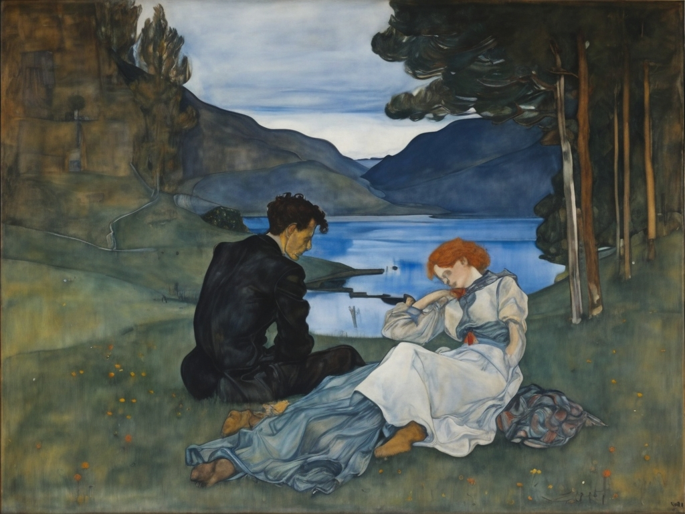

Tu ne vieillis plus. Ton visage, dans ma mémoire, est le même visage que
j'ai embrassé un jour, la même fleur fanée de ta jeunesse. Et, bien que je
vieillisse, sache que je marche encore avec toi. Je veux être nu avec toi, et je ne
parle pas de mon corps, et je ne parle pas de tes ossements. Combien d'années se
sont écoulées? J'ai flotté, j'ai été entraîné toutes ces années. Tu sais?
J'imagine encore, quand je marche dans une rue quelconque, que tu marches avec
moi. Je crois entendre ta voix encore. Chaque nuit, je m'endors en te ramenant à
la vie.

<figure style="text-align: center;">
  
  <figcaption>Toi et moi à quinze ans</figcaption>
</figure>
