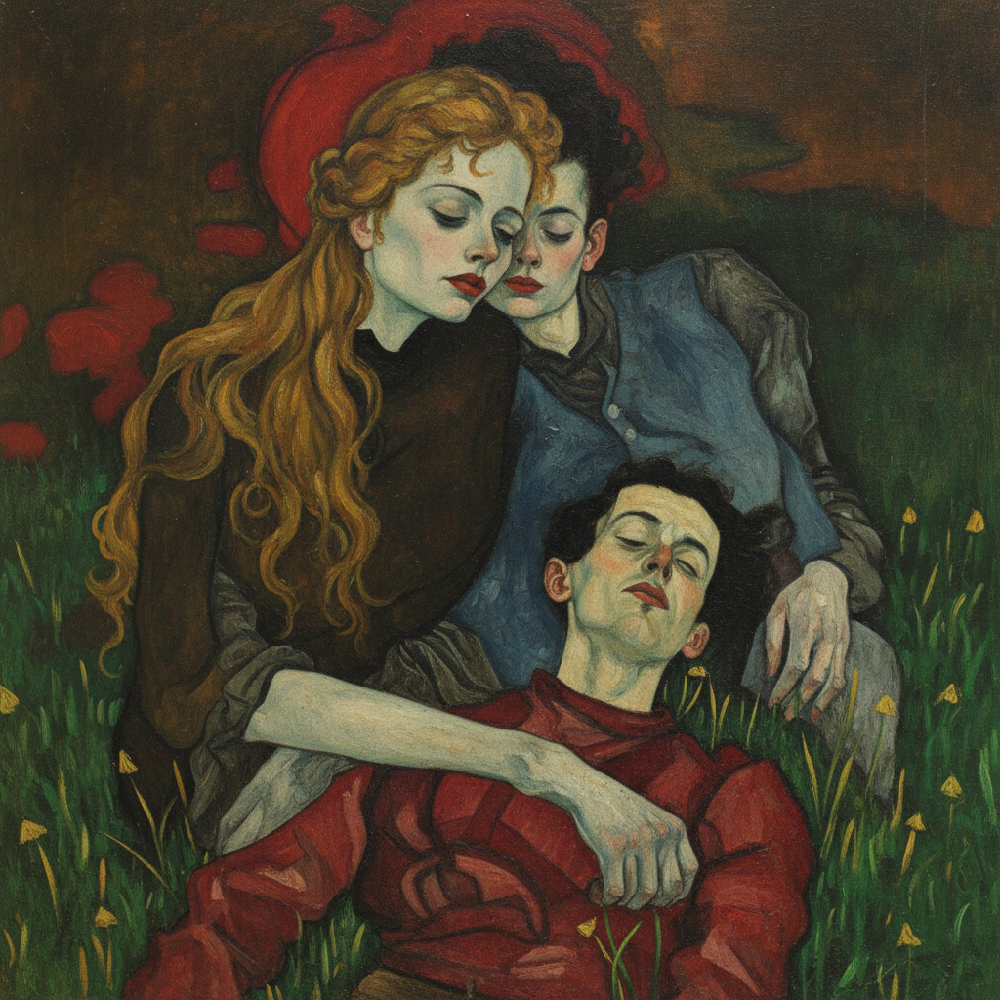

Si j'ai vu le cercueil, la pierre froide, l'herbe fleurie, la mère en
pleurs; enfin, les signes universels de ta réalité finale. Si je me suis allongé
sur la rosée qui tapisse ta tombe, sur un lit qui ne fait qu'un avec tes
cauchemars, sur un désir sans objet ni sens. Si j'ai hésité, comme Jésus-Christ;
si j'ai consacré ma chair à des tigres affamés, comme Siddhartha; si enfin je ne
suis ni meilleur ni pire que n'importe qui. Si toutes ces choses sont ainsi,
pourquoi est-ce que j'imagine encore que tu vis, que tu es quelque part heureux
et en sécurité? Et pourrais-je vivre sans cette triste lâcheté?

La nuit dernière je rêvai que je reposais sur un champ, ou peut-être un parc. Je
posais ma tête sur ta jambes; c'est-à-dire sur te jambes et sur celles de
l'autre toi, celle qui était morte. Tes cheveux tombaient comme une cascade sur
mon front. Je voulais les embrasser, mais une paralysie total m'en empêchait. Je
suppose que ce rêve est, a sà manière, adèquat. Il existe deux toi. Mais je aime
seulement à une.

<figure style="text-align: center;">
  
</figure>
